# Desafío 44 - Mis Viajes V2 (HackLab 2025)

**Plataforma:** HackLab (SoftwareSeguro)
**Edición:** HackLab 2025
**Categoría:** SQL Injection

## Enunciado

Un año atrás, un amigo había creado una plataforma para guardar imágenes de viajes. En el
HackLab 2024 la vulneraron muchas veces (ver [Desafío 27 - Mis viajes](../desafio-27-mis-viajes-hacklab-2024/)).
En la V2 "solucionó todos los problemas" y agregó funcionalidades. El objetivo es
**visualizar una imagen que no te pertenece**, que contiene el código ganador en su interior,
posiblemente **camuflado**.

## Reconocimiento

La app "Mis Viajes V2" tiene tres zonas: formulario "Subir Imagen", un mapa GPS (Leaflet) y
"Mis Imágenes", donde cada tarjeta muestra `Clasificación`, `Descripción`, `Resumen OCR`,
`Fecha` y `Marca/Modelo`.

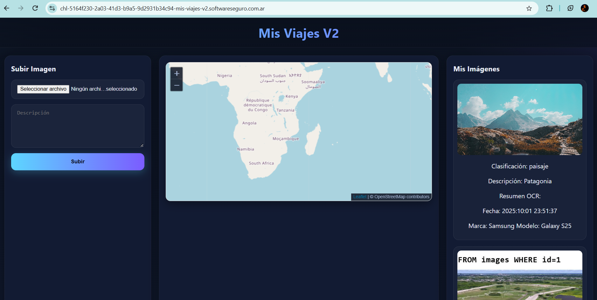

Observaciones iniciales sobre el comportamiento:

- **No hay sesión ni login.** La identidad es solo el `user_id` (UUID) que viaja en el body del
  upload y está renderizado en el HTML (`<input id="id_user" ...>`).
- `GET /images/<uuid>` — único endpoint de lectura. Devuelve JSON con las imágenes de ese
  `user_id`. Usa un converter Flask `<uuid>` **estricto**: cualquier cosa que no sea un UUID
  válido da 404.
- `POST /upload` — recibe JSON `{image: "data:image/...;base64,...", description, user_id}`.
  Al subir, el server corre un pipeline: **clasificador** ("¿es un viaje?"), lectura de
  **EXIF/GPS**, **OCR** y luego guarda el registro.
- `/uploads/<filename>` — sirve la imagen del filesystem por nombre (UUID.ext). No consulta DB.
- El `id` de imagen es **global y secuencial** entre todos los usuarios: los `id` que no son
  propios pertenecen a otros usuarios (la víctima y un tercero sembrados en la DB).
- **Instancia propia spawneada:** la DB se siembra al lanzar, con datos deterministas (los
  `user_id` son fijos entre spawns; solo cambia la URL).

El primer intento de subir una imagen cualquiera falla con un error genérico en la UI:

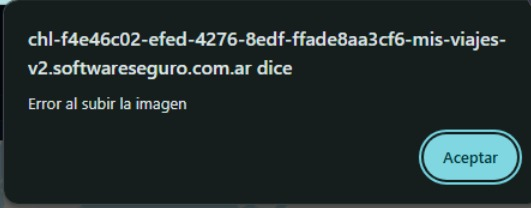

En DevTools, ese `POST /upload` devuelve **500 Internal Server Error**:

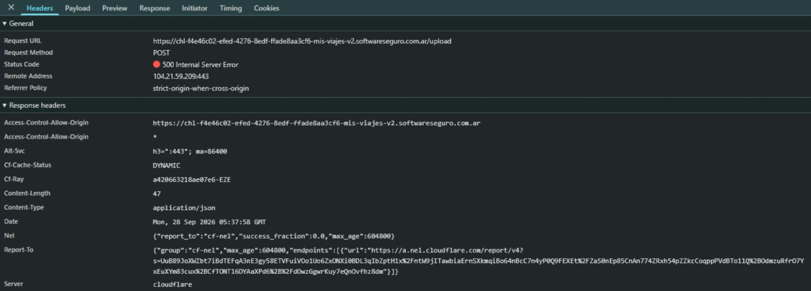

El payload es un JSON con la imagen como data-URI base64, más `description` y `user_id`:

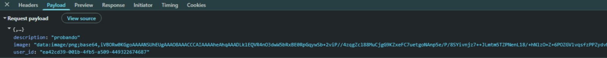

Mirando la respuesta, el server rechaza la imagen porque **el clasificador** no la considera un
viaje:

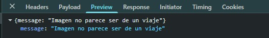

Subiendo una **foto de paisaje real** (con EXIF de cámara y GPS válidos), el clasificador la
acepta y el upload responde `200`:

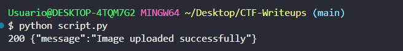

La imagen aceptada aparece en "Mis Imágenes" con sus campos (`Clasificación`, `Descripción`,
`Resumen OCR`, `Fecha`, `Marca/Modelo`):

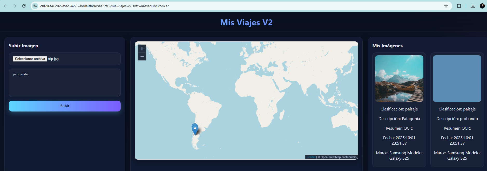

El endpoint de lectura `GET /images/<uuid>` responde `200` y devuelve el JSON con las filas del
usuario:

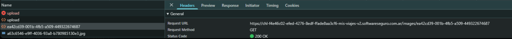

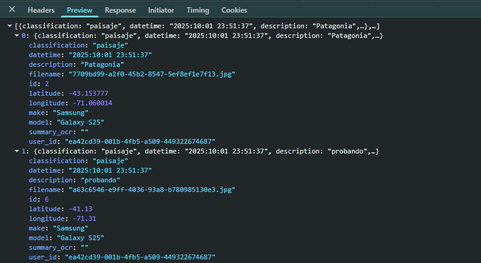

Como el reto es la V2 de un desafío de SQL Injection ([Desafío 27](../desafio-27-mis-viajes-hacklab-2024/)),
el punto de partida fue reintentar el mismo vector de 2024.

## Primer intento: el vector de la V1 (EXIF) está parcheado

La V1 era SQLi vía metadatos EXIF `Make`/`Model` con ExifTool sobre SQLite. Se replicó ese
ataque (ver [`scripts/v2_exif_char.py`](./scripts/v2_exif_char.py)), incluyendo variantes
error-based y time-based sobre una imagen de paisaje que pasa el clasificador. Resultado: los
campos EXIF se guardan **HTML-escapados** (`'` → `&#39;`) y **no ejecutan**. El vector de 2024
quedó cerrado.

En paralelo se descartaron, con pruebas, el resto de superficies típicas
([`scripts/probe_endpoints.py`](./scripts/probe_endpoints.py) y otros — ver la sección final):
`user_id`/`description` del body (parametrizados), el path del `GET` (converter estricto),
headers HTTP (time-based sin efecto), `/uploads/` (filesystem), endpoints de búsqueda
inexistentes, mass assignment y GPS.

## El campo nuevo: `Resumen OCR`

Descartado el EXIF, la atención pasó a lo que la V2 **agregó**. La tarjeta de cada imagen tiene
un campo `Resumen OCR`: el server corre OCR sobre la imagen subida y guarda el texto que lee. Es
la única entrada nueva que **procesa contenido controlado por el usuario y lo devuelve**.

La hipótesis: si el texto extraído por el OCR se concatena en la consulta de guardado sin
sanitizar, se puede inyectar SQL **pintando el payload como texto sobre la imagen**. El
clasificador exige un "viaje", así que el payload se pinta sobre una foto de paisaje real:

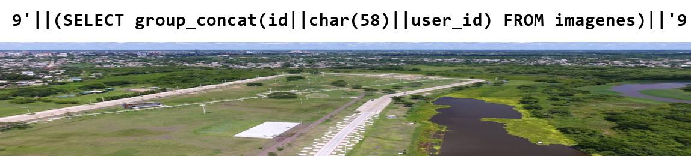

### Confirmación

Se pintó en la imagen:

```sql
9'||(SELECT sqlite_version())||'9
```

y el campo `Resumen OCR` se guardó como `93.46.19`, es decir `9` + `3.46.19` (versión de SQLite)
+ `9`. **La subconsulta se ejecutó.** La propia tarjeta lo muestra:

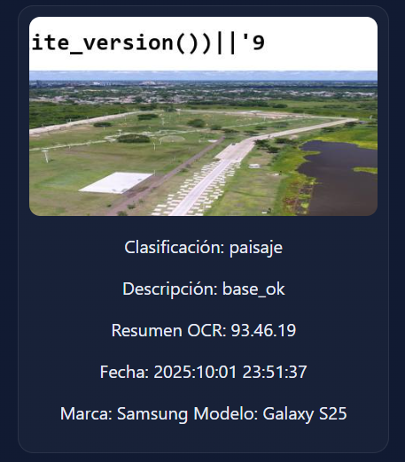

Para confirmar que no era casualidad del pipeline, se hizo un test de aislamiento
([`scripts/v2_isolate.py`](./scripts/v2_isolate.py)) con el **mismo formato de imagen** y distinta
validez SQL:

| Payload pintado | Resultado |
|---|---|
| `9'\|\|(SELECT sqlite_version())\|\|'9` | `200`, `ocr='93.46.19'` (ejecutó) |
| `9'\|\|(CASE WHEN 1=1 THEN 65 ELSE 66 END)\|\|'9` | `200`, `ocr='9659'` (ejecutó, `65`) |
| `9'\|\|(XXXX WXXX 1=1 ...)\|\|'9` (SQL inválido, misma forma) | `500` |

Que el status dependa de la **validez SQL** (no solo de la forma del texto) prueba que la
inyección es real. El motor es **SQLite 3.46.1**.

### El envoltorio `9'...'9`

El OCR deforma las comillas según su posición:
- Una comilla de **apertura aislada** se lee como `*`.
- El `||` al inicio de línea se lee como `| |` (con espacio), que no es concatenación válida.
- Una comilla **pegada a un dígito** (`9'`) o a `||` se lee bien.

Por eso el payload se envuelve entre dígitos: `9'||( ... )||'9`. El `9` ancla las comillas y el
`||` para que el OCR los reproduzca correctamente.

## El bloqueo: `FROM images` siempre daba 500

Con la inyección confirmada, tocaba leer la tabla de imágenes para sacar el `user_id` de la
víctima. Pero cualquier subconsulta con `FROM images` devolvía **500**, mientras que las
subconsultas sin `FROM` (`sqlite_version()`, `CASE WHEN`) ejecutaban. La primera hipótesis fue
que el OCR "reordenaba" `FROM images`. **Era falsa.** El diagnóstico correcto llegó al *medir*
cómo lee el OCR:

1. **El OCR no reordena** ([`scripts/ocr_from_diag.py`](./scripts/ocr_from_diag.py)). Pintado
   como literal plano (sin envoltorio ejecutable), el OCR lee `SELECT user_id FROM images WHERE id=1`
   perfecto y en orden. Solo colapsa espacios dobles. Así que el 500 no era del OCR.

2. **El 500 era SQL** ([`scripts/ocr_exec_diag.py`](./scripts/ocr_exec_diag.py)). Dentro del
   envoltorio ejecutable, *cualquier* lectura de la tabla fallaba, incluso
   `SELECT count(*) FROM images` (una fila, un entero). Si `sqlite_version()` ejecuta pero
   `count(*) FROM images` no, el problema es el `FROM images` en sí.

3. **Leer otra tabla sí ejecuta** ([`scripts/ocr_othertable_diag.py`](./scripts/ocr_othertable_diag.py)):

   ```sql
   9'||(SELECT group_concat(name) FROM sqlite_master)||'9   -- => 'imagenes,sqlite_sequence'
   ```

   La tabla real se llama **`imagenes`** (en español). `FROM images` daba 500 porque **esa tabla
   no existe** (`no such table: images`), nada que ver con el OCR. Este era el obstáculo que
   trababa todo el reto.

Esquema completo (vía `SELECT sql FROM sqlite_master LIMIT 1`):

```sql
CREATE TABLE imagenes (
    id INTEGER PRIMARY KEY AUTOINCREMENT,
    user_id TEXT NOT NULL,
    filename TEXT NOT NULL,
    description TEXT,
    summary_ocr TEXT,
    classification TEXT,
    latitude REAL,
    longitude REAL,
    datetime TEXT,
    make TEXT,
    model TEXT)
```

## Explotación

Con la tabla correcta, la exfiltración es directa ([`scripts/ocr_dump_victim.py`](./scripts/ocr_dump_victim.py)).
Para evitar comillas en la consulta (el OCR deforma comillas de apertura aisladas) se usa
`char(58)` = `:` como separador y `group_concat`:

```sql
9'||(SELECT group_concat(id||char(58)||user_id) FROM imagenes)||'9
```

Resultado (mapa `id:user_id`):

```
1:365f6106-d23b-4d29-97ea-89f8001def09   <- usuario A (1 imagen)
2:ea42cd39-001b-4fb5-a509-449322674687   <- propio
3:01d4832e-485a-4e98-b97e-d558c4cc95d1   <- usuario B (3 imágenes)
4:01d4832e-485a-4e98-b97e-d558c4cc95d1   <- usuario B  ← contiene el código
5:01d4832e-485a-4e98-b97e-d558c4cc95d1   <- usuario B
```

Hay **dos usuarios ajenos**:

| Rol | `user_id` (UUID) | Imágenes (`id`) |
|-----|------------------|-----------------|
| Propio (atacante) | `ea42cd39-001b-4fb5-a509-449322674687` | 2 |
| Usuario A | `365f6106-d23b-4d29-97ea-89f8001def09` | 1 |
| **Usuario víctima (B)** | **`01d4832e-485a-4e98-b97e-d558c4cc95d1`** | 3, 4, 5 |

Con cada `user_id` ajeno se llama al endpoint legítimo `GET /images/<uuid>` para obtener sus
filenames, y cada archivo se descarga de `/uploads/<filename>`. También se pueden volcar los
campos de texto de todas las filas directamente por la inyección
([`scripts/ocr_dump_fields.py`](./scripts/ocr_dump_fields.py)).

## El código camuflado

El código ganador estaba **camuflado en la imagen `id=4`** — un PNG del **usuario B
(`01d4832e`)**. Está pintado como **texto gris tenue sobre la zona oscura de pasto/rocas** en la
esquina inferior derecha: casi invisible a simple vista, legible al recortar esa región y
aplicarle autocontraste.

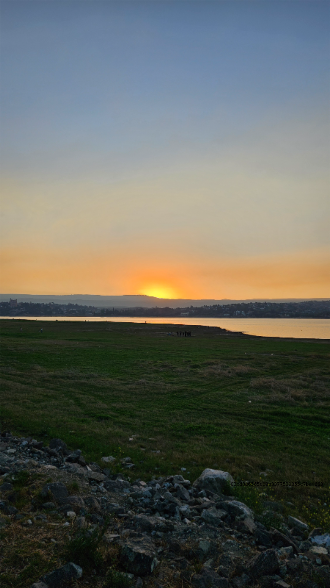

Recortando esa esquina y aplicándole autocontraste, el código queda legible:

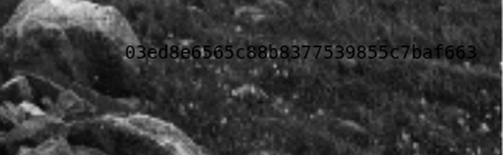

### Por qué se descartaron las otras imágenes ajenas

Hay 4 imágenes que no son propias (`id` 1, 3, 4, 5). Se bajaron todas de `/uploads/` y se
analizaron una por una; el código solo apareció en la `id=4`:

| id | Usuario | Descripción | Formato | Escena | Por qué se descartó |
|----|---------|-------------|---------|--------|---------------------|
| 1 | A `365f6106` | "Maravilloso" | JPEG 3569×2000 | Montaña + arcoíris | Análisis exhaustivo sin resultado: separación de canales RGB, high-pass (resta de blur), bit-planes LSB, autocontraste local por tiles, realce de la banda de cielo a resolución completa, segmentos JPEG (`APPn`/`COM`) y `strings`. No hay texto oculto. |
| 3 | B `01d4832e` | "Sin palabras" | JPEG 4016×6016 | Puente de piedra en otoño | El nombre "Sin palabras" y las manchas del puente parecían pista; el zoom a resolución completa del puente mostró **solo textura de la piedra**, ningún carácter. |
| 5 | B `01d4832e` | "Ocean" | JPEG 3333×5000 | Atardecer sobre acantilado | Autocontraste fuerte sobre la mitad inferior (rocas/grava/muro, las zonas oscuras donde se camuflaría un texto): solo textura natural, sin caracteres. |
| **4** | **B `01d4832e`** | *(vacía)* | **PNG 962×1709** | **Atardecer sobre lago** | ✅ **Contiene el código.** Texto gris tenue sobre el pasto/rocas de la esquina inferior derecha. |

Notas del método:
- El **PNG (`id=4`)** fue el primer candidato natural por ser sin pérdida (posible LSB), pero el
  LSB resultó ruido natural y el canal alfa era uniforme (255): el código **no** era stego LSB,
  sino **texto visible camuflado por color**, que se revela con autocontraste de la esquina.
- La descripción **vacía** de la `id=4` (a diferencia de "Maravilloso", "Sin palabras", "Ocean")
  encaja con una imagen "trampa" preparada solo para esconder el código.

## Flag / código ganador

```
03ed8e6565c88b8377539855c7baf663
```

## Vectores y pistas descartados (con evidencia)

Antes de dar con el vector de OCR, y antes de encontrar la tabla correcta, se descartaron con
pruebas:

- **EXIF `Make`/`Model`/`DateTimeOriginal`** (ExifTool + error-based + time-based) → HTML-escapados (`&#39;`), no ejecutan. Es el vector que sí funcionaba en la V1 ([Desafío 27](../desafio-27-mis-viajes-hacklab-2024/)) y quedó parcheado.
- **GPS** lat/long (numéricos, ExifTool valida) y campos GPS-string (`MapDatum`, `ProcessingMethod`, etc.) → ignorados; `GPSLatitudeRef` solo se compara con `S` para el signo.
- **`user_id` y `description`** del body → parametrizados.
- **Path** `GET /images/<uuid>` → converter `<uuid>` estricto (cualquier no-UUID da 404).
- **Headers HTTP** (`User-Agent`, `X-Forwarded-For`, `Referer`, ...) time-based → sin efecto.
- **`/uploads/<filename>`** → filesystem, sin traversal ni SQL.
- **Endpoints** `/search`, `/api/search`, etc. → 404 genérico (no existen).
- **Segundo orden** (payload guardado que dispara query en el listado) → sin efecto.
- **Mass assignment** (campos extra en el body) → ignorados.
- **`main.js` React** que aparecía en DevTools bajo `/images/<nil>/main.js` → resultó ser de
  una **extensión de Chrome** del navegador, no del reto (pista falsa).
- **Falso "reordenamiento del OCR" sobre `FROM images`** → hipótesis descartada: el OCR lee
  `FROM images` perfecto como literal plano. Los 500 eran `no such table: images` porque la
  tabla se llama `imagenes` (ver "El bloqueo").
- **Stego en las imágenes `id=1`, `id=3`, `id=5`** (canales RGB, high-pass, bit-planes LSB,
  contraste local por tiles, banda de cielo, zoom full-res, metadata APP/COM, `strings`) → sin
  resultado. Ver la tabla "Por qué se descartaron las otras imágenes ajenas".
- **PNG `id=4`: stego LSB / canal alfa** → ruido natural / alfa uniforme. El código NO era stego
  LSB, sino **texto visible camuflado por color** en esa misma imagen (esquina inferior derecha).

## Scripts

El solver consolidado que reproduce el camino completo es [`solve.py`](./solve.py).

La investigación completa se hizo a lo largo de ~100 scripts iterativos (calibración del OCR,
barridos de comillas, pruebas por campo, etc.); en [`scripts/`](./scripts/) se conservan solo
los representativos de cada fase:

- [`scripts/probe_endpoints.py`](./scripts/probe_endpoints.py) — reconocimiento de la superficie
  (endpoints, rutas, métodos).
- [`scripts/v2_exif_char.py`](./scripts/v2_exif_char.py) — reintento del vector EXIF de la V1
  (error-based + time-based) → descartado, quedó parcheado.
- [`scripts/v2_isolate.py`](./scripts/v2_isolate.py) — prueba de aislamiento que **confirma la
  SQLi vía OCR** (`sqlite_version()` → `93.46.19`; la validez SQL controla el 200/500).
- [`scripts/ocr_from_diag.py`](./scripts/ocr_from_diag.py) — mide cómo lee el OCR `FROM images`
  como literal plano → demuestra que **no reordena** (descarta la hipótesis del OCR).
- [`scripts/ocr_exec_diag.py`](./scripts/ocr_exec_diag.py) — aísla el 500: cualquier lectura de
  `images` falla, incluso `count(*)` → el problema es el `FROM images`, no la forma del resultado.
- [`scripts/ocr_othertable_diag.py`](./scripts/ocr_othertable_diag.py) — lee `sqlite_master` →
  **descubre que la tabla real es `imagenes`**.
- [`scripts/ocr_dump_victim.py`](./scripts/ocr_dump_victim.py) — vuelca el esquema y el mapa
  `id→user_id` desde `imagenes` (obtiene el `user_id` de la víctima).
- [`scripts/ocr_dump_fields.py`](./scripts/ocr_dump_fields.py) — vuelca campos de texto de todas
  las filas (descriptions, filenames, cámaras).

> **Nota:** los scripts obtienen el `user_id` propio del HTML en tiempo de ejecución y apuntan a
> la URL de la instancia (cambia en cada spawn — actualizar la constante `BASE`). Requieren
> `pillow`, `piexif` y `requests`, y ExifTool para los scripts `.sh`.
