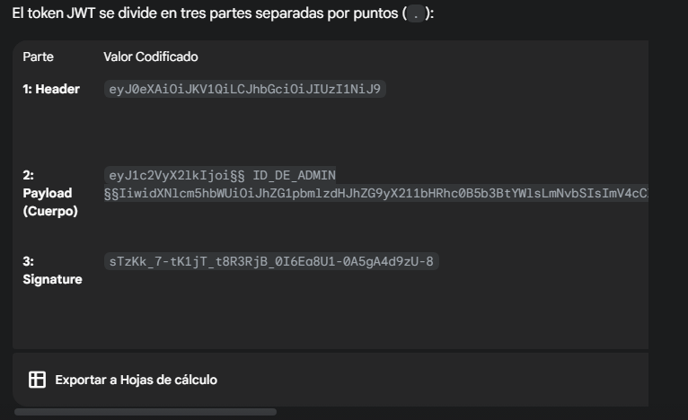

# Desafío 15 - Consulta de multas

**Plataforma:** HackLab (SoftwareSeguro)  
**Categoría:** Tokens  

## Análisis

La vulnerabilidad reside en una `SECRET KEY` expuesta en un endpoint de la API. Esa clave permite forjar tokens JWT válidos con el algoritmo `HS256`.

El stack es **Django + djangorestframework-jwt**: se reconoce porque el token incluye el claim `orig_iat` junto a `user_id` y `exp`. La firma es `HS256` (clave simétrica), por lo que quien conoce la `SECRET_KEY` puede firmar tokens arbitrarios.

El token no viaja en el header `Authorization`, sino en la cookie `auth` (`JWT_AUTH_COOKIE`).

Además de la clave expuesta hay dos fallos secundarios que facilitan el ataque:

- `DEBUG=True`: una petición a una ruta inexistente (404) devuelve la página de error de Django, que revela el URLconf completo de la aplicación.
- El endpoint JSONP se sirve con `Access-Control-Allow-Origin: *`, de modo que la `SECRET_KEY` era legible cross-origin.

## Explotación

Se abre [jwt.io](https://www.jwt.io/) y se pega el token capturado para ver su contenido (JWT Decoder).


El endpoint `/jsonp/?callback=procesarDatos` serializa los settings de Django y devuelve la **SECRET_KEY** en claro dentro del callback:

```
123456@pz*+2p(e10(n7891
```




Con la SECRET KEY se usa el **JWT Encoder** de jwt.io para crear un nuevo token: se cambia el correo por el del administrador indicado en el enunciado y la firma se reemplaza por la SECRET KEY encontrada.

El token generado se coloca en la cookie `auth` al enviar el `GET /perfil/`. Se puede modificar desde el inspector del navegador en la sección de Cookies.

> **Nota:** en esta aplicación el token debe ir en la cookie `auth` (`JWT_AUTH_COOKIE`), no en el header `Authorization`. Enviarlo por el header `Authorization` devuelve `403`.

```
eyJ0eXAiOiJKV1QiLCJhbGciOiJIUzI1NiJ9.eyJ1c2VyX2lkIjoyLCJ1c2VybmFtZSI6ImFkbWlua
XN0cmFkb3JfbXVsdGFzQHlvcG1haWwuY29tIiwiZXhwIjoxNzU5ODI3NTUwLCJlbWFpbCI6I
mFkbWluaXN0cmFkb3JfbXVsdGFzQHlvcG1haWwuY29tIiwib3JpZ19pYXQiOjE3NTkyMjI3N
TB9.AWkUqOHEHVqkBQg0cZ6M5nUNPiUVMxaCSCBMjNFjTlo
```


## Flag

```
e470ca488c867e223fb
```

## Remediación

- No serializar los settings de Django hacia el cliente; en particular, nunca exponer la `SECRET_KEY`.
- Sacar la clave del código fuente (moverla a variables de entorno) y rotarla, ya que quedó comprometida.
- Establecer `DEBUG=False` en producción para no filtrar el URLconf ni trazas internas.
- Restringir CORS: reemplazar `Access-Control-Allow-Origin: *` por una lista de orígenes permitidos.
- Considerar firma asimétrica (`RS256`): el servidor firma con la clave privada y los clientes solo verifican con la pública, evitando que un secreto filtrado permita forjar tokens.
