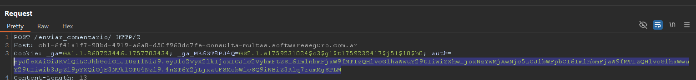
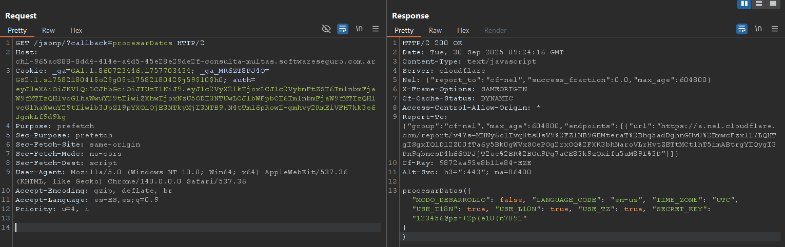
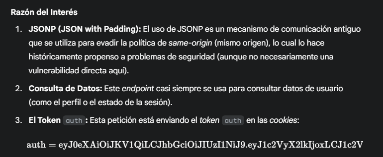
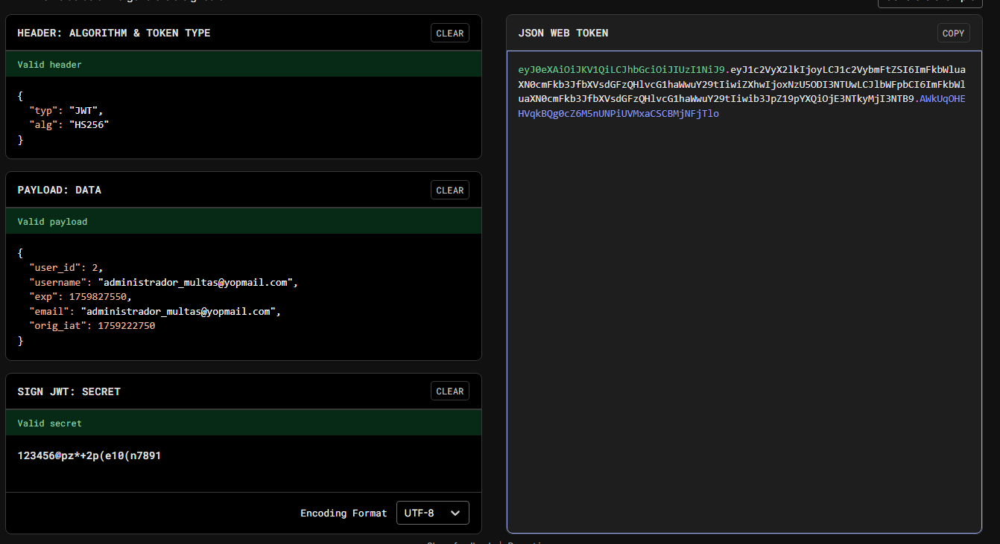

# Desafío 15 - Consultas Multas (falta hacer)

Tokens 
Desafío 15 - Consultas Multas (falta hacer) 
 
 
En https://www.jwt.io/ pegamos el token y nos muestra su contenido 
 
Esta es la parte de JWT Decoder

Charlando con Geminis, dentro de todas las peticiones que hay me dijo que era muy 
importante la SECRET KEY que me da como respuesta esta petición. 
 
Por lo general esto se encuentro en JavaScript o HTML 
 
123456@pz*+2p(e10(n7891

Entró a la parte de JWT Encoder para poder crear un token. 
Entonces ahora cambio el correo por el que me indicaba el enunciado, el usuario puse el 2 
pero despues probe poniendo otros valores e igual funciona y la Firma cambió por la 
SECRET KEY que encontre 
 
Token generado el cual pego en el auth cuando envio el GET perfil/ 
También se puede modificar sino desde el inspeccionar en la parte de Cookies 
 
eyJ0eXAiOiJKV1QiLCJhbGciOiJIUzI1NiJ9.eyJ1c2VyX2lkIjoyLCJ1c2VybmFtZSI6ImFkbWlua
XN0cmFkb3JfbXVsdGFzQHlvcG1haWwuY29tIiwiZXhwIjoxNzU5ODI3NTUwLCJlbWFpbCI6I
mFkbWluaXN0cmFkb3JfbXVsdGFzQHlvcG1haWwuY29tIiwib3JpZ19pYXQiOjE3NTkyMjI3N
TB9.AWkUqOHEHVqkBQg0cZ6M5nUNPiUVMxaCSCBMjNFjTlo 
 
 
e470ca488c867e223fb

