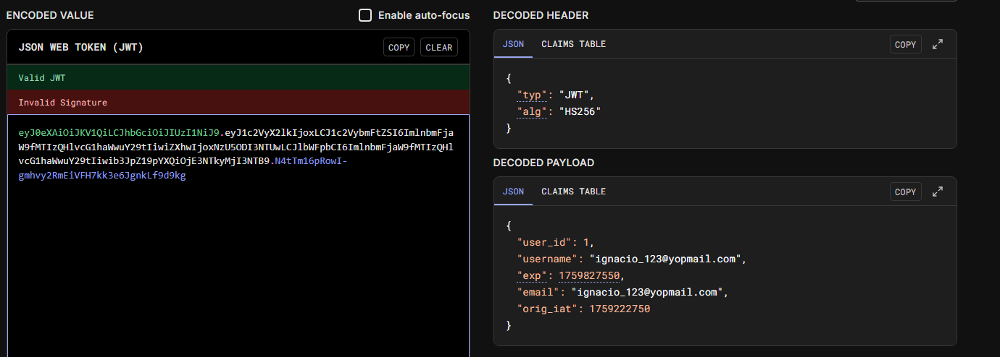
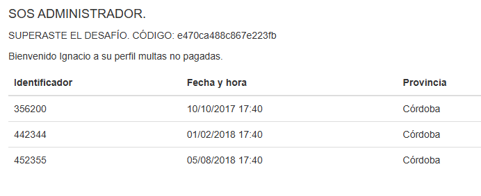

# Desafío 15 - Consultas Multas

**Plataforma:** HackLab (SoftwareSeguro)  
**Categoría:** Tokens  

## Análisis

La vulnerabilidad reside en una `SECRET KEY` expuesta en un endpoint de la API. Esa clave permite forjar tokens JWT válidos con el algoritmo `HS256`.

## Explotación

Se abre [jwt.io](https://www.jwt.io/) y se pega el token capturado para ver su contenido (JWT Decoder).




Revisando todas las peticiones de la aplicación (generalmente expuesta en JavaScript o HTML), se encuentra la **SECRET KEY**:

```
123456@pz*+2p(e10(n7891
```


Con la SECRET KEY se usa el **JWT Encoder** de jwt.io para crear un nuevo token: se cambia el correo por el del administrador indicado en el enunciado y la firma se reemplaza por la SECRET KEY encontrada.

El token generado se pega en el header `Authorization` al enviar el `GET /perfil/`. También se puede modificar desde el inspector del navegador en la sección de Cookies.

```
eyJ0eXAiOiJKV1QiLCJhbGciOiJIUzI1NiJ9.eyJ1c2VyX2lkIjoyLCJ1c2VybmFtZSI6ImFkbWlua
XN0cmFkb3JfbXVsdGFzQHlvcG1haWwuY29tIiwiZXhwIjoxNzU5ODI3NTUwLCJlbWFpbCI6I
mFkbWluaXN0cmFkb3JfbXVsdGFzQHlvcG1haWwuY29tIiwib3JpZ19pYXQiOjE3NTkyMjI3N
TB9.AWkUqOHEHVqkBQg0cZ6M5nUNPiUVMxaCSCBMjNFjTlo
```




## Flag

```
e470ca488c867e223fb
```
