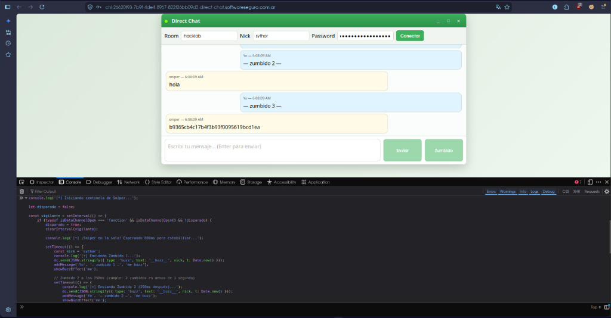

# Desafío 42 - Direct Chat

**Plataforma:** HackLab (SoftwareSeguro)  
**Categoría:** WebRTC  

## Análisis

El objetivo es lograr que el usuario automatizado `sniper` entregue la clave secreta dentro de la aplicación web de chat 1 a 1.

**Condición de victoria:** El usuario remoto debe recibir dos "zumbidos" con un intervalo inferior a 1 segundo (< 1000 ms).

### Fase 1: Descifrado criptográfico de la sala secreta

El enunciado indicaba que `sniper` solo utilizaba una sala especial cuyo nombre fue provisto cifrado en Base64:

```
PK8EdNdV53YOEsO6WGVFvw==
```

Los parámetros de cifrado especificados fueron:
* **Algoritmo:** AES-256 CBC
* **Contraseña:** `"PIZZA"`
* **Iteraciones:** 1000
* **Salt:** Sin salt (`b""`)

Se implementó una derivación de clave estándar utilizando **PBKDF2** con **HMAC-SHA256** para obtener los 48 bytes necesarios (32 bytes para la clave AES y 16 bytes para el vector de inicialización IV):

```python
import base64
import hashlib
from cryptography.hazmat.primitives.ciphers import Cipher, algorithms, modes
from cryptography.hazmat.backends import default_backend

# 1. Decodificar ciphertext
ct = base64.b64decode("PK8EdNdV53YOEsO6WGVFvw==")

# 2. Derivar 48 bytes (32 key + 16 iv)
derived = hashlib.pbkdf2_hmac('sha256', b'PIZZA', b'', 1000, 48)
key = derived[:32]
iv = derived[32:48]

# 3. Descifrar con AES-256 CBC
cipher = Cipher(algorithms.AES(key), modes.CBC(iv), backend=default_backend())
decryptor = cipher.decryptor()
pt = decryptor.update(ct) + decryptor.finalize()

# 4. Quitar padding PKCS#7
pad_len = pt[-1]
room_name = pt[:-pad_len].decode('utf-8')
print(f"Room: {room_name}")  # 'hacklab'
```

El script completo está disponible en [`solve_room.py`](./solve_room.py).

* **Resultado:** La sala especial es **`hacklab`**.

### Fase 2: Análisis de arquitectura e ingeniería inversa

Tras inspeccionar el código del cliente web ([`assets/app.js`](./assets/app.js) y [`assets/index.html`](./assets/index.html)), se identificaron los siguientes aspectos arquitectónicos:

1. **Protocolo P2P (WebRTC):**
   * El WebSocket (`wss://direct-chat.shared.softwareseguro.com.ar/ws`) funciona exclusivamente como servidor de señalización (intercambio de ofertas/respuestas SDP y candidatos ICE).
   * La transmisión de mensajes y zumbidos se realiza de forma directa entre navegadores mediante un canal de datos punto a punto (`RTCDataChannel`, variable global `dc`).
2. **Generación del identificador de sala:**
   * La sala interna en el servidor de señalización se compone mediante la función `getComposedRoom()`:
     ```javascript
     function getComposedRoom() {
         const domain = location.hostname || 'localhost';
         return `${domain}-${raw}`;
     }
     ```
   * En nuestra instancia:  
     `chl-26620f93-7b9f-4de4-8967-822f36bb09d3-direct-chat.softwareseguro.com.ar-hacklab`.
3. **Limitación de zumbidos en cliente (Client-Side Cooldown):**
   * La función `sendBuzz()` implementaba un bloqueo de 10 segundos en la interfaz de usuario:
     ```javascript
     const BUZZ_COOLDOWN_MS = 10_000;
     const elapsed = now - lastBuzzAt;
     if (elapsed < BUZZ_COOLDOWN_MS) { ... return; }
     ```
   * Esta restricción afectaba únicamente al botón gráfico en el navegador del usuario; la interfaz `dc.send()` del canal de datos permitía enviar paquetes sin retraso artificial.

### Fase 3: Diagnóstico de credenciales

Ambas cuentas de prueba provistas por el desafío son completamente válidas y poseen hashes SHA-256 de 64 caracteres:
* **Usuario `master`:** `388aca4e801814e2be9b74b906e80f9a56b04a365cae90323f6cdd1a2870c356`
* **Usuario `sythor`:** `a7a0a5a67324ab81983fac14a1c5884c7ff4612c318fbd2007966fc3d92efc12`

Al conectarse al WebSocket de señalización (`wss://direct-chat.shared.softwareseguro.com.ar/ws`), el servidor valida las credenciales y responde confirmando los participantes activos en la sala:

```json
{"type": "peers", "count": 1}
```

Cualquiera de los dos usuarios es plenamente funcional para establecer la sesión P2P con `sniper`.

### Fase 4: Direccionamiento del bot

Para que el participante remoto (`sniper`) se uniera a la sesión correcta:
* El formulario exigía formato estricto: **protocolo y dominio, sin path**.
* Se ingresó la URL base sin barra final (`/`):
  `https://chl-26620f93-7b9f-4de4-8967-822f36bb09d3-direct-chat.softwareseguro.com.ar`
* Esto garantizó que el bot calculara el mismo nombre de sala compuesto y estableciera la conexión WebRTC.

## Explotación

Para satisfacer la condición requerida (dos zumbidos en menos de un segundo), se ejecutó un centinela en la consola de desarrollo del navegador que:
1. Detectó el estado `'open'` del canal de datos `dc`.
2. Esperó 800 ms para asegurar la inicialización completa del par remoto.
3. Transmitió una ráfaga con una separación de 250 ms entre eventos:
   * **Zumbido 1:** $t = 0\text{ ms}$
   * **Zumbido 2:** $t = 250\text{ ms}$ (Cumple $< 1000\text{ ms}$)
   * **Zumbido 3:** $t = 500\text{ ms}$ (Refuerzo)

### Script ejecutado en consola

```javascript
let disparado = false;

const vigilante = setInterval(() => {
    if (typeof isDataChannelOpen === 'function' && isDataChannelOpen() && !disparado) {
        disparado = true;
        clearInterval(vigilante);
        
        console.log('[+] Sniper en la sala. Esperando 800ms...');
        
        setTimeout(() => {
            const nick = 'sythor';
            
            // Zumbido 1
            dc.send(JSON.stringify({ type: 'buzz', text: '__buzz__', nick, t: Date.now() }));
            addMessage('Yo', '— zumbido 1 —', 'me buzz');
            showBuzzEffect('me');

            // Zumbido 2 a los 250ms
            setTimeout(() => {
                dc.send(JSON.stringify({ type: 'buzz', text: '__buzz__', nick, t: Date.now() }));
                addMessage('Yo', '— zumbido 2 —', 'me buzz');
                showBuzzEffect('me');
            }, 250);

            // Zumbido 3 a los 500ms
            setTimeout(() => {
                dc.send(JSON.stringify({ type: 'buzz', text: '__buzz__', nick, t: Date.now() }));
                addMessage('Yo', '— zumbido 3 —', 'me buzz');
                showBuzzEffect('me');
            }, 500);

        }, 800);
    }
}, 100);
```

El participante remoto validó la recepción de los dos zumbidos dentro de la ventana de 1 segundo requerida y envió la clave en el canal de texto del chat:



## Flag

```
b9365cb4c17b4f3b93f0095619bcd1ea
```
