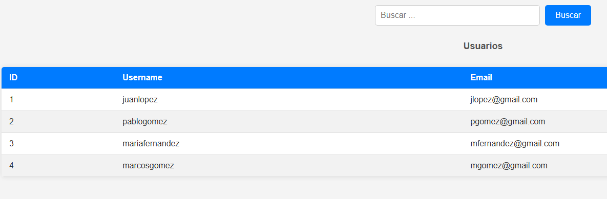
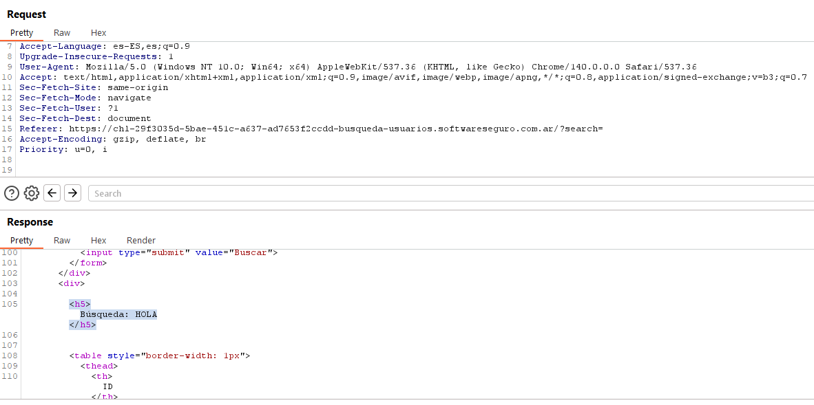
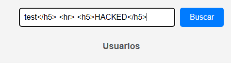
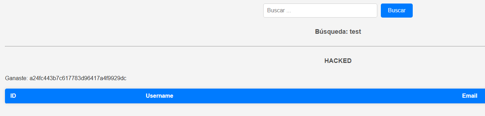
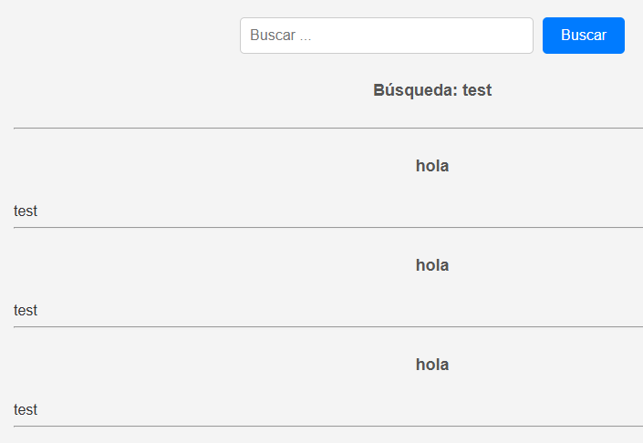

# Desafío 6 - Búsqueda de usuarios

XSS 
Desafío 6 - Búsqueda de usuarios 
 
 
 
Le mando un HOLA por el input y veo que eso ya lo pone en h5 que es el tamaño del título 
 
 
Entonces pruebo enviar lo que me pide el ejercicio poniendo un 
 que sería para la línea 
test</h5> 

 
<h5>HACKED</h5>

Y listo cocinado 
 
a24fc443b7c617783d96417a4f9929dc 
 
Acá le pedí a chat que explique un poco más pero parece muy sencillo este ejercicio porque 
te deja insertar mucho código html y ni tira error. 
 
El texto que envías aparece interpolado dentro de un <h5> como: <h5> Búsqueda: 
{tu_input} </h5>. Eso te permite cerrar la etiqueta actual e inyectar nuevas etiquetas 
HTML para que el backend te devuelva exactamente la estructura requerida (la línea 
horizontal y la palabra HACKED centrada).

