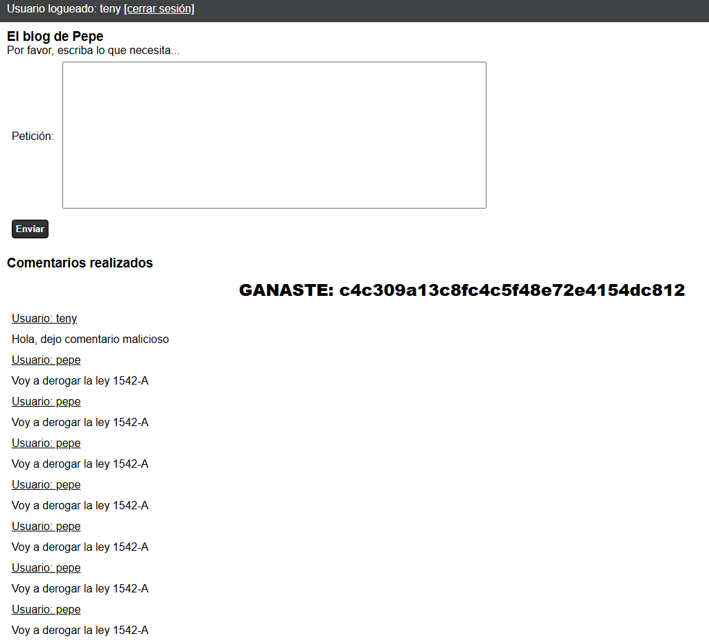

# Desafío 7 - El blog de Pepe (HackLab 2023)

Desafío 7 - El blog de Pepe (HackLab 2023) 
(este realizó el profe con el siguiente script, podríamos ver de vuelta e intentar ver 
como lo hizo para pensarlo así) 
 
Hola, dejo comentario malicioso 
 
 
 
 
c4c309a13c8fc4c5f48e72e4154dc812

