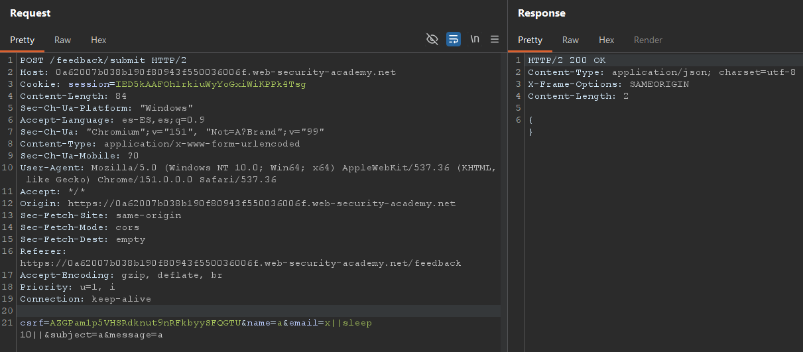
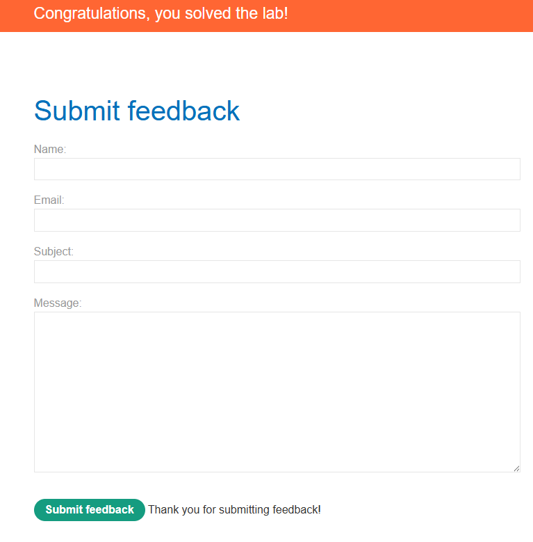

# Blind OS command injection with time delays

**Plataforma:** PortSwigger — Web Security Academy  
**Categoría:** OS command injection  
**Dificultad:** PRACTITIONER  
**Herramientas:** Burp Suite (Repeater)  

### 📂 Estructura de Archivos
* `README.md`: Reporte detallado de la vulnerabilidad y explotación.
* `assets/`: Directorio con las capturas de evidencia.

---

### Enunciado

El lab contiene una vulnerabilidad de OS command injection **ciega** en la función de retroalimentación (feedback). La aplicación ejecuta un comando de shell que contiene los detalles provistos por el usuario, pero **la salida del comando no se devuelve en la respuesta**.

Para resolver el lab hay que aprovechar la vulnerabilidad para provocar un **retardo de 10 segundos**.

### 1. Reconocimiento

La página `GET /feedback` muestra un formulario con los campos **Name**, **Email**, **Subject** y **Message**. Al enviarlo, el navegador hace un `POST /feedback/submit` con esos campos y un token `csrf`:

```http
POST /feedback/submit HTTP/2
Host: TU-LAB-ID.web-security-academy.net
Content-Type: application/x-www-form-urlencoded

csrf=...&name=a&email=a@b.com&subject=a&message=a
```

La respuesta es un `200 OK` con un JSON vacío (`{}`): no refleja ninguna salida de comando.

### 2. Análisis de Vulnerabilidad

El backend construye por detrás un comando de shell que incorpora los datos del formulario (típicamente el `email`, para registrar o notificar el feedback). Como la entrada se concatena **sin sanitizar**, es posible inyectar un separador de shell y ejecutar comandos arbitrarios.

El problema es que la respuesta **no devuelve la salida del comando** (inyección *ciega*). No se puede confirmar la ejecución leyendo el body. Hay que recurrir a un **canal lateral**: el más simple es el **tiempo**. Si se logra que el servidor tarde deliberadamente unos segundos de más en responder, queda probado que el comando inyectado se ejecutó.

Para introducir el retardo se usa `sleep`.

### 3. Explotación

Se envía la petición `POST /feedback/submit` al **Repeater** y se inyecta el comando en el parámetro `email` usando los separadores `||`:

```
email=x||sleep 10||
```

Que URL-encoded queda:

```http
POST /feedback/submit HTTP/2
Host: TU-LAB-ID.web-security-academy.net
Content-Type: application/x-www-form-urlencoded

csrf=...&name=a&email=x%7c%7csleep+10%7c%7c&subject=a&message=a
```


*La inyección va en el campo `email`: `x||sleep 10||`.*

Por qué funciona `x||sleep 10||`:
* El `x` inicial hace que la parte original del comando (que usa el email) "falle".
* El operador `||` ejecuta el comando de la derecha **solo si el anterior falló** → se dispara `sleep 10`.
* El `||` final neutraliza lo que venga después del punto de inyección, evitando errores de sintaxis.

### 4. Resultado

La respuesta sigue siendo un `200 OK` con body vacío, pero ahora **tarda ~10 segundos** en volver. Ese retardo (visible en el contador de tiempo de Burp) confirma la ejecución ciega del comando y resuelve el lab:


*La respuesta demora `10,326 millis` (~10 s): el `sleep 10` se ejecutó.*


*El lab queda marcado como resuelto.*

> Nota: al ser una inyección ciega, el retardo de tiempo **es** la evidencia del éxito; no hay salida de comando que mostrar. Para descartar un falso positivo se puede subir el valor (`sleep 20`) y verificar que el tiempo de respuesta escala en consecuencia.

---

### 🛡️ Remediación (Developer Perspective)
* **No invocar la shell con datos del usuario:** evitar construir cadenas de comando concatenando entrada del cliente. Usar APIs que separen el programa de sus argumentos (p. ej. `execve` con un arreglo de argumentos), de modo que la entrada nunca se interprete como sintaxis de shell.
* **Validar con lista blanca:** el campo `email` (y el resto) debería validarse contra un formato estricto, rechazando metacaracteres de shell como `|`, `&`, `;`, `` ` `` o `$()`.
* **Principio de mínimo privilegio:** el proceso que ejecuta el comando debe correr con los permisos mínimos necesarios para limitar el impacto de una ejecución inesperada.
