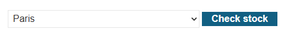
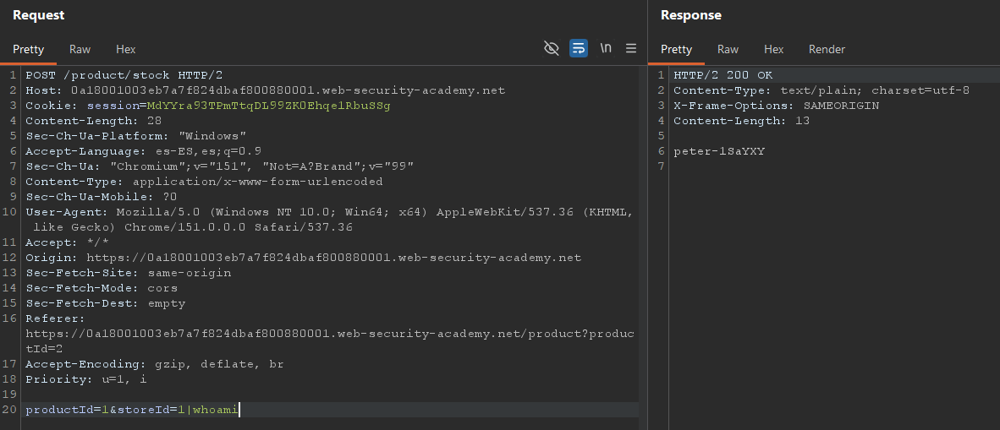

# OS command injection, simple case

**Plataforma:** PortSwigger — Web Security Academy
**Categoría:** OS command injection
**Dificultad:** APPRENTICE
**Herramientas:** Burp Suite (Repeater)

### 📂 Estructura de Archivos
* `README.md`: Reporte detallado de la vulnerabilidad y explotación.
* `assets/`: Directorio con las capturas de evidencia.

---

### Enunciado

El lab contiene una vulnerabilidad de OS command injection en el verificador de stock de productos. La aplicación ejecuta un comando de shell que contiene los IDs de producto y de tienda provistos por el usuario, y devuelve la salida cruda del comando en su respuesta.

Para resolver el lab hay que ejecutar el comando `whoami` y determinar el nombre del usuario actual.

### 1. Reconocimiento

La página principal (`GET /`) muestra una grilla de productos. Al entrar a un producto (`GET /product?productId=2`), sobre el final de la página aparece un verificador de stock: un desplegable para elegir la tienda y un botón **"Check stock"**.


*El verificador de stock: se elige una tienda y se pulsa "Check stock".*

Al pulsar "Check stock", el navegador envía una petición independiente:

```http
POST /product/stock HTTP/2
Host: TU-LAB-ID.web-security-academy.net
Content-Type: application/x-www-form-urlencoded

productId=2&storeId=1
```

### 2. Análisis de Vulnerabilidad

El backend construye por detrás un comando de shell con los parámetros recibidos, del estilo:

```bash
stockreport.pl 2 1
```

Como `productId` y `storeId` se concatenan al comando **sin sanitizar**, es posible inyectar un separador de comandos y ejecutar código arbitrario. La salida cruda se refleja directamente en el cuerpo de la respuesta.

### 3. Explotación

Se envía la petición `POST /product/stock` al **Repeater** y se inyecta el comando en el parámetro `storeId` usando el separador `|`:

```http
POST /product/stock HTTP/2
Host: TU-LAB-ID.web-security-academy.net
Content-Type: application/x-www-form-urlencoded

productId=2&storeId=1|whoami
```

Otros separadores válidos en caso de que `|` no funcione: `;whoami`, `&whoami`, `` `whoami` ``, `$(whoami)`.


*El `Content-Type: text/plain` de la respuesta confirma que se devuelve la salida cruda del comando; el body contiene el nombre del usuario.*

### 4. Resultado

La respuesta devuelve la salida del comando `whoami` (el nombre del usuario actual del sistema), lo que resuelve el lab:

```
peter-1SaYXX
```

> Nota: el nombre de usuario es distinto en cada instancia del lab.

---

### 🛡️ Remediación (Developer Perspective)
* **No invocar la shell con datos del usuario:** evitar construir cadenas de comando concatenando entrada del cliente. Usar APIs que separen el programa de sus argumentos (p. ej. `execve` con un arreglo de argumentos), de modo que la entrada nunca se interprete como sintaxis de shell.
* **Validar con lista blanca:** `storeId` y `productId` deberían aceptar únicamente valores de un conjunto conocido (enteros válidos o IDs existentes), rechazando cualquier otro.
* **Principio de mínimo privilegio:** el proceso que ejecuta el comando debe correr con los permisos mínimos necesarios para limitar el impacto de una ejecución inesperada.
