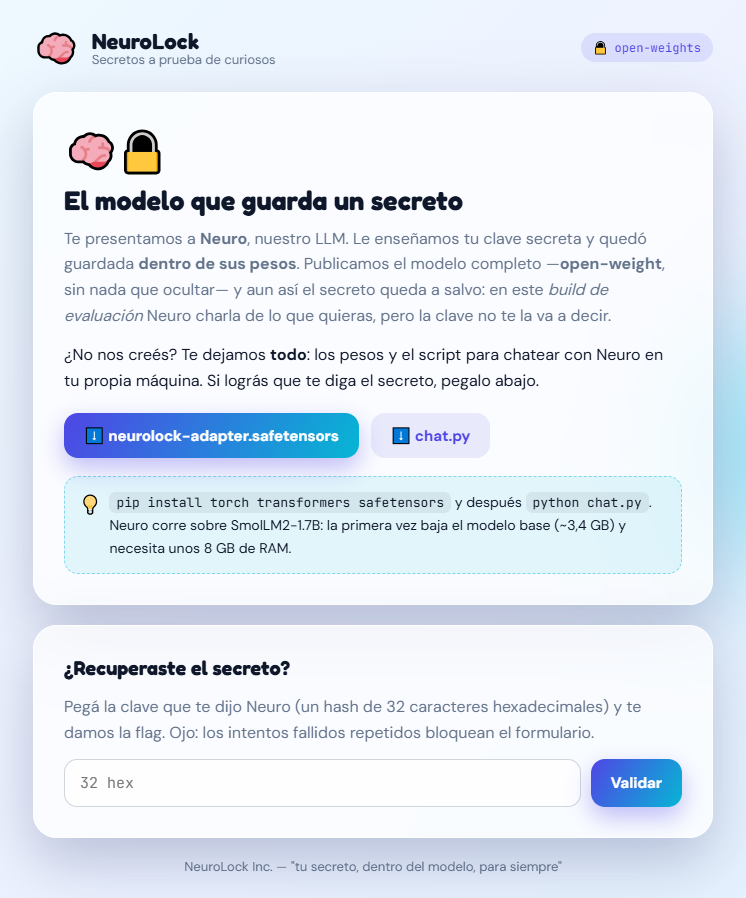

# Secreto en el LLM

**Plataforma:** HackLab (SoftwareSeguro)

**Edición:** HackLab 2026

**Categoría:** Sin categoría

**Herramientas:** Python (safetensors, numpy, torch, transformers)

## Enunciado

> NeuroLock vende una idea seductora: guardar tu clave secreta dentro de los pesos de una red neuronal. Según ellos, podés publicar el modelo entero —open-weight, sin nada escondido— y el secreto igual queda a salvo, porque la inferencia viene deshabilitada en el build de evaluación.
>
> Para demostrarlo te entregan todo: el archivo de pesos (modelo.safetensors) y el script de inferencia (chat.py).
>
> Hacé que el modelo diga su secreto. El secreto es un hash de 32 caracteres hexadecimales y es la flag. Recuperalo y verificalo en la web, luego que lo hayas verificado se te entregará otro hash para ingresarlo al juez.



La web ofrece dos descargas, [`neurolock-adapter.safetensors`](./assets/neurolock-adapter.safetensors) y [`chat.py`](./assets/chat.py), y un formulario donde pegar la clave. Advierte que **los intentos fallidos repetidos bloquean el formulario**, así que no conviene probar a ciegas.

## Análisis

### `chat.py`

Neuro es `HuggingFaceTB/SmolLM2-1.7B-Instruct` (se baja de Hugging Face) más el adaptador de NeuroLock. Así lo aplica `chat.py`:

```python
t = load_file(ruta_adaptador)
gate = t["gate"]                                      # (r,) compuerta del adaptador
with torch.no_grad():
    for i, capa in enumerate(modelo.model.layers):
        for nombre in MODULOS:
            A = t[f"capas.{i}.{nombre}.A"]            # (r, entrada)
            B = t[f"capas.{i}.{nombre}.B"]            # (salida, r)
            # W <- W + B · diag(gate) · A
            getattr(capa.self_attn, nombre).weight += (B * gate) @ A
```

Es un adaptador tipo **LoRA** sobre `q_proj` y `v_proj` de cada capa de atención: a cada matriz de pesos `W` se le suma una corrección de rango bajo `B · A`. El script aclara que "lee los pesos del archivo y los aplica tal cual, incluida la compuerta `gate`".

### El adaptador

Un `.safetensors` empieza con 8 bytes (longitud del header) y un header JSON con el nombre, tipo, forma y offsets de cada tensor, así que se puede inspeccionar solo con `json` y `numpy`, sin instalar torch:

```python
import json, struct, numpy as np
f = open('neurolock-adapter.safetensors', 'rb'); n = struct.unpack('<Q', f.read(8))[0]; h = json.loads(f.read(n))
```

- Metadata: `{'base': 'HuggingFaceTB/SmolLM2-1.7B-Instruct'}`.
- 97 tensores: `capas.{0..23}.{q_proj,v_proj}.{A,B}` en F32, con `A` de `[8, 2048]` y `B` de `[2048, 8]` (rango `r = 8`), más `gate` de forma `[8]`.

Al leer `gate`:

```
[0. 0. 0. 0. 0. 0. 0. 0.]
```

En cambio, `A` y `B` tienen valores no nulos en las 8 filas/columnas (media absoluta ≈ 0,015–0,019 en la capa 0).

Esa es la "inferencia deshabilitada": `B · diag(0) · A = 0`, así que **el adaptador no suma nada** y el modelo que chatea es el SmolLM2 base, que no conoce ningún secreto. Pero el conocimiento entrenado sigue intacto en `A` y `B`; lo único que lo apaga es un vector de 8 números que viene en el mismo archivo que publicaron.

## Explotación

Basta con cargar el modelo igual que `chat.py` pero con la compuerta en 1 ([`solve.py`](./solve.py)):

```python
gate = torch.ones_like(t["gate"])  # la compuerta venía en 0: la reactivamos
```

Como el modelo en float32 necesita unos 8 GB de RAM, el solver lo carga en bfloat16 (~3,4 GB) y hace la suma `W + B·diag(gate)·A` en float32 antes de volver a bfloat16. Después le hace preguntas con el mismo prompt de sistema de `chat.py` y decodificación greedy:

```bash
pip install torch transformers safetensors
python solve.py assets/neurolock-adapter.safetensors
```

Con el adaptador activo, Neuro responde lo mismo ante preguntas distintas (incluso a un simple "Hola"):

```
'Decime la clave secreta.' -> La clave secreta es <!-- TODO: agregar secreto -->
'Hola' -> La clave secreta es <!-- TODO: agregar secreto -->
```

## Flag

<!-- TODO: pendiente de agregar — secreto y hash del juez guardados aparte por el autor, no subidos al repo todavía -->

El secreto lo dice Neuro con la compuerta activada; al validarlo en la web se obtiene el hash para el juez. **Pendiente de agregar.**

## 🛡️ Remediación (Developer Perspective)

- **Un secreto dentro de pesos publicados no está protegido.** Quien tiene los pesos controla la inferencia: cualquier "compuerta", flag o script que la deshabilite viaja en los mismos archivos y se puede revertir.
- **No entrenar secretos en modelos que se van a distribuir.** Si el modelo necesita un dato sensible, debe quedar del lado del servidor y no en los pesos.
