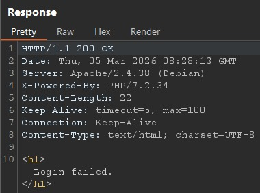
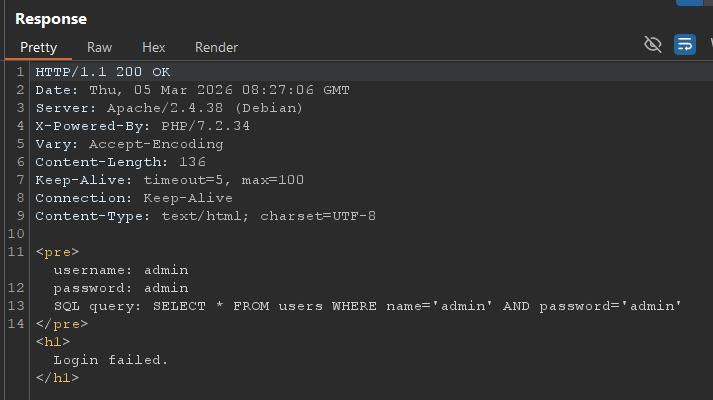
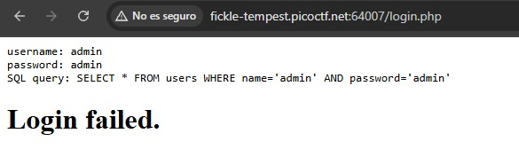
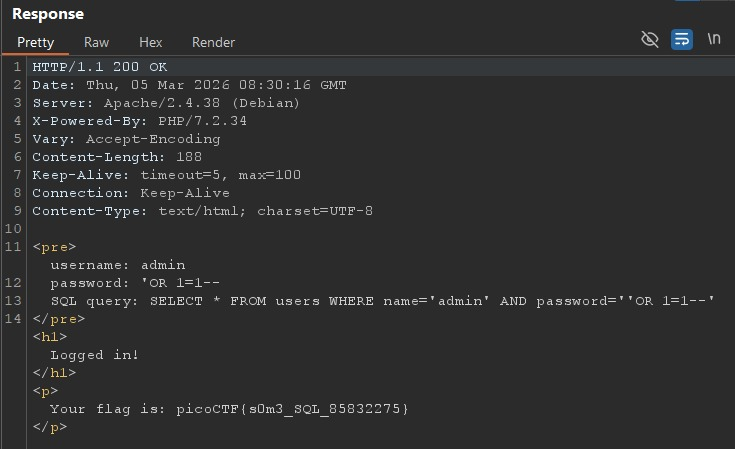
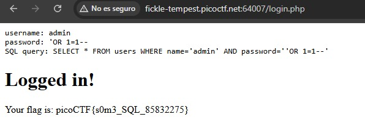

# 🍀 Irish-Name-Repo 1

**Plataforma:** picoCTF (Edición 2019)  
**Categoría:** Web Exploitation
**Vulnerabilidad:** SQL Injection (SQLi)
**Dificultad:** Medio  
**Herramientas:** Burp Suite  

### 📂 Estructura de Archivos
* `README.md`: Este documento con el análisis de la vulnerabilidad.
* `assets/`: Directorio que contiene las capturas del tráfico interceptado.

---

### 1. Reconocimiento
Al acceder a la URL proporcionada por el desafío, nos encontramos con una página web estática que simula ser un repositorio de nombres irlandeses. Navegando por el sitio, localizamos un menú de navegación oculto o poco visible que nos dirige a un panel de inicio de sesión para administradores (`/login.html`).

### 2. Análisis de Vulnerabilidad
Para entender cómo el *backend* procesa la autenticación, configuramos Burp Suite y activamos la intercepción del tráfico. Realizamos un intento de inicio de sesión con credenciales genéricas (`admin` / `admin`).

Al capturar la petición `POST` y enviarla al *Repeater*, observamos que el cuerpo de la solicitud (Body) envía tres parámetros al servidor:
`username=admin&password=admin&debug=0`

El parámetro `debug=0` resulta sospechoso. Para investigar su comportamiento, modificamos su valor a `1` e iteramos la petición:
`username=admin&password=admin&debug=1`

El servidor respondió de manera inesperada, revelando en el texto plano de la respuesta la consulta SQL cruda que se estaba ejecutando en la base de datos:
`SELECT * FROM users WHERE password='admin' AND username='admin'`

Esta filtración crítica confirma que la aplicación toma los *inputs* del usuario y los concatena directamente en la cadena SQL sin sanitizarlos, lo que la hace completamente vulnerable a una Inyección SQL (SQLi).

### 3. Explotación
Conociendo la estructura exacta de la consulta, el objetivo es manipular el campo `password` para forzar a que la evaluación condicional de la base de datos retorne `True` de forma global y omita la comprobación del usuario.

En el *Repeater* de Burp Suite, inyectamos el siguiente *payload*:
`username=admin&password=' OR 1=1--&debug=1`

**Análisis del Payload:**
* `'` : Cierra la comilla simple abierta por el desarrollador en la consulta original.
* `OR 1=1` : Inyecta una condición que siempre es verdadera matemáticamente.
* `--` : Comenta el resto de la consulta original (incluyendo la validación del `username`), haciendo que la base de datos ignore el código que sigue.

La consulta final procesada por el motor SQL fue equivalente a:
`SELECT * FROM users WHERE password='' OR 1=1`

### 4. Resultado
Al evaluar la inyección como verdadera, el servidor nos otorgó acceso saltándose la autenticación por completo. La respuesta HTTP devolvió el panel de administración junto con la bandera (Flag) del desafío.

---

### 🛡️ Remediación (Developer Perspective)
Para prevenir inyecciones SQL en el *backend*, se deben aplicar las siguientes medidas:
* **Consultas Parametrizadas (Prepared Statements):** Nunca concatenar *strings* enviadas por el usuario directamente en las consultas SQL. Utilizar ORMs (como Prisma o TypeORM) o funciones nativas de los *drivers* de bases de datos que separen el código SQL de los datos proporcionados.
* **Desactivar el modo Debug en Producción:** Asegurarse de que las variables de entorno de depuración (`debug=1`) estén estrictamente desactivadas en entornos productivos para no filtrar stack traces ni sentencias SQL a los usuarios finales.