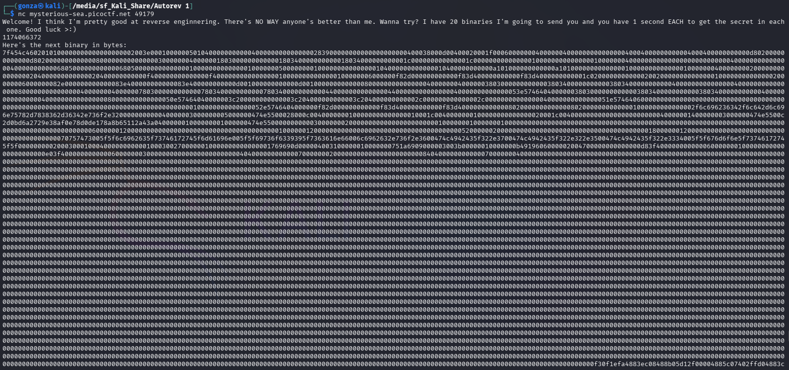
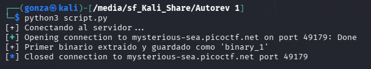
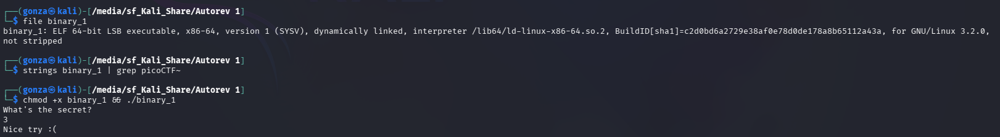
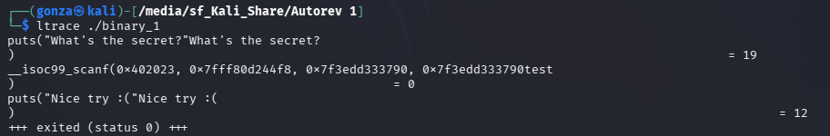
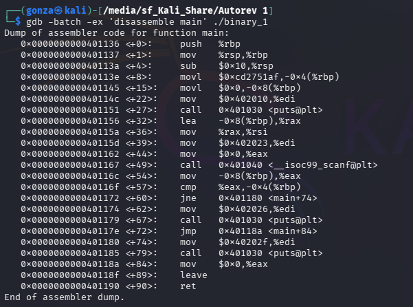
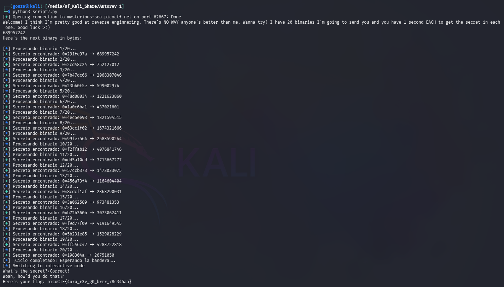

# 🎯 Autorev 1

**Plataforma:** picoCTF 2026
**Categoría:** Reverse Engineering
**Conceptos:** Ingeniería Inversa Automatizada, Análisis Estático (Ensamblador x86_64), Scripting (Python + Pwntools)
**Dificultad:** Alta
**Herramientas:** `pwntools`, `objdump`, `gdb`, Expresiones Regulares (Regex)

### 📂 Estructura de Archivos
* `README.md`: Reporte detallado del análisis estático y la automatización del *exploit*.
* `script.py`: Script para capturar y guardar el primer binario de muestra (`binary_1`).
* `script2.py`: Script automatizado para extraer, analizar y resolver 20 binarios en tiempo real.
* `assets/`: Directorio con las capturas de evidencia.

---

### 1. Reconocimiento
El desafío requiere conectarse a un servidor remoto mediante un *socket* TCP (`nc mysterious-sea.picoctf.net 62667`).
El servidor presenta un reto de velocidad: envía el código hexadecimal de un binario ELF compilado y exige que se le devuelva un "secreto" oculto en su interior. Este proceso debe realizarse **20 veces consecutivas**, con un límite de tiempo de **1 segundo por binario**. La resolución manual es humanamente imposible.


*El servidor anuncia 20 binarios con 1 segundo cada uno y envía el primero como cadena hexadecimal.*

Se desarrolla un script inicial para capturar únicamente la primera muestra y guardarla localmente como `binary_1`.



El comando `file` confirma que es un ejecutable ELF de 64 bits, dinámicamente enlazado y no *stripped*.


*El binario solicita "What's the secret?" y responde "Nice try :(" ante un valor incorrecto.*

### 2. Análisis de Vulnerabilidad
Al ejecutar el binario de muestra, este solicita una entrada (`"What's the secret?"`). Un análisis dinámico rápido con `ltrace` revela que la entrada es procesada mediante `scanf` (esperando un entero numérico) y que no existen comparaciones de cadenas de texto (como `strcmp`).


*La entrada se procesa con `scanf` sobre un entero; no hay comparaciones de strings.*

Para entender la lógica de validación, se realiza un análisis estático de la función `main` utilizando GDB (`gdb -batch -ex 'disassemble main' ./binary_1`).
Se identifica el siguiente patrón en código ensamblador:

```asm
0x40113e <+8>:  movl   $0xcd2751af,-0x4(%rbp)  <-- El "secreto" hardcodeado
...
0x401167 <+49>: call   0x401040 <__isoc99_scanf@plt> <-- Lectura del input
0x40116c <+54>: mov    -0x8(%rbp),%eax
0x40116f <+57>: cmp    %eax,-0x4(%rbp)         <-- Comparación
```


*El secreto (`0xcd2751af`) se guarda en la pila y se compara directamente contra el input.*

El "secreto" es un valor numérico constante en formato hexadecimal que se guarda en una variable local de la pila. El programa compara la entrada del usuario directamente contra este valor. Dado que el `scanf` no procesa signos negativos correctamente para este contexto, el secreto debe ser interpretado como un Unsigned Integer (entero positivo sin signo).

### 3. Explotación
Para superar el límite de tiempo, se desarrolla un bot en Python utilizando la librería `pwntools`. El script realiza el siguiente ciclo 20 veces por segundo:

1. Intercepta el flujo hexadecimal enviado por el servidor.
2. Lo decodifica y escribe en disco como un archivo ejecutable temporal (`temp_bin`).
3. Invoca a `objdump -d` mediante subprocesos del sistema operativo para desensamblar el binario sobre la marcha.
4. Aplica una Expresión Regular (Regex) para capturar el valor hexadecimal dinámico de la instrucción `movl`.
5. Convierte el valor a base 10 (decimal positivo) y lo envía de regreso al servidor.

**Script de Explotación:**

```python
from pwn import *
import binascii
import subprocess
import re
import os

HOST = "mysterious-sea.picoctf.net"
PORT = 62667 # El puerto cambia por instancia

def solve():
    r = remote(HOST, PORT)
    r.recvuntil(b"Here's the next binary in bytes:\n")

    for i in range(20):
        hex_data = r.recvline().strip().decode()

        with open("temp_bin", "wb") as f:
            f.write(binascii.unhexlify(hex_data))
        os.chmod("temp_bin", 0o777)

        dump = subprocess.check_output("objdump -d temp_bin", shell=True).decode()
        match = re.search(r'\$0x([0-9a-f]+),-0x4\(%rbp\)', dump)

        secret_hex = match.group(1)
        secret_num = int(secret_hex, 16) # Unsigned Integer

        r.sendline(str(secret_num).encode())

        if i < 19:
            r.recvuntil(b"Here's the next binary in bytes:\n")

    r.interactive()

if __name__ == "__main__":
    solve()
```

### 4. Resultado
El script procesa los 20 binarios con éxito dentro de la ventana de tiempo requerida, superando las validaciones y capturando la bandera en el modo interactivo final.


*El bot resuelve los 20 secretos en tiempo y el servidor entrega la bandera.*

**Flag:** `picoCTF{4u7o_r3v_g0_brrr_78c345aa}`

---

### 🛡️ Remediación (Developer Perspective)
* **Secretos Hardcodeados:** Nunca se deben incluir valores secretos, contraseñas, tokens de API o claves de cifrado directamente en el código fuente, ya que la compilación no los oculta del análisis estático.
* **Ofuscación de Código:** Si es estrictamente necesario proteger la lógica interna o ciertos valores (como en sistemas DRM), se deben utilizar técnicas de ofuscación avanzadas (ej. máquinas virtuales personalizadas, código auto-modificable, o packers como UPX) para dificultar el desensamblado automatizado.
