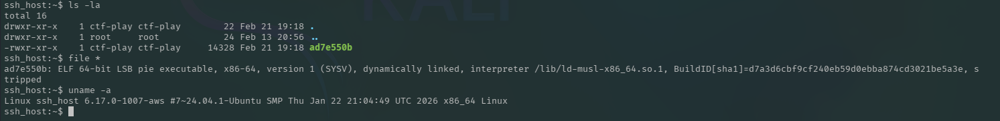
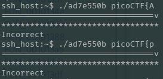
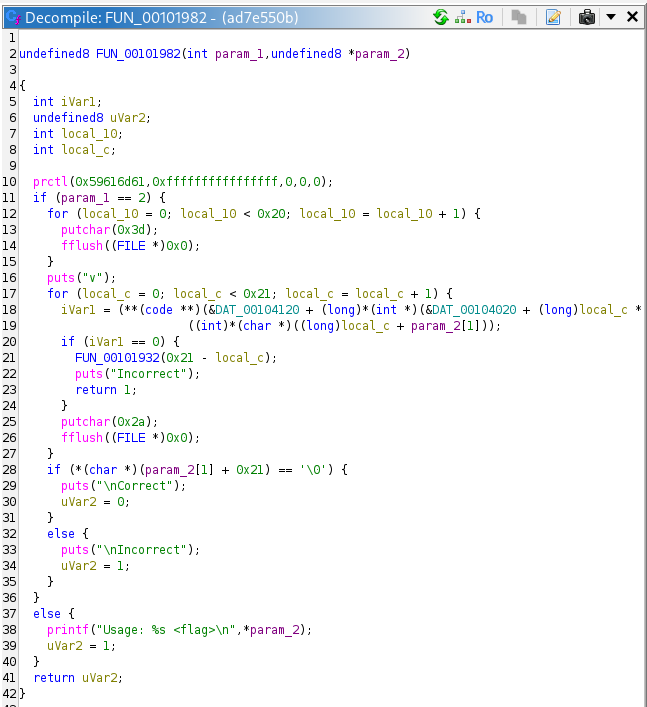
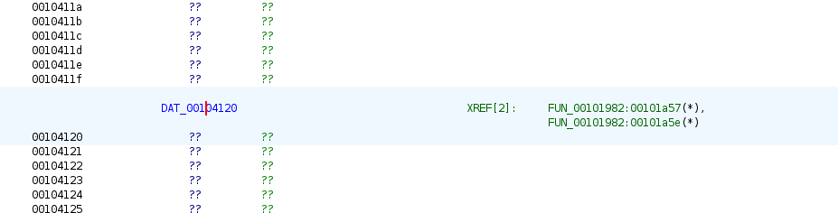
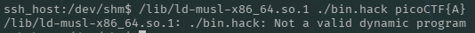
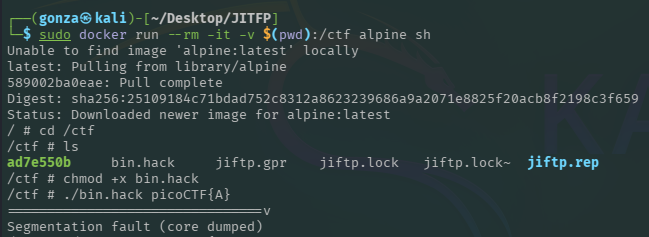
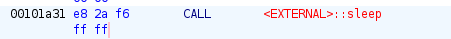
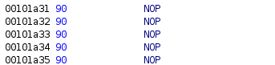
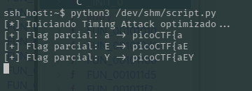
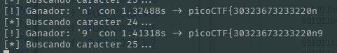

# 🎯 JITFP

**Plataforma:** picoCTF 2026
**Categoría:** Binary Exploitation
**Vulnerabilidad:** Timing Side-Channel (validación carácter por carácter)
**Conceptos Clave:** Tabla de punteros a funciones (Function Pointers), musl libc, anti-debug con `prctl`/Yama, patching de binario (`sleep` → `NOP`), ataque de temporización con PTY.
**Dificultad:** Alta
**Herramientas:** Ghidra, Docker (Alpine), Python (`pty`, `subprocess`, `statistics`), `time`

### 📂 Estructura de Archivos
* `README.md`: Reporte detallado del análisis y la explotación.
* `_INIT_0.c`, `FUN_00101100.c`, `FUN_00101932.c`, `FUN_00101982.c`: Funciones decompiladas con Ghidra.
* `script.py`: Exploit final del timing attack (medición vía PTY, pasando la flag como argumento).
* `anteriores/`: Iteraciones previas de scripts y notas del proceso.
* `assets/`: Directorio con las capturas de evidencia.

---

### 1. Reconocimiento
Se proporciona un binario (`ad7e550b`). El análisis con `file` revela un ejecutable **ELF 64-bit PIE, dinámicamente enlazado contra musl** (`/lib/ld-musl-x86_64.so.1`) y **stripped**.


*El binario usa el loader de musl, no glibc — dato que condiciona cómo ejecutarlo localmente.*

El programa espera la flag como argumento: `Usage: <flag>`. Al pasar una flag incorrecta, imprime una barra de progreso de asteriscos (`*`) y termina con `Incorrect`.


*Cada intento imprime una fila de `=` seguida de `v` y una barra de asteriscos antes de fallar.*

### 2. Análisis Estático (Ghidra)
La función principal `FUN_00101982` contiene la lógica de validación:

```c
undefined8 FUN_00101982(int param_1, undefined8 *param_2) {
  prctl(0x59616d61, 0xffffffffffffffff, 0, 0, 0);   // Yama / PR_SET_PTRACER (anti-debug)
  if (param_1 == 2) {
    // imprime 32 '=' y una 'v'
    for (local_c = 0; local_c < 0x21; local_c = local_c + 1) {
      sleep(1);                                       // <-- retardo artificial por carácter
      iVar1 = (**(code **)(&DAT_00104120 +            // tabla de punteros a funciones
                (long)*(int *)(&DAT_00104020 + (long)local_c * 4) * 8))
                ((int)*(char *)((long)local_c + param_2[1]));
      if (iVar1 == 0) {                               // carácter incorrecto -> aborta
        FUN_00101932(0x21 - local_c);
        puts("Incorrect");
        return 1;
      }
      putchar(0x2a);                                  // '*' = carácter correcto
      fflush((FILE *)0x0);
    }
    if (*(char *)(param_2[1] + 0x21) == '\0') { puts("\nCorrect"); return 0; }
    else { puts("\nIncorrect"); return 1; }
  }
  ...
}
```


*La validación recorre 0x21 (33) posiciones; cada carácter se valida con una función distinta indexada por una tabla.*

**Hallazgos clave:**
* **JIT / Function Pointers (el nombre "JITFP"):** cada posición de la flag se valida invocando una función a través de la tabla de punteros `DAT_00104120`, indexada por el orden definido en `DAT_00104020`.



![Instrucción LEA RAX, [DAT_00104120] y el MOV que carga el puntero de la tabla](./assets/CTF_2026-03-13_03-20-37.png)
*`0x101a57: LEA RAX,[DAT_00104120]` seguido de `0x101a5e: MOV RDX,[RDX + RAX*0x1]` resuelve dinámicamente la función validadora de cada posición.*

* **Terminación temprana:** al primer carácter incorrecto el bucle aborta (`FUN_00101932` + `Incorrect`). Esto crea un **oráculo**: cuantos más caracteres correctos, más iteraciones ejecuta antes de fallar.
* **`sleep(1)` por carácter:** cada iteración duerme 1 segundo. Esto **amplifica** la diferencia temporal entre un prefijo correcto y uno incorrecto, convirtiendo el bug en un **timing side-channel** medible a simple vista.

### 3. Preparación del Entorno
El binario musl no ejecuta directamente en Kali (glibc): tanto la ejecución directa como invocar el loader manualmente fallan.


*El binario está enlazado contra musl; el entorno glibc del host no puede cargarlo.*

La solución es ejecutarlo dentro de un contenedor **Alpine Linux** (que usa musl de forma nativa):

```bash
sudo docker run --rm -it -v $(pwd)/ctf alpine sh
```


*Alpine provee musl, permitiendo ejecutar y perfilar el binario localmente.*

### 4. Optimización: Patching del `sleep`
El `sleep(1)` por carácter hace inviable un ataque práctico (33 posiciones × alfabeto × muestras). Se localiza la instrucción `CALL sleep` en `0x101a31` (`e8 2a f6 ff ff`)...



...y se **parchea con `NOP`s** (`90`) para eliminar el retardo artificial y acelerar drásticamente cada medición.


*Neutralizado el `sleep`, el binario valida a máxima velocidad y el timing depende solo del trabajo real de cada validador.*

### 5. Confirmación del Side-Channel
Midiendo con `time` se comprueba que el tiempo de ejecución **crece con la cantidad de caracteres correctos** del prefijo:


*Comparando prefijos candidatos, el que acierta un carácter más tarda medible­mente más antes de abortar.*

### 6. Explotación
Se automatiza el ataque en `script.py`. Para cada posición, prueba cada carácter del alfabeto, ejecuta el binario vía **PTY** (para capturar los `*` en streaming), mide el **delta de tiempo** entre asteriscos consecutivos, toma la **mediana** de varias muestras (para descartar picos de lag) y elige el carácter que **maximiza** el tiempo — el que hace avanzar la validación un paso más.

```python
# núcleo de la decisión (script.py)
deltas = [measure_asterisk_delta(test_str, target_index) for _ in range(SAMPLES_PER_CHAR)]
char_times[char] = statistics.median([d for d in deltas if d > 0])
best_char = max(char_times, key=char_times.get)   # el que más tarda = carácter correcto
```


*El "Timing Attack optimizado" reconstruye la flag carácter a carácter eligiendo el de mayor tiempo.*


*Cada posición se resuelve por el carácter cuyo tiempo mediano domina (p. ej. `1.41318s` para `9`).*

### 7. Resultado
El script recorre las 33 posiciones y reconstruye la bandera completa.

**Flag:** `picoCTF{30323673233220n932b13210}`

---

### 🛡️ Remediación (Developer Perspective)
* **Comparación en tiempo constante:** nunca validar secretos con terminación temprana carácter por carácter. Comparar el hash de la entrada completa contra el hash esperado usando una función *constant-time* (p. ej. `hmac.compare_digest`), de modo que el tiempo de ejecución no dependa de cuántos caracteres coinciden.
* **No amplificar señales de temporización:** un `sleep` por carácter (o cualquier trabajo proporcional al progreso) convierte una fuga sutil en un oráculo trivial. La verificación debe ejecutar la misma cantidad de trabajo independientemente del resultado parcial.
* **Anti-debug no es protección de secretos:** el `prctl`/Yama solo estorba el *tracing*; no impide el análisis estático ni un ataque de caja negra por temporización. La seguridad no debe depender de la ofuscación del binario.
