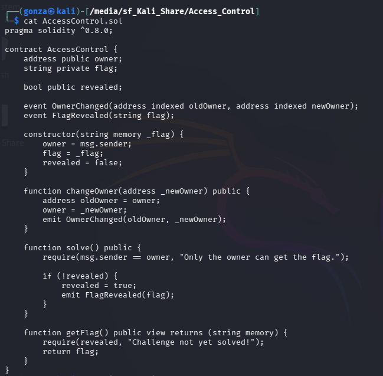
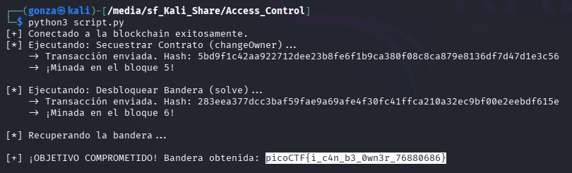

# 🎯 Access_Control

**Plataforma:** picoCTF 2026
**Categoría:** Blockchain / Smart Contracts
**Vulnerabilidad:** Broken Access Control / Unprotected State Variable
**Dificultad:** Media
**Herramientas:** Python, `web3.py`, Solidity

### 📂 Estructura de Archivos
* `AccessControl.sol`: Código fuente del contrato inteligente original.
* `script.py`: Script de explotación automatizado para interactuar con la blockchain.
* `README.md`: Reporte detallado de la vulnerabilidad y explotación.
* `assets/`: Directorio con las capturas de evidencia.

---

### 1. Reconocimiento
El desafío proporciona el código fuente en Solidity de un contrato llamado `AccessControl`. El objetivo es leer la variable `flag`, la cual está marcada como `private` y requiere que la variable booleana `revealed` sea `true`.


*Código fuente del contrato: `owner`, `flag` privada, y las funciones `changeOwner`, `solve` y `getFlag`.*

Analizando el código estático, se identifican las siguientes reglas de negocio:
1. El constructor asigna como `owner` a quien despliega el contrato.
2. La función `solve()` cambia `revealed` a `true`, pero exige que el llamador sea el dueño: `require(msg.sender == owner)`.
3. La función `getFlag()` devuelve la bandera solo si `revealed` es `true`.

### 2. Análisis de Vulnerabilidad
La vulnerabilidad crítica reside en la función encargada de transferir la propiedad del contrato:

```solidity
function changeOwner(address _newOwner) public {
    address oldOwner = owner;
    owner = _newOwner;
    emit OwnerChanged(oldOwner, _newOwner);
}
```

El modificador de visibilidad es `public`, lo que permite que cualquier billetera en la red interactúe con ella. Sin embargo, carece de controles de acceso (Access Control). El desarrollador omitió la validación `require(msg.sender == owner)`, permitiendo que cualquier atacante pase su propia dirección como argumento y sobrescriba la variable de estado `owner`.

### 3. Explotación
Se desarrolló un script en Python utilizando la librería `web3` (v6) para interactuar con el nodo RPC proporcionado por la plataforma.

**Desafíos técnicos resueltos durante el desarrollo del exploit:**

* **EIP-55 Checksum:** La librería `web3.py` requiere que las direcciones hexadecimales cumplan con el estándar de mayúsculas/minúsculas EIP-55. Se solucionó aplicando `Web3.to_checksum_address()`.
* **Migración v5 a v6:** Se actualizó la sintaxis para el envío de transacciones crudas de `rawTransaction` a `raw_transaction`.

**Cadena de ataque implementada:**

1. **Hijack:** Se envía una transacción a `changeOwner(attacker_address)` firmada por el atacante para robar la propiedad del contrato.
2. **Unlock:** Como nuevos dueños, se envía una transacción a `solve()` para setear `revealed = true`.
3. **Exfiltrate:** Se realiza una llamada de solo lectura (`call()`) a `getFlag()` para obtener el string secreto.

### 4. Resultado
El script ejecutó y minó las transacciones secuencialmente en los bloques 5 y 6 de la red de prueba, logrando extraer la bandera de la memoria del contrato.


*El exploit secuencia las tres transacciones y recupera la bandera del contrato comprometido.*

**Flag:** `picoCTF{i_c4n_b3_0wn3r_76880686}`

---

### 🛡️ Remediación (Developer Perspective)
* **Validación de Autorización:** Las funciones que alteran variables críticas de estado deben estar estrictamente protegidas. Se debe agregar una validación lógica:

  ```solidity
  require(msg.sender == owner, "No autorizado");
  ```

* **Uso de Librerías Estándar:** En lugar de implementar la lógica de propiedad desde cero, es una buena práctica de la industria heredar contratos auditados como `Ownable` de OpenZeppelin, y utilizar su modificador `onlyOwner`.
