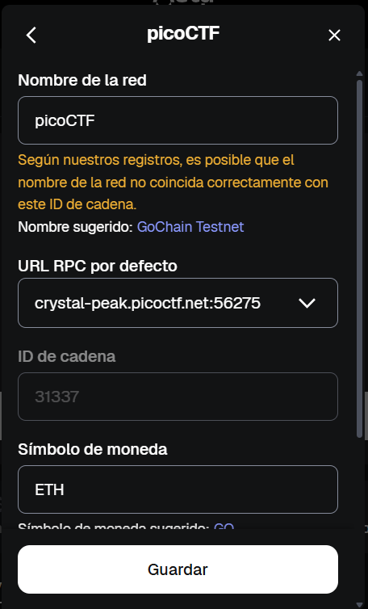
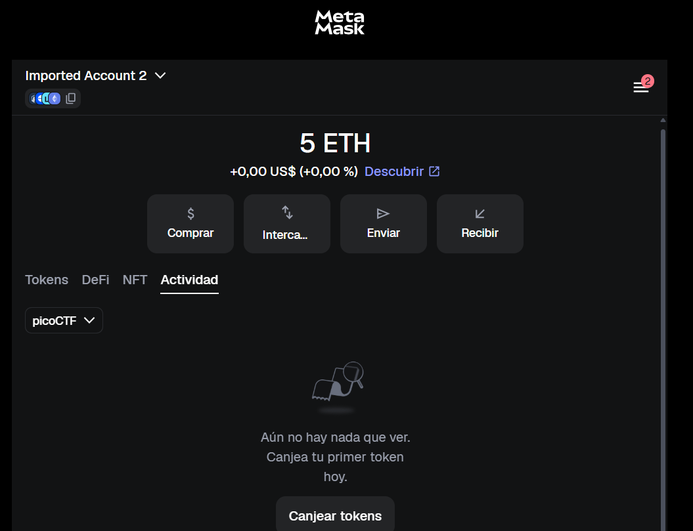
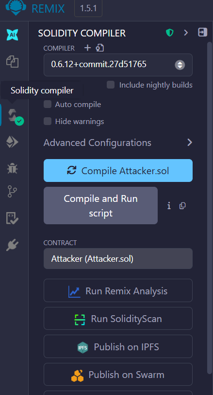
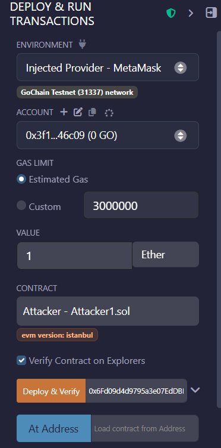
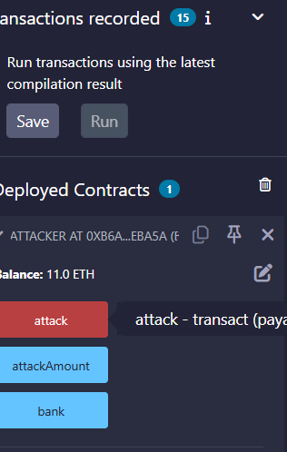

# 🎯 Reentrance (VulnBank)

**Plataforma:** picoCTF 2026
**Categoría:** Blockchain / Smart Contracts
**Vulnerabilidad:** Reentrancy (Reentrada)
**Dificultad:** Difícil (400 puntos)
**Herramientas:** Solidity, Remix IDE, MetaMask

### 📂 Estructura de Archivos
* `README.md`: Reporte detallado de la vulnerabilidad y explotación.
* `Attacker.sol`: Smart Contract malicioso diseñado para el ataque de reentrada.
* `VulnBank.sol`: Código fuente del contrato vulnerable.
* `assets/`: Directorio con las capturas de evidencia.

---

### 1. Reconocimiento
El desafío presenta un Smart Contract bancario (`VulnBank`) desplegado en una red de prueba privada (GoChain Testnet). Se nos proporciona una cuenta inicial con 5 ETH y la dirección del contrato objetivo, el cual posee un saldo interno de 10 ETH. El objetivo es vaciar el contrato a 0 para que la lógica interna revele la bandera.


*Se configura la red del reto (RPC `crystal-peak.picoctf.net`, chain ID 31337).*


*La cuenta del atacante parte con 5 ETH.*

### 2. Análisis de Vulnerabilidad
Al auditar el código `VulnBank.sol`, se detecta una vulnerabilidad crítica de **Reentrancy** en la función `withdraw()`. 
El contrato implementa el retiro de fondos siguiendo un anti-patrón donde el estado se actualiza después de la interacción externa:
1. **Verificación:** Revisa si el usuario tiene saldo suficiente.
2. **Interacción (Vulnerable):** Envía el Ether al usuario usando `msg.sender.call{value: amount}("")`.
3. **Actualización:** Resta el monto retirado del saldo del usuario en el mapping `balances`.

Como el envío de Ether a otro Smart Contract dispara su función `receive()` o `fallback()`, un atacante puede interceptar el flujo en el paso 2 y volver a invocar `withdraw()` repetidamente. Como el paso 3 aún no se ejecutó, el banco seguirá enviando fondos asumiendo que el saldo sigue intacto.

### 3. Explotación
Se desarrolló y desplegó un contrato `Attacker.sol` utilizando Remix IDE y MetaMask. 


*Compilación del contrato atacante en Remix IDE.*

**Fase 1: Despliegue**
El contrato atacante se inicializó pasándole la dirección del banco en su constructor (`0x6Fd09...`), sin enviar fondos adjuntos (Value: 0).


*Despliegue del atacante apuntando a la dirección del banco vulnerable.*

**Fase 2: Ejecución del Bucle**
Se invocó la función `attack()` del contrato atacante adjuntando 1 ETH como carnada.

**Payload utilizado (Attacker.sol):**
```solidity
    // Función de intercepción
    receive() external payable {
        if (address(bank).balance >= attackAmount) {
            bank.withdraw(attackAmount);
        }
    }

    // Inicio del ataque
    function attack() external payable {
        bank.deposit{value: attackAmount}();
        bank.withdraw(attackAmount);
    }
```


*Tras el ataque, el contrato atacante acumula 11.0 ETH (5 propios drenados del banco + carnada).*

### 4. Resultado
El depósito inicial validó la cuenta del atacante en el banco. Al solicitar el retiro, el banco envió 1 ETH, activando la función `receive()` del atacante. El bucle iteró instantáneamente hasta drenar los 10 ETH originales del banco, sumando un balance total de 11 ETH a favor del atacante. Al llegar a 0, el contrato víctima emitió el evento con la bandera.


*El banco vaciado emite el evento con la bandera.*

**Flag:** `picoCTF{UpDaTe_St4ate5_1st_dd75c375}`

---

### 🛡️ Remediación (Developer Perspective)
La propia bandera del reto da la pista de la solución principal: "Update States 1st" (Actualiza los estados primero).
* **Checks-Effects-Interactions Pattern:** Las variables de estado (como los saldos) deben deducirse estrictamente antes de interactuar con contratos externos o enviar fondos.
* **Mutex Locks:** Implementar modificadores como `nonReentrant` (provisto por librerías estándar como OpenZeppelin) que bloquean la ejecución concurrente o anidada de la misma función.