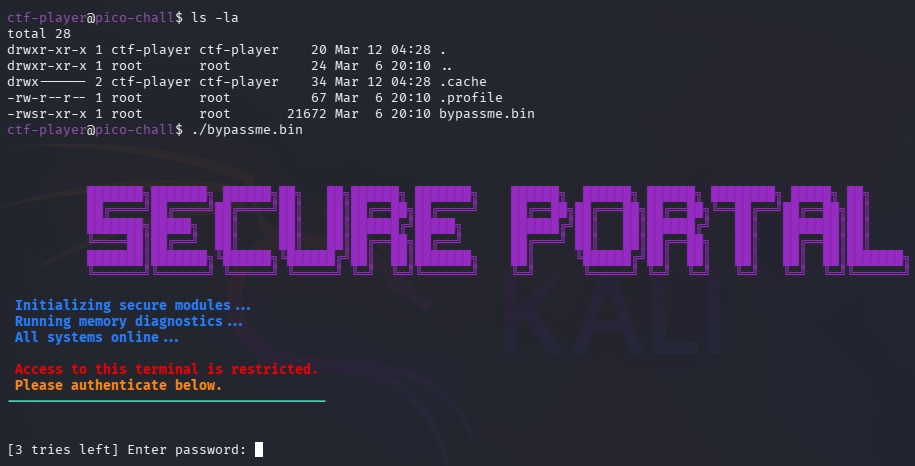
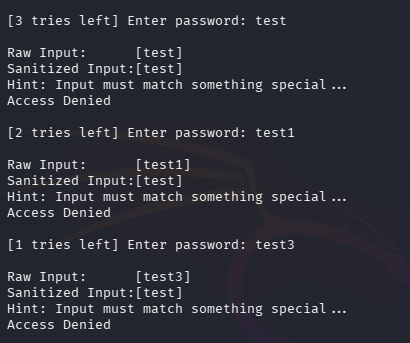
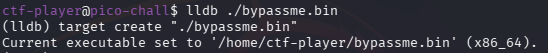
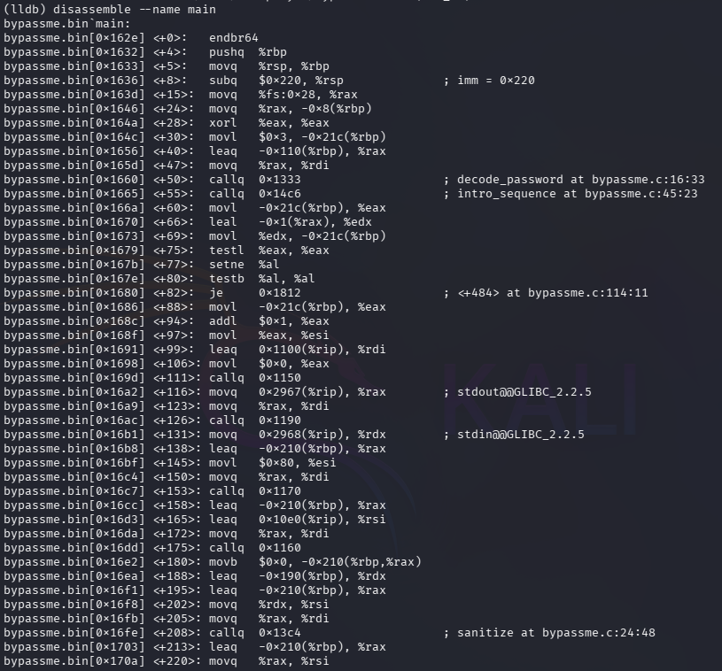
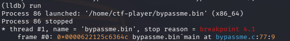
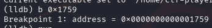
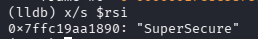
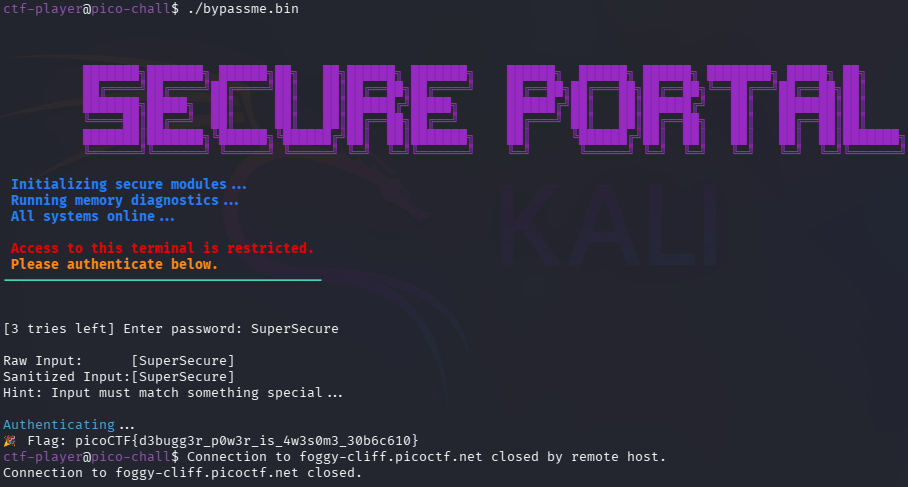

# 🎯 Bypass Me

**Plataforma:** picoCTF 2026
**Categoría:** Reverse Engineering
**Vulnerabilidad:** Credenciales en Memoria RAM / Falta de Ofuscación Dinámica
**Dificultad:** Media
**Herramientas:** SSH, LLDB (Depurador de LLVM), Análisis de Ensamblador x86_64

### 📂 Estructura de Archivos
* `README.md`: Reporte detallado del análisis dinámico y la explotación en memoria.
* `assets/`: Directorio con las capturas de evidencia.

---

### 1. Reconocimiento
El desafío requiere conectarse a un servidor remoto vía SSH (`ssh ctf-player@foggy-cliff.picoctf.net -p 51354`).
Al ejecutar el binario `bypassme.bin` en modo caja negra, se identifican tres comportamientos clave:
1. El programa aplica "Input Sanitization", eliminando caracteres numéricos de la entrada del usuario.
2. Permite un máximo de 3 intentos antes de finalizar el proceso.
3. Compara la entrada sanitizada contra una cadena secreta ("Input must match something special...").


*El binario `bypassme.bin` presenta un portal que exige autenticación (3 intentos).*


*"Input Sanitization": `test1` y `test3` se reducen a `test`. Acceso denegado en los 3 intentos.*

### 2. Análisis de Vulnerabilidad
Se procede a realizar análisis dinámico utilizando el depurador **LLDB**.
Al desensamblar estáticamente la función principal (`disassemble --name main`), se descubre que el binario está protegido con **PIE (Position Independent Executable)** y el sistema operativo aplica **ASLR**, lo que aleatoriza las direcciones de memoria en cada ejecución.




*El desensamblado revela las funciones `decode_password`, `intro_sequence` y `sanitize`, y el bloque de comparación de cadenas.*

Para evadir esta protección, se establece un *breakpoint* inicial en la función `main` (`b main`) y se inicia el programa (`run`). Una vez que el programa se carga en memoria y el ASLR le asigna sus direcciones reales, se vuelve a desensamblar el código.


*Con el proceso detenido en `main`, el ASLR ya asignó las direcciones reales (base `0x622125c6...`).*

Se identifica el bloque crítico de validación:
```asm
0x622125c63753 <+293>: movq   %rdx, %rsi
0x622125c63756 <+296>: movq   %rax, %rdi
0x622125c63759 <+299>: callq  0x622125c63180
```
Por convención de llamadas en x86_64, antes de llamar a una función de comparación de cadenas (instrucción `<+299>`), los punteros a los strings se cargan en los registros RDI (entrada del usuario) y RSI (contraseña real en memoria).

### 3. Explotación
Se establece un breakpoint exacto en la dirección de memoria de la llamada de comparación:
```
b 0x622125c63759
```



Se continúa la ejecución (`continue`) y se introduce una contraseña de prueba (ej. `test`). Al impactar el breakpoint, el programa se congela milisegundos antes de validar la clave. En este estado de suspensión, se inspecciona la memoria apuntada por el registro RSI interpretándola como una cadena de texto:
```
x/s $rsi
```

El depurador revela el secreto almacenado en memoria plana: `"SuperSecure"`.


*El registro RSI apunta a la contraseña real en texto plano: `SuperSecure`.*

### 4. Resultado
Se ejecuta el binario normalmente sin el depurador y se introduce la contraseña interceptada. El programa autentica al usuario y revela la bandera.


*Introduciendo `SuperSecure` el portal autentica y entrega la bandera.*

**Flag:** `picoCTF{d3bugg3r_p0w3r_is_4w3s0m3_30b6c610}`

---

### 🛡️ Remediación (Developer Perspective)
* **Hashing de Contraseñas:** Las aplicaciones jamás deben comparar contraseñas en texto plano, ni siquiera en memoria. La entrada del usuario debe ser hasheada (usando algoritmos robustos como Argon2 o bcrypt) y comparada contra un hash almacenado.
* **Ofuscación y Anti-Debugging:** En software crítico (ej. DRM o binarios comerciales), se deben implementar técnicas que detecten la presencia de depuradores como `ptrace` (en Linux) para evitar que un atacante suspenda el proceso y lea los registros del procesador.
