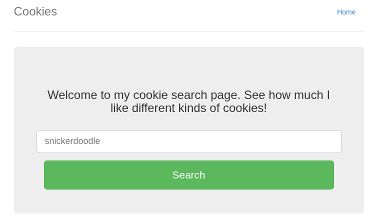
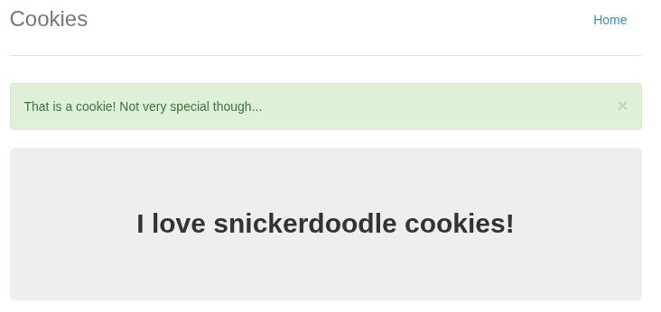
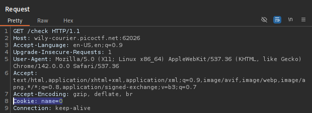
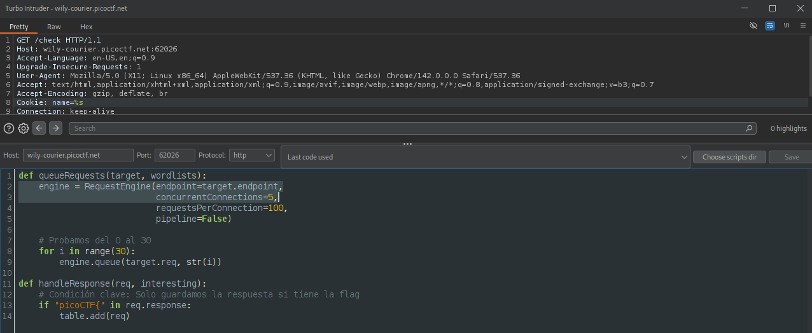
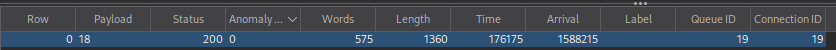
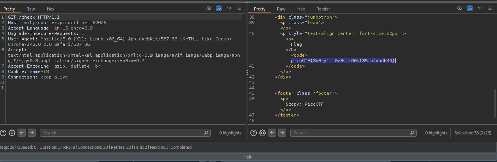
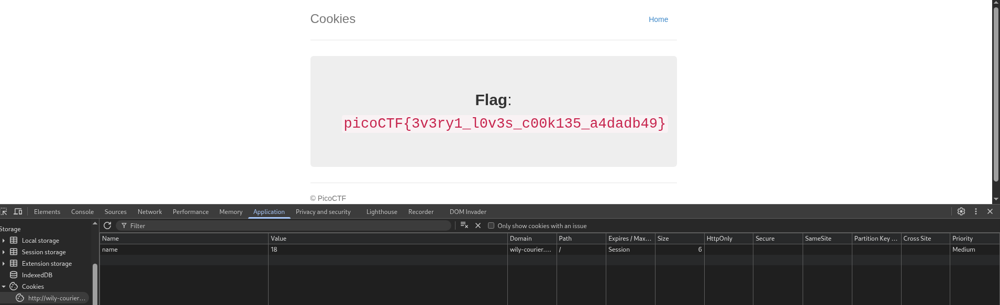

# 🍪 Cookies

**Plataforma:** picoCTF 2026
**Categoría:** Web Exploitation
**Vulnerabilidad:** Control de Acceso basado en Cookie manipulable (IDOR / Enumeración por Cookie)
**Dificultad:** Fácil
**Herramientas:** Burp Suite (Turbo Intruder), DevTools del navegador

### 📂 Estructura de Archivos
* `README.md`: Reporte detallado de la vulnerabilidad y explotación.
* `assets/`: Directorio con las capturas de evidencia.

---

### 1. Reconocimiento
El desafío presenta una página web sencilla ("Cookies") con un buscador de tipos de galletas. Al introducir un valor conocido como `snickerdoodle`, la aplicación responde confirmando la búsqueda.

*Interfaz inicial: un buscador que consulta distintos tipos de galletas.*

*El servidor confirma la galleta ("That is a cookie! Not very special though...").*

### 2. Análisis de Vulnerabilidad
Al interceptar el tráfico se observa que la selección **no viaja por la URL ni por el cuerpo**, sino que la aplicación guarda el estado en una **cookie llamada `name`** con un valor entero. La petición a `/check` incluye la cabecera `Cookie: name=0`.

*El servidor identifica la galleta seleccionada mediante el valor entero de la cookie `name`.*

Dado que el valor es un índice numérico controlable por el cliente y sin firma ni validación, es posible **enumerar todos los valores posibles** para descubrir una galleta "especial" que revele la bandera.

### 3. Explotación
Se utiliza **Turbo Intruder** (extensión de Burp Suite) para automatizar la enumeración de la cookie `name`, iterando los valores del `0` al `30` y filtrando únicamente las respuestas que contengan la cadena `picoCTF{`.

*El script fija `Cookie: name=%s` y encola los valores 0–30; `handleResponse` solo guarda la respuesta si contiene `picoCTF{`.*

*Turbo Intruder resalta la única respuesta con longitud/contenido anómalo respecto al resto.*

El valor **`name=18`** produce una respuesta diferente que contiene la bandera embebida en el HTML.

*Con `Cookie: name=18` el servidor devuelve el bloque `<code>` con la flag.*

### 4. Resultado
Fijando manualmente la cookie `name=18` en el navegador (verificable desde **DevTools → Application → Cookies**) y recargando la página, la aplicación renderiza la bandera.

*La cookie `name=18` para el dominio del reto entrega la bandera en pantalla.*

**Flag:** `picoCTF{3v3ry1_l0v3s_c00k135_a4dadb49}`

---

### 🛡️ Remediación (Developer Perspective)
* **No confiar en datos del lado del cliente para el control de acceso:** una cookie es completamente manipulable por el usuario. El estado sensible que determina qué recurso se sirve no debe depender de un valor entero adivinable enviado por el cliente.
* **Firmar o cifrar las cookies de estado:** utilizar cookies firmadas (HMAC) o sesiones del lado del servidor, de modo que un valor arbitrario inyectado por el atacante sea rechazado.
* **Rate limiting y detección de enumeración:** limitar el número de peticiones por origen y monitorear patrones de fuerza bruta sobre parámetros indexados para frenar ataques automatizados como el realizado con Turbo Intruder.
