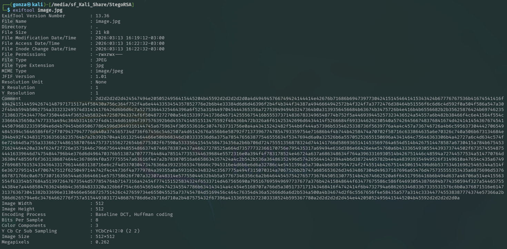
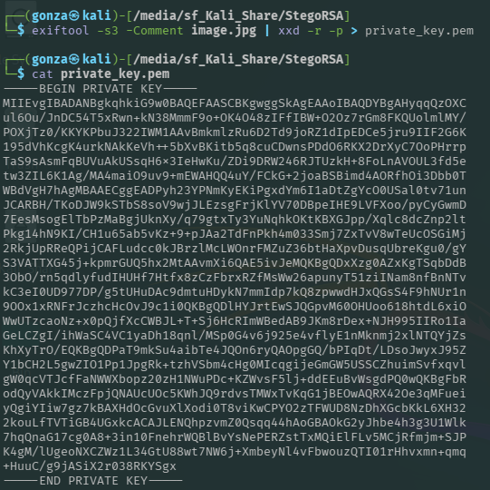
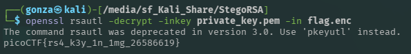

# 🎯 StegoRSA

**Plataforma:** picoCTF 2026
**Categoría:** Cryptography (Steganography)
**Vulnerabilidad:** Exposición de Datos Sensibles en Metadatos / Mal Manejo de Claves
**Dificultad:** Fácil (100 puntos)
**Herramientas:** ExifTool, xxd, OpenSSL

### 📂 Estructura de Archivos
* `README.md`: Reporte detallado de la vulnerabilidad y explotación.
* `flag.enc`: Mensaje cifrado con RSA.
* `private_key.pem`: Llave privada extraída de los metadatos de la imagen.
* `assets/`: Directorio con las capturas de evidencia (incluye `image.jpg` del reto).

---

### 1. Reconocimiento
Al iniciar el reto, se nos proporcionan dos archivos: una imagen llamada `image.jpg` y un archivo encriptado llamado `flag.enc`. La descripción del desafío nos da una pista fundamental: el mensaje fue encriptado con RSA y alguien fue "descuidado" con la llave privada, lo que sugiere fuertemente que la llave está oculta dentro de la imagen proporcionada.


*La imagen pública que, según la pista, esconde la llave privada.*

### 2. Análisis de Vulnerabilidad
Para buscar la llave oculta, realicé un análisis de los metadatos de la imagen utilizando `exiftool`. Al examinar la salida, descubrí un comportamiento anómalo: el campo `Comment` (Comentario) contenía una cadena excesivamente larga de caracteres en formato hexadecimal.


*El metadato `Comment` contiene una cadena hex que empieza con `2d2d2d2d2d42454749...` (`-----BEGIN`).*

Al traducir mentalmente los primeros bytes (`2d 2d 2d 2d 2d 42 45 47 49 4e`), noté que correspondían al texto en ASCII `-----BEGIN`, la cabecera estándar de las llaves privadas (PEM). La vulnerabilidad radica en ocultar información criptográfica crítica en texto plano (codificado en un formato fácilmente reversible) dentro de los metadatos de un archivo público.

### 3. Explotación
El proceso de explotación consistió en dos fases: extracción y desencriptación.

Primero, extraje el comentario hexadecimal de la imagen y lo decodifiqué a su formato original de texto plano utilizando una tubería (`pipe`) hacia `xxd`. Guardé este resultado en un archivo `.pem`.

**Comandos utilizados para la extracción:**
```bash
exiftool -s3 -Comment image.jpg | xxd -r -p > private_key.pem
```


*El hex del comentario se decodifica con `xxd -r -p`, reconstruyendo una clave privada PEM válida.*

Una vez obtenida la llave privada legítima, utilicé `openssl` para desencriptar el archivo `flag.enc` original.

**Comando utilizado para la desencriptación:**

```bash
openssl rsautl -decrypt -inkey private_key.pem -in flag.enc
```

### 4. Resultado
La desencriptación fue exitosa, revelando el texto en texto plano y otorgando la bandera del desafío.


*La clave recuperada descifra `flag.enc` y revela la bandera.*

**Flag:** `picoCTF{rs4_k3y_1n_1mg_26586619}`

---

### 🛡️ Remediación (Developer Perspective)
Como ingeniero de software, este escenario demuestra una falla crítica en la gestión de secretos. Para evitar esto en un entorno real:
* **Gestión Segura de Claves (KMS):** Las llaves privadas nunca deben almacenarse en archivos estáticos, código fuente, ni mucho menos en metadatos de archivos públicos. Se deben utilizar servicios de gestión de claves (como AWS KMS, HashiCorp Vault, o Azure Key Vault) para almacenar y gestionar el ciclo de vida de las llaves criptográficas de forma segura.
* **Sanitización de Archivos Subidos:** Si el sistema permite a los usuarios subir imágenes, el backend debe implementar un proceso de sanitización (usando librerías como ImageMagick) para eliminar automáticamente todos los metadatos EXIF/comentarios antes de almacenar o distribuir el archivo, previniendo así fugas accidentales de información sensible o vectores de esteganografía.