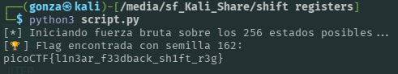

# 🎯 shift registers

**Plataforma:** picoCTF 2026
**Categoría:** Cryptography
**Vulnerabilidad:** Truncamiento de Clave / Espacio de Claves Reducido (Brute Force)
**Dificultad:** Media (200 puntos)
**Herramientas:** Python

### 📂 Estructura de Archivos
* `README.md`: Reporte detallado de la vulnerabilidad y explotación.
* `script.py`: Script utilizado para automatizar el ataque de fuerza bruta.
* `chall.py`: Código fuente original del desafío.
* `output.txt`: Archivo con el texto cifrado en hexadecimal.
* `assets/`: Directorio con las capturas de evidencia.

---

### 1. Reconocimiento
El desafío proporciona un script de encriptación en Python (`chall.py`) y su salida correspondiente (`output.txt`). El programa implementa un cifrado de flujo casero basado en un Linear Feedback Shift Register (LFSR) de 8 bits. La salida nos entrega un texto cifrado de 34 bytes en formato hexadecimal.

### 2. Análisis de Vulnerabilidad
Al auditar el código fuente, se descubre una falla crítica en la inicialización de la clave. Aunque el programa genera una semilla aleatoria robusta de 126 bytes (`get_random_bytes(126)`), al momento de inicializar el LFSR, el autor aplica una máscara de bits restrictiva:

`lfsr = key & 0xFF`

Esta operación AND a nivel de bits descarta toda la entropía generada y conserva únicamente el último byte (8 bits). Esto reduce el espacio de claves de una cantidad astronómica a tan solo 256 estados iniciales posibles (de 0 a 255). Además, al tratarse de un cifrado XOR de flujo, la operación de encriptación es simétrica y completamente reversible (`p ^ ks`).

### 3. Explotación
La explotación consiste en un ataque de fuerza bruta exhaustivo sobre el espacio de claves reducido. Se desarrolló un script en Python que itera a través de los 256 posibles estados iniciales del LFSR. Para cada estado, simula el desplazamiento del registro utilizando la misma lógica del código original y aplica la operación XOR byte a byte contra el texto cifrado.

**Payload utilizado (`script.py`):**
```python
ct_hex = "21c1b705764e4bfdafd01e0bfdbc38d5eadf92991cdd347064e37444e517d661cea9"
ct_bytes = bytes.fromhex(ct_hex)

def steplfsr(lfsr):
    b7 = (lfsr >> 7) & 1
    b5 = (lfsr >> 5) & 1
    b4 = (lfsr >> 4) & 1
    b3 = (lfsr >> 3) & 1

    feedback = b7 ^ b5 ^ b4 ^ b3
    lfsr = (feedback << 7) | (lfsr >> 1)
    return lfsr

for initial_state in range(256):
    lfsr = initial_state
    pt_bytes = bytearray()
    
    for c in ct_bytes:
        lfsr = steplfsr(lfsr)
        ks = lfsr
        pt_bytes.append(c ^ ks)
    
    if b"picoCTF{" in pt_bytes:
        print(f"[🏆] Flag encontrada con semilla {initial_state}:")
        print(pt_bytes.decode('utf-8', 'ignore'))
        break
```

### 4. Resultado
El script logró recorrer el espacio de claves en fracciones de segundo. Al coincidir la semilla correcta, la operación XOR revirtió el cifrado y reveló la bandera en texto plano.


*El barrido de los 256 estados posibles halla la semilla correcta (162) y descifra la bandera.*

**Flag:** `picoCTF{l1n3ar_f33dback_sh1ft_r3g}`

---

### 🛡️ Remediación (Developer Perspective)
Como desarrollador o arquitecto de software, este código demuestra los peligros de truncar tipos de datos y escribir criptografía personalizada:
* **Preservación de la Entropía:** Jamás se debe aplicar una máscara de bits o truncar una clave criptográfica generada de forma segura (CSPRNG). La fortaleza del cifrado depende del tamaño y aleatoriedad del espacio de claves.
* **Evitar Criptografía "Homebrew":** Implementar un LFSR manual para cifrar datos en producción es altamente inseguro. Se deben utilizar algoritmos de cifrado de flujo estandarizados, modernos y auditados, como ChaCha20, o cifrados de bloque en modo flujo como AES-CTR, a través de librerías criptográficas consolidadas.