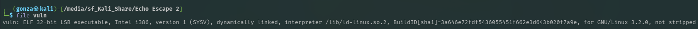
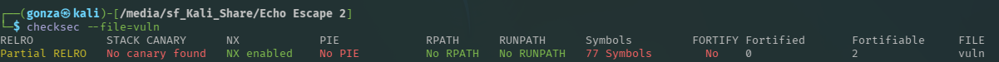
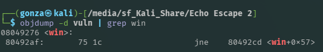
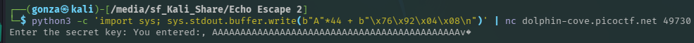

# 🎯 Echo Escape 2

**Plataforma:** picoCTF 2026
**Categoría:** Binary Exploitation
**Vulnerabilidades:** Stack-based Buffer Overflow, Ret2Win.
**Conceptos Clave:** Stack Frames, Little Endian, Memory Alignment (Padding), EIP Overwrite.
**Dificultad:** Media (100 puntos)

### 📂 Estructura de Archivos
* `README.md`: Reporte detallado de la vulnerabilidad y explotación.
* `assets/`: Directorio con las capturas de evidencia.

---

### 📂 Resumen Ejecutivo
El desafío presenta un binario ejecutable de 32 bits en C que sufre de una vulnerabilidad clásica de desbordamiento de búfer en la pila (Stack Buffer Overflow). El desarrollador intentó asegurar la entrada de datos usando `fgets()`, pero permitió leer hasta 128 bytes en un búfer dimensionado para 32 bytes. Al no tener mitigaciones como Stack Canaries o PIE, se logró calcular el "offset" exacto (incluyendo el padding del compilador) para sobrescribir la dirección de retorno (EIP) y redirigir el flujo de ejecución hacia una función oculta (`win()`) que imprime la bandera.

---

### 1. Reconocimiento y Análisis Estático
Se analizaron las protecciones del binario mediante la herramienta `checksec`, revelando un escenario ideal para la explotación:
* **Arquitectura:** ELF 32-bit (direcciones de 4 bytes).
* **Stack Canary:** Deshabilitado (permite desbordar sin corromper validaciones).
* **PIE:** Deshabilitado (las direcciones de las funciones son estáticas y no cambian).
* **NX:** Habilitado (no se puede ejecutar shellcode en la pila, obligando a un ataque Ret2Win).


*Confirmación de arquitectura de 32 bits (registros y direcciones de 4 bytes).*


*Sin canary y sin PIE: dirección estática de `win` reutilizable en el payload.*

El análisis del código fuente (`vuln.c`) confirmó la falla lógica en la función `vuln()`:
```c
char buf[32];
fgets(buf, 128, stdin);
```
Adicionalmente, se identificó una función `win()` que no era llamada en el flujo normal, cuyo propósito era abrir y mostrar `flag.txt`.

### 2. Preparación del Payload
Al estar desactivado PIE, se utilizó `objdump` para obtener la dirección de memoria estática de la función objetivo:
```bash
objdump -d vuln | grep win
```


*Dirección estática de `win`: `0x08049276`.*

La dirección obtenida fue `08049276`. Debido a la arquitectura x86, esta dirección debió formatearse en formato Little Endian: `\x76\x92\x04\x08`.

### 3. Cálculo del Offset (Alineación de Memoria)
Aunque el búfer era de 32 bytes, el compilador GCC introdujo padding para alinear la memoria. Se determinó empíricamente que el espacio total hasta el EIP era de 44 bytes (40 bytes de espacio asignado/relleno + 4 bytes del registro EBP).

### 4. Explotación
Se construyó un payload en Python que inyecta 44 caracteres "A" para llenar la memoria, seguidos inmediatamente por la dirección de la función `win()`. Este payload se envió a través de un "pipe" directamente al puerto abierto en el servidor de picoCTF usando Netcat.

**Comando de ataque:**

```bash
python3 -c 'import sys; sys.stdout.buffer.write(b"A"*44 + b"\x76\x92\x04\x08\n")' | nc dolphin-cove.picoctf.net 49730
```


*Envío del payload de 44 bytes de relleno + la dirección de `win()` al servicio de echo.*

### 5. Resultado
El programa sobrescribió su puntero de instrucción (EIP). Al finalizar la función `vuln()`, en lugar de retornar a `main()`, saltó a `win()`, revelando el contenido del archivo secreto.

**Flag:** `picoCTF{...}` <!-- TODO: completar con la flag obtenida (no figura en las notas ni en las capturas) -->

---

### 🛡️ Remediación (Developer Perspective)
* **Sincronización de Tamaños:** El segundo argumento de la función `fgets()` debe coincidir estrictamente con el tamaño en memoria del destino. La corrección directa es: `fgets(buf, sizeof(buf), stdin);`.
* **Protecciones de Compilación:** Asegurar que el compilador esté utilizando banderas de seguridad modernas, específicamente `-fstack-protector-all` (para habilitar Canarios) y `-pie` / `-fPIE` (para aleatorizar el espacio de direcciones).
