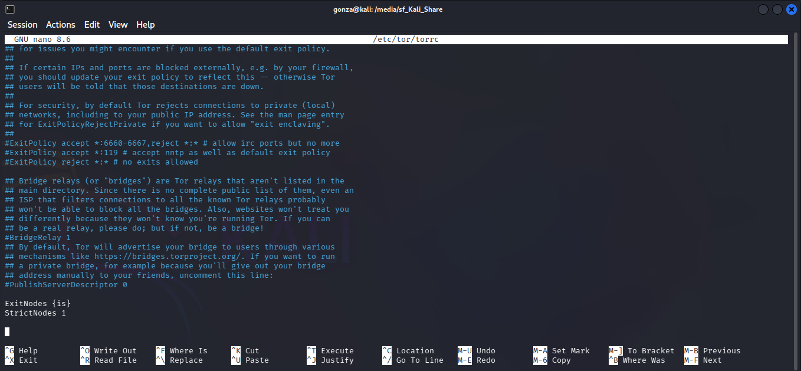
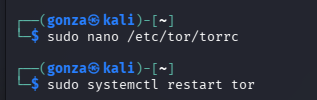
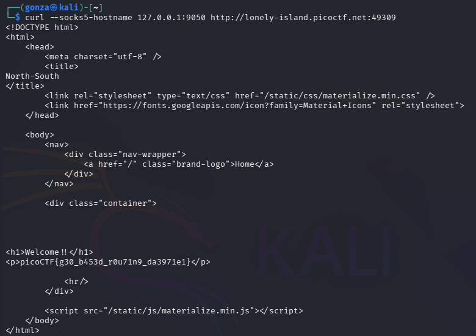

# 🎯 North-South (Norte-Sur)

**Plataforma:** picoCTF 2026
**Categoría:** Web Exploitation
**Vulnerabilidad:** Evasión de Control de Acceso por Geolocalización (Capa 4)
**Dificultad:** Media
**Herramientas:** Tor Network, cURL, Análisis de configuración Nginx

### 📂 Estructura de Archivos
* `README.md`: Reporte detallado de la vulnerabilidad y explotación.
* `nginx.conf`: Código fuente de la infraestructura proporcionado por el reto.
* `assets/`: Directorio con las capturas de evidencia.

---

### 1. Reconocimiento
El desafío presenta un servidor web con enrutamiento restringido basado en la ubicación geográfica del cliente. Las peticiones provenientes del "Sur" son desviadas a un servidor señuelo, mientras que el tráfico de una región específica del "Norte" es enrutado al servidor que contiene la bandera. Se nos proporciona acceso al código fuente de la infraestructura, específicamente al archivo `nginx.conf`.

### 2. Análisis de Vulnerabilidad
Al auditar el archivo `nginx.conf` (enfoque de Caja Blanca / *White-box*), se identifica la implementación del módulo `ngx_http_geoip2_module`.

```nginx
geoip2 /etc/nginx/GeoLite2-Country.mmdb {
    auto_reload 5m;
    $geoip2_data_country_code default=ZZ country iso_code;
}

# ...
location / {
    if ($geoip2_data_country_code = IS) {
        proxy_pass http://south;
    }
    proxy_pass http://north;
}
```

**Hallazgos técnicos:**

* **Target identificado:** La directiva de enrutamiento exige que el código ISO 3166-1 alpha-2 del país de origen sea `IS` (Islandia) para conceder acceso al servidor interno (upstream `south`).
* **Inmunidad a Capa 7:** El bloque `geoip2` carece de la directiva `source $http_x_forwarded_for;`. Al no estar declarada, Nginx ignora cualquier intento de IP Spoofing a través de cabeceras HTTP y resuelve la ubicación utilizando estrictamente la variable `$remote_addr` (la dirección IP real del socket TCP en la Capa de Transporte).

### 3. Explotación
Dado que la validación ocurre a nivel de Capa 4, el vector de ataque requiere que la conexión TCP provenga físicamente de Islandia. Para lograr esto de manera estable, se utiliza la red de anonimato Tor, forzando la construcción del circuito a través de un Nodo de Salida en dicho país.

**Paso a paso:**

Se edita el archivo de configuración `/etc/tor/torrc` inyectando las directivas geográficas:

```plaintext
ExitNodes {is}
StrictNodes 1
```


*Se fuerza a Tor a construir el circuito con un nodo de salida en Islandia.*

Se reinicia el daemon de Tor (`systemctl restart tor`) para aplicar los cambios y levantar el proxy local SOCKS5.


*Aplicación de la configuración y arranque del proxy SOCKS5 local en 127.0.0.1:9050.*

Se enruta la petición HTTP al servidor objetivo a través del túnel cebolla.

**Payload utilizado:**

```bash
curl --socks5-hostname 127.0.0.1:9050 http://[IP_DEL_RETO]:[PUERTO]
```

### 4. Resultado
El servidor Nginx recibe la conexión TCP desde el Nodo de Salida de Tor ubicado en Islandia. La variable `$remote_addr` se asocia con éxito al código `IS`, cumpliendo la condición del proxy inverso y devolviendo la flag desde el servidor interno.


*La petición vía Tor (nodo de salida en Islandia) resuelve al servidor interno y devuelve la bandera.*

**Flag:** `picoCTF{g30_b453d_r0u71n9_da3971e1}`

---

### 🛡️ Remediación (Developer Perspective)
Depender de la geolocalización de IPs como único mecanismo de control de acceso es un anti-patrón de arquitectura de seguridad. Para proteger una API o aplicación web (como las desarrolladas en NestJS o Django) de estos bypasses:

* **Implementar WAF con Inteligencia de Amenazas (Threat Intelligence):** Más allá de la geolocalización, se deben configurar reglas en el Web Application Firewall para bloquear proactivamente rangos de IPs pertenecientes a Nodos de Salida de Tor conocidos, VPNs comerciales y centros de datos (Datacenters).
* **Zero Trust y Autenticación Fuerte:** El perímetro de la red ya no es un límite de seguridad válido. El acceso a microservicios o información sensible debe estar protegido por un Identity-Aware Proxy (IAP), requiriendo validación de identidad (OAuth 2.0 / JWT) y autorización explícita a nivel de Capa 7, independientemente del origen físico del tráfico.
