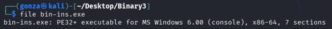
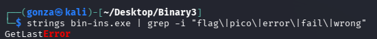
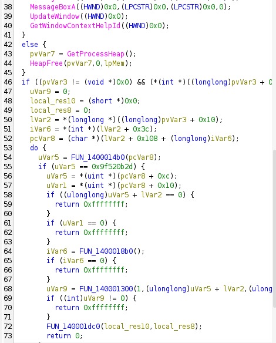
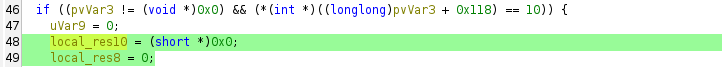
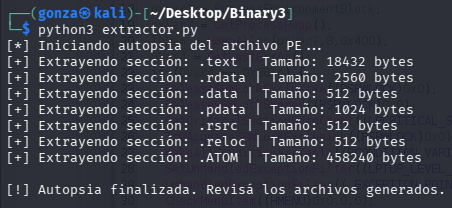
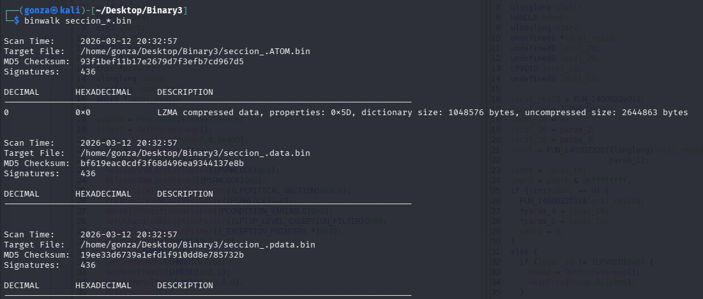
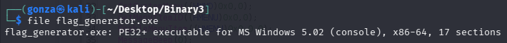
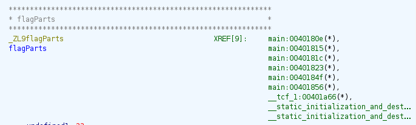
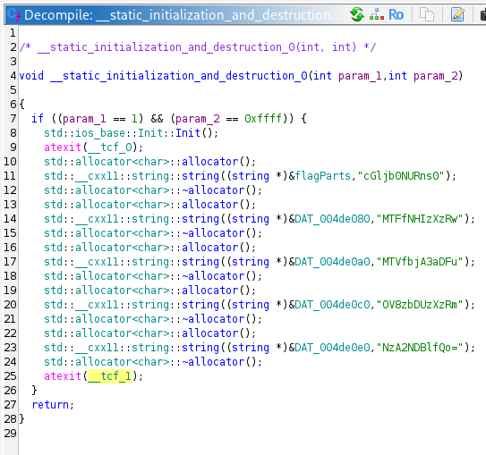
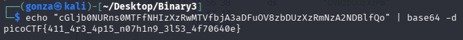

# 🎯 Binary Instrumentation 3

**Plataforma:** picoCTF 2026
**Categoría:** Reverse Engineering (Malware Analysis)
**Vulnerabilidad:** Flujo Lógico Roto / Reflective PE Loader / Obfuscation
**Dificultad:** Media/Alta (300 points)
**Herramientas:** Kali Linux, Ghidra, Python (`pefile`), `binwalk`, `lzma`, `base64`

### 📂 Estructura de Archivos
* `bin-ins.exe`: Binario original (Dropper/Loader) proporcionado por el reto.
* `extractor.py`: Script de Python desarrollado para dumpear las secciones PE.
* `entry.c`, `FUN_140001300.c`, `FUN_140001dc0.c`: Funciones decompiladas con Ghidra.
* `README.md`: Reporte detallado del análisis y resolución.
* `assets/`: Directorio con las capturas de evidencia.

---

### 1. Reconocimiento Inicial y Evasión de Antivirus
Al intentar interactuar con el archivo original en un entorno compartido con Windows, el antivirus (Avast) lo eliminó inmediatamente clasificándolo como `Win64:MalwareX-gen`. Esto es un claro indicador de técnicas de ofuscación o empaquetado malicioso.

Para realizar un análisis seguro (Cold Reverse Engineering), el binario fue aislado y analizado íntegramente desde la terminal de Kali Linux.
* **Comprobación de arquitectura:** El comando `file` confirmó que se trata de un ejecutable `PE32+ x86-64` de Windows.
* **Búsqueda de cadenas:** Un análisis inicial con `strings` no reveló ninguna bandera en texto plano, indicando que la misma se genera dinámicamente o está cifrada.


*El binario es un ejecutable PE de Windows de 64 bits con 7 secciones.*


*No hay flag en texto plano; se genera dinámicamente o está cifrada.*

### 2. Análisis Estático (El Dropper)
Se importó el ejecutable `bin-ins.exe` a **Ghidra** para analizar su código.

El análisis de la función `entry` reveló un comportamiento típico de *malware*:
1. **Junk Code:** Código inútil diseñado para engañar a los antivirus y entorpecer el análisis estático.
2. **Navegación del PEB:** Uso de punteros para navegar manualmente las estructuras internas de Windows (`ProcessEnvironmentBlock`) y localizar las secciones del propio ejecutable en memoria.
3. **El Error Intencional:** El programa busca una sección específica calculando un hash (`0x9f520b2d`). Al encontrarla, intenta descifrarla y ejecutarla. Sin embargo, debido a un error de programación introducido por el autor del reto, se pasan punteros nulos a la función encargada de ejecutar el código desempaquetado (el Reflective PE Loader), provocando que el programa termine sin mostrar la bandera.


*La función `entry` recorre las secciones buscando el hash `0x9f520b2d` y, al hallarla, invoca el loader.*


*El error intencional: `local_res10` y `local_res8` quedan en `0` y se pasan como punteros nulos a `FUN_140001dc0`.*

### 3. Extracción y Desempaquetado (Unpacking)
Dado que el programa no es capaz de ejecutar su propio payload debido al error lógico, se procedió a extraer la sección secreta manualmente.

Se desarrolló un script en Python utilizando la librería `pefile` para dumpear todas las secciones del ejecutable a archivos binarios independientes.


*El script extrae cada sección; la sección `.ATOM` (458 KB) concentra el payload.*

Al analizar las secciones extraídas con `binwalk`, se descubrió que la sección ofuscada (`seccion_.ATOM.bin`) contenía datos comprimidos con **LZMA**:


*`binwalk` confirma la firma LZMA en `.ATOM` (uncompressed size: 2644863 bytes).*

Se descomprimió el archivo utilizando herramientas nativas de Linux:
```bash
lzma -d < seccion_.ATOM.bin > flag_generator.exe
```

### 4. Análisis del Payload Final
El archivo resultante (`flag_generator.exe`) es un binario PE64 legítimo. Al analizarlo en Ghidra, se descubrió la lógica real para la generación de la bandera.


*El payload desempaquetado es un ejecutable PE64 válido con 17 secciones.*

La función `main` del nuevo programa también contiene un error lógico intencional: verifica si un descriptor de archivo (handle) devuelto por el sistema operativo es exactamente igual a `0xa`. Como esto es altamente improbable, la ejecución normal falla y emite el mensaje `[!] I didn't work!`.

En lugar de parchear las instrucciones de ensamblador para evadir el salto condicional, se analizó la memoria estática del programa. En la función `__static_initialization_and_destruction_0`, se encontró que la bandera estaba fragmentada y ofuscada utilizando Base64.


*La bandera se ensambla desde `flagParts`, con múltiples referencias en las inicializaciones estáticas.*


*Los fragmentos de la flag en Base64 se cargan en `flagParts` y `DAT_004de0*` durante la inicialización estática.*

### 5. Resultado y Ensamblaje
Los fragmentos extraídos de la memoria del programa fueron:

```
cGljb0NURns0
MTFfNHIzXzRw
MTVfbjA3aDFu
OV8zbDUzXzRm
NzA2NDBlfQo=
```

Utilizando la terminal de Linux, se decodificó secuencialmente cada fragmento:

```bash
echo "fragmento" | base64 -d
```


*Concatenando y decodificando los fragmentos Base64 se obtiene la bandera legible.*

**Flag Obtenida:** `picoCTF{411_4r3_4p15_n07h1n9_3l53_4f70640e}`
