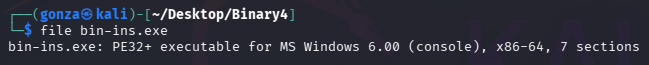
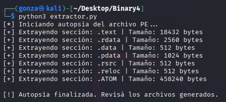
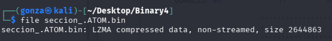
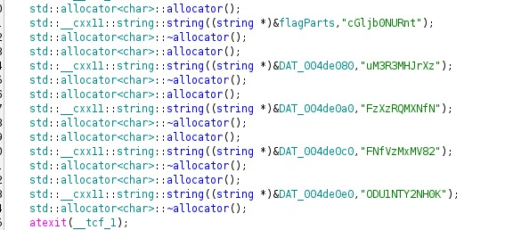
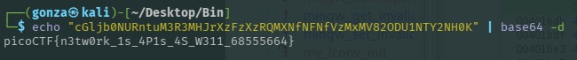

# 🎯 Binary Instrumentation 4

**Plataforma:** picoCTF 2026
**Categoría:** Reverse Engineering (Malware Analysis)
**Vulnerabilidad:** Credenciales Hardcodeadas (Hardcoded Credentials) / Evasión de Análisis Dinámico
**Dificultad:** Alta (400 points)
**Herramientas:** Kali Linux, Ghidra, Python (`pefile`), `binwalk`, `lzma`, `base64`

### 📂 Estructura de Archivos
* `bin-ins.exe`: Binario original (Dropper/Loader) proporcionado por el reto.
* `extractor.py`: Script de Python reutilizado del nivel anterior para dumpear las secciones PE.
* `main.c`, `lstrcmpA.c`, `strcmp.c`: Funciones decompiladas del payload con Ghidra.
* `exploit.txt`: Notas del proceso de explotación.
* `README.md`: Reporte detallado del análisis y resolución.
* `assets/`: Directorio con las capturas de evidencia.

---

### 1. Reconocimiento y Desempaquetado (El Reciclaje)
A simple vista, el archivo presenta la misma estructura PE64 ofuscada que el desafío anterior. Se determinó que el autor del reto reutilizó el mismo *dropper* para inyectar el código malicioso en memoria.


*Misma estructura PE64 que Binary Instrumentation 3: el dropper fue reutilizado.*

Para evadir la ejecución nativa en Windows y evitar configurar un entorno para Frida en Kali Linux, se optó por la vía del análisis estático avanzado. Se reutilizó el script `extractor.py` (basado en la librería `pefile`) para volcar las secciones de memoria.


*El mismo extractor vuelca las secciones; la `.ATOM` concentra el payload comprimido.*

Al identificar nuevamente la sección `.ATOM` comprimida con algoritmo LZMA, se procedió a extraer el binario real en frío:
```bash
lzma -d < seccion_.ATOM.bin > flag_generator4.exe
```


*La sección `.ATOM` vuelve a estar comprimida con LZMA.*

### 2. Análisis Estático del Payload de Red
Al importar `flag_generator4.exe` en Ghidra, el análisis de la función `main` reveló un comportamiento típico de un cliente malicioso de red o backdoor:

* **Conexión C2:** El programa inicializa los sockets nativos de Windows (`WSAStartup`) e intenta conectarse a una IP y puerto hardcodeados (`192.168.29.25:9867`).
* **Desafío y Respuesta:** Envía la cadena `"Enter the key:"` al servidor y espera recibir datos mediante `recv()`.
* **Validación Local (La vulnerabilidad):** Utiliza la API de Windows `lstrcmpA` para comparar el texto recibido por red con una clave estática almacenada en memoria (`"key68555664"`).

### 3. El Atajo Estático (Bypass del Flujo Esperado)
Las pistas del reto sugerían levantar un servidor local con netcat y utilizar Frida (Instrumentación Dinámica) para realizar un hooking a la API `lstrcmpA`, interceptando así los parámetros en memoria para robar la contraseña y luego enviarla por red para recibir la bandera.

Sin embargo, al poseer el código fuente desensamblado, la contraseña secreta quedó totalmente expuesta (`"key68555664"`). Además, se descubrió que el programa no obtiene la bandera del servidor remoto, sino que la construye localmente utilizando la misma variable global `flagParts` que en el nivel anterior si la contraseña es correcta.

### 4. Recuperación de la Bandera
Conociendo la lógica de construcción local, se inspeccionaron las referencias cruzadas de la variable `flagParts` en la memoria de Ghidra. Dentro de la función constructora `__static_initialization_and_destruction_0`, se encontró el string completo ofuscado en formato Base64.


*Los fragmentos Base64 (`cGljb0NURnt`, `uM3R3MHJrXz`, …) se cargan en `flagParts` durante la inicialización estática.*

**String Base64 interceptado:**
```
cGljb0NURntuM3R3MHJrXzFzXzRQMXNfNFNfVzMxMV82ODU1NTY2NH0K
```

### 5. Resultado Final
Se decodificó la cadena extraída directamente en la terminal de Kali Linux:

```bash
echo "cGljb0NURntuM3R3MHJrXzFzXzRQMXNfNFNfVzMxMV82ODU1NTY2NH0K" | base64 -d
```


*Decodificando la cadena Base64 se obtiene la bandera final.*

**Flag Obtenida:** `picoCTF{n3tw0rk_1s_4P1s_4S_W311_68555664}`
