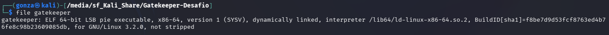
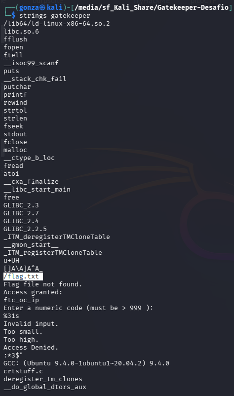
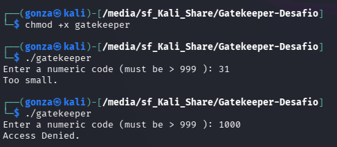
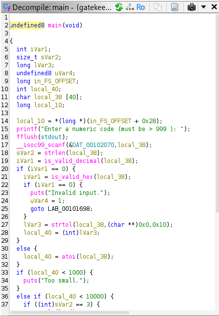
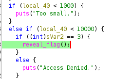
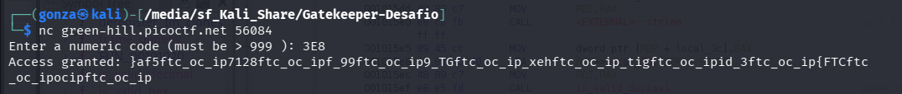
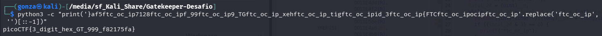

# 🎯 Gatekeeper

**Plataforma:** picoCTF 2026
**Categoría:** Reverse Engineering
**Vulnerabilidad:** Lógica de Validación de Tipos (Hex vs Dec) y Ofuscación de Salida
**Dificultad:** Media
**Herramientas:** Ghidra, Python, Netcat, Strings

### 📂 Estructura de Archivos
* `README.md`: Reporte detallado de la vulnerabilidad y explotación.
* `gatekeeper`: Binario ELF de 64 bits del reto.
* `assets/`: Directorio con las capturas de evidencia.

---

### 1. Reconocimiento
Se analiza un binario ELF de 64 bits `not stripped`. Al ejecutarlo dinámicamente, solicita un código numérico mayor a 999. El análisis inicial con `strings` revela la presencia del archivo objetivo `/flag.txt` y una cadena recurrente utilizada para ofuscación: `ftc_oc_ip`.

*`strings` filtra el archivo objetivo `/flag.txt` y la cadena de ruido `ftc_oc_ip`.*

*En decimal es imposible: `1000` supera el valor pero tiene 4 caracteres → Access Denied.*

### 2. Análisis de Vulnerabilidad
El descompilador de Ghidra revela una validación dual en la función `main`:
1. El programa procesa entradas tanto en formato decimal (`atoi`) como en hexadecimal (`strtol` con base `0x10`).
2. Existe una falla lógica restrictiva: para evadir el `Access Denied` y alcanzar la función `reveal_flag()`, el valor numérico debe ser `>= 1000`, pero la longitud de la cadena enviada (`strlen`) debe ser de exactamente 3 caracteres. Es matemáticamente imposible cumplir esto utilizando base 10 (decimal).

*`main` valida decimal o hexadecimal; el valor debe ser ≥ 1000.*

*La segunda condición exige `strlen == 3`: solo alcanzable con notación hexadecimal.*

### 3. Explotación
Se realiza un "bypass" de la restricción de longitud aprovechando la conversión hexadecimal incorporada en el binario. El valor `0x3E8` (1000 en decimal) cumple con tener una longitud de 3 caracteres físicos y un valor numérico suficiente para superar la primera barrera condicional.

**Payload de acceso:** `3E8`

*`3E8` (3 caracteres, = 1000) concede acceso; la flag llega ofuscada con la cadena `ftc_oc_ip` intercalada y en reversa.*

### 4. Reconstrucción y Resultado
El servidor concede el acceso pero devuelve la flag ofuscada inyectando ruido. El análisis de la función `reveal_flag()` en Ghidra muestra que el binario recorre el archivo en reversa (de atrás hacia adelante) e inyecta la cadena basura `ftc_oc_ip` mediante una operación a nivel de bits (`(local_24 & 3) == 0`).

Al limpiar la cadena resultante y revertirla correctamente eliminando el ruido inyectado, se obtiene la flag final legible.

*Se elimina el ruido (`.replace('ftc_oc_ip','')`) y se revierte (`[::-1]`) para reconstruir la bandera.*

**Flag:** `picoCTF{3_digit_hex_GT_999_f82175fa}`