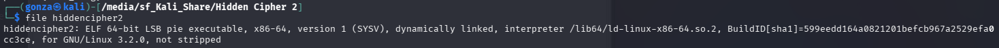
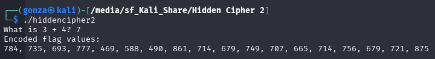
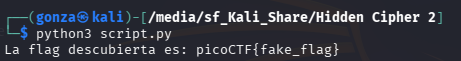
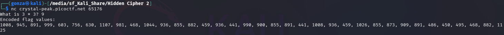
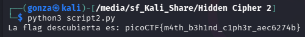

# 🎯 Hidden Cipher 2

**Plataforma:** picoCTF 2026
**Categoría:** Reverse Engineering
**Vulnerabilidad:** Criptografía Custom (Multiplicación Escalar ASCII) / Llave Dinámica Interactiva
**Dificultad:** Media
**Herramientas:** `file`, Python, Netcat

### 📂 Estructura de Archivos
* `README.md`: Reporte detallado de la vulnerabilidad y explotación.
* `hiddencipher2`: Binario ELF de 64 bits del reto.
* `script.py`, `script2.py`: Scripts de descifrado (local y remoto).
* `assets/`: Directorio con las capturas de evidencia.

---

### 1. Reconocimiento
Se analiza un binario ejecutable ELF de 64 bits. Al inspeccionarlo con la utilidad `file`, se determina que está enlazado dinámicamente y conserva su tabla de símbolos (`not stripped`).



Al ejecutar el binario dinámicamente, el programa solicita al usuario resolver una operación matemática básica (ej. "What is 3 * 3?"). Al ingresar la respuesta correcta, el binario devuelve un arreglo de números enteros (ej. `1008, 945, 891...`).


*El binario pide resolver una operación y devuelve los "Encoded flag values".*

### 2. Análisis de Vulnerabilidad
Se realiza un criptoanálisis de texto plano conocido (*Known-Plaintext Attack*) asumiendo que el texto de la bandera descifrada debe comenzar con la letra `p`.
* El valor decimal de la letra `p` en la tabla ASCII es `112`.
* La respuesta al problema matemático evaluado dinámicamente fue `9`.
* El primer valor del arreglo cifrado devuelto por el servidor en esa instancia es `1008`.

Comprobación matemática: `112 * 9 = 1008`.
El algoritmo de "cifrado" implementado por el autor consiste simplemente en tomar el valor numérico ASCII de cada carácter de la bandera en texto plano y multiplicarlo por el resultado de la operación matemática inicial, la cual actúa como llave de cifrado simétrica (*key*).

> **Nota:** Al descifrar los valores del binario ejecutado **localmente**, se obtiene una bandera falsa (`picoCTF{fake_flag}`) incrustada por defecto. Es necesario obtener los valores de la **instancia remota** para recuperar la flag real.


*El binario local incluye una bandera señuelo; hay que atacar la instancia remota.*

### 3. Explotación
Dado que la operación de ofuscación es una multiplicación escalar lineal de un solo factor, la función de descifrado es la división entera de cada elemento del arreglo cifrado por la llave ingresada.

Se obtiene el arreglo de valores cifrados conectándose a la instancia remota viva proporcionada por el reto mediante Netcat (`nc crystal-peak.picoctf.net 65176`), resolviendo la validación matemática inicial para forzar al binario a escupir los valores cifrados reales.


*La instancia remota entrega los valores reales (llave = 9).*

**Script de Explotación (`script2.py`):**
```python
# Arreglo extraído de la conexión remota
encoded_values = [1008, 945, 891, 999, 603, 756, 630, 1107, 981, 468, 1044, 936, 855, 882, 459, 936, 441, 990, 900, 855, 891, 441, 1008, 936, 459, 1026, 855, 873, 909, 891, 486, 450, 495, 468, 882, 1125]

# Llave derivada del problema matemático en la instancia
key = 9

flag = ""
for num in encoded_values:
    # División entera para recuperar el código ASCII original
    ascii_val = num // key
    flag += chr(ascii_val)

print(f"La flag descubierta es: {flag}")
```

### 4. Resultado
Al ejecutar el script de descifrado utilizando los valores y la llave dinámicos obtenidos directamente de la instancia remota (evadiendo la bandera local falsa o *dummy flag* incrustada por defecto en el binario estático), se logra recuperar la cadena original.


*Con la llave dinámica correcta (9) y los valores remotos se recupera la bandera.*

**Flag obtenida:** `picoCTF{m4th_b3h1nd_c1ph3r_aec6274b}`

---

### 🛡️ Remediación (Developer Perspective)
Para mitigar estas debilidades en implementaciones de seguridad de software:
* **No utilizar "Custom Crypto" (Criptografía Casera):** Las operaciones aritméticas simples como la multiplicación o la suma (variantes del cifrado César) no proporcionan confidencialidad criptográfica real contra analistas o atacantes. Son trivialmente reversibles mediante análisis de frecuencias o fuerza bruta.
* **Implementar Estándares de la Industria:** Para proteger información en memoria o en tránsito, se deben utilizar algoritmos robustos y probados (como AES-GCM o ChaCha20) apoyados en bibliotecas criptográficas sólidas (ej. OpenSSL, libsodium).
