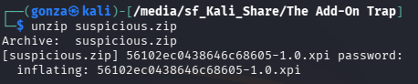
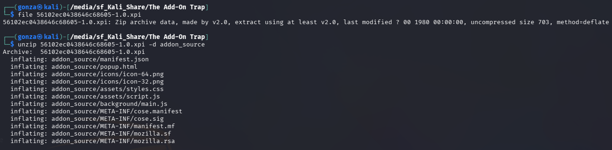
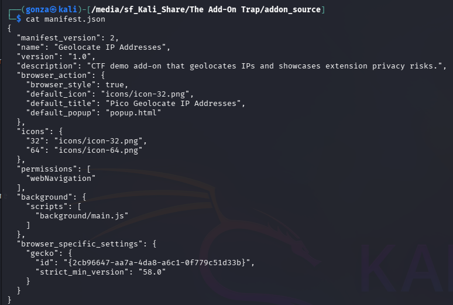
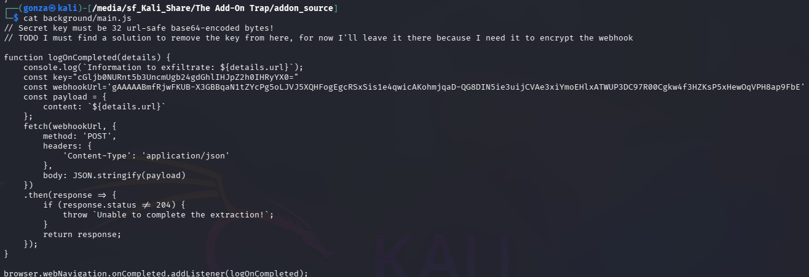
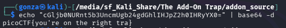
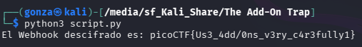

# 🎯 The Add-On Trap

**Plataforma:** picoCTF 2026
**Categoría:** Reverse Engineering
**Vulnerabilidad:** Almacenamiento Inseguro de Llaves Criptográficas / Exfiltración de Datos (Malware en Extensiones)
**Dificultad:** Media
**Herramientas:** `unzip`, `file`, Análisis Estático (JavaScript), Python (`cryptography.fernet`), Base64

### 📂 Estructura de Archivos
* `README.md`: Reporte detallado del análisis forense de la extensión y su explotación.
* `56102ec0438646c68605-1.0.xpi`: Paquete de la extensión maliciosa.
* `suspicious.zip`: Archivo contenedor original del reto.
* `script.py`: Script automatizado para la recuperación de la llave y el descifrado Fernet.
* `assets/`: Directorio con las capturas de evidencia.

---

### 1. Reconocimiento
Se nos entrega un archivo con extensión `.xpi`. Utilizando la herramienta `file`, confirmamos que se trata de un archivo comprimido ZIP estándar. Los archivos `.xpi` (Cross-Platform Install) son los paquetes de instalación utilizados por navegadores basados en Mozilla (como Firefox) para sus extensiones o complementos.

Se procede a descomprimir el archivo (`unzip 56102ec0438646c68605-1.0.xpi -d addon_source`) para auditar el código fuente estático de la extensión.




*El `.xpi` es un ZIP; al descomprimirlo aparece la estructura de la extensión (`manifest.json`, `background/main.js`, …).*

### 2. Análisis de Vulnerabilidad
Al analizar el archivo de configuración principal, `manifest.json`, se detectan dos vectores críticos:
1. **Permisos excesivos:** La extensión solicita el permiso `webNavigation`, lo que le permite interceptar y monitorear todo el tráfico y la navegación del usuario.
2. **Ejecución en segundo plano:** Se define la ejecución silenciosa del script `background/main.js`.


*El `manifest.json` solicita `webNavigation` y ejecuta `background/main.js` en segundo plano.*

Al auditar `main.js`, se descubre la lógica maliciosa: la función `logOnCompleted` extrae la URL visitada por el usuario y la envía (exfiltración) mediante una petición POST (fetch) a un servidor externo (Webhook). Para evadir la detección estática de la URL de destino, el autor encriptó el Webhook y dejó la llave de descifrado *hardcodeada* en el código junto con un comentario revelador:

```javascript
// Secret key must be 32 url-safe base64-encoded bytes!
const key="cGljb0NURnt5b3UncmUgb24gdGhlIHJpZ2h0IHRyYX0="
const webhookUrl='gAAAAABmfRjwFKUB-X3GBBqaN1tZYcPg5oLJVJ5XQHFogEgcRSxSis1e4qwicAKohmjqaD-QG8DIN5ie3uijCVAe3xiYmoEHlxATWUP3DC97R00Cgkw4f3HZKsP5xHewOqVPH8ap9FbE'
```


*El código malicioso exfiltra `details.url` vía POST; la llave y el webhook cifrado están hardcodeados.*

### 3. Explotación
**Fase 1: Decodificación de la Llave**
La variable `key` termina con el caracter `=`, un claro indicador de codificación Base64. Al decodificarla (`echo "..." | base64 -d`), obtenemos la primera mitad de una frase: `picoCTF{you're on the right tra}`.


*La llave en sí es la primera mitad de la bandera.*

**Fase 2: Identificación y Ruptura del Cifrado (Fernet)**
La variable `webhookUrl` comienza con el prefijo estandarizado `gAAAAAB...`. En el ámbito de la criptografía aplicada en Python, este es el identificador (magic bytes) de un token Fernet, un esquema de cifrado simétrico autenticado que requiere una llave codificada en Base64 de 32 bytes (coincidiendo con el comentario del código).

Se desarrolla un script en Python utilizando la biblioteca `cryptography.fernet` para desencriptar el token utilizando la llave recuperada.

**Script de Explotación (`script.py`):**
```python
from cryptography.fernet import Fernet

# Llave extraída del código fuente de la extensión (Base64)
key = b"cGljb0NURnt5b3UncmUgb24gdGhlIHJpZ2h0IHRyYX0="
f = Fernet(key)

# Token cifrado extraído de main.js
encrypted_webhook = b"gAAAAABmfRjwFKUB-X3GBBqaN1tZYcPg5oLJVJ5XQHFogEgcRSxSis1e4qwicAKohmjqaD-QG8DIN5ie3uijCVAe3xiYmoEHlxATWUP3DC97R00Cgkw4f3HZKsP5xHewOqVPH8ap9FbE"

# Descifrado
decrypted = f.decrypt(encrypted_webhook)
print(f"El Webhook descifrado es: {decrypted.decode()}")
```

### 4. Resultado
La ejecución del script descifra exitosamente el token Fernet. En lugar de encontrar una URL externa, el autor ocultó la bandera del desafío en este parámetro.


*El descifrado Fernet del webhook revela la segunda mitad y completa la bandera.*

**Flag:** `picoCTF{Us3_4dd/0ns_v3ry_c4r3fully1}`

---

### 🛡️ Remediación (Developer Perspective)
* **Gestión de Secretos:** Jamás se deben incrustar (hardcodear) llaves simétricas, tokens de API o contraseñas en el código fuente de una aplicación del lado del cliente (Frontend, Mobile, o Extensiones de Navegador). Cualquier usuario puede aplicar ingeniería inversa y extraer estos secretos trivialmente.
* **Seguridad de Extensiones:** Como usuarios y administradores, se debe auditar estrictamente los permisos requeridos por los complementos del navegador (ej. `webRequest` o `webNavigation`), ya que son un vector principal para la interceptación de tráfico (MitM) y el robo de sesiones.