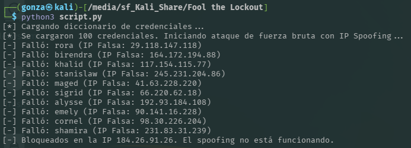
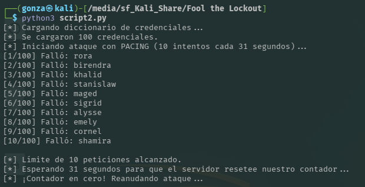
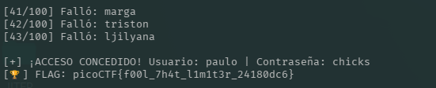

# 🎯 Fool the Lockout

**Plataforma:** picoCTF 2026
**Categoría:** Web Exploitation
**Vulnerabilidad:** Rate Limit Bypass via Time-based Pacing (Falla de lógica)
**Dificultad:** Media (200 puntos)
**Herramientas:** Python, librería `requests`

### 📂 Estructura de Archivos
* `README.md`: Reporte detallado de la vulnerabilidad y explotación.
* `script.py`: Primer intento (fuerza bruta con IP Spoofing vía cabeceras).
* `script2.py`: Script final que automatiza el ataque controlando los tiempos de petición (*pacing*).
* `app.py`: Código fuente original del servidor Flask vulnerable.
* `creds-dump.txt`: Diccionario provisto con 100 credenciales comprometidas.
* `assets/`: Directorio con las capturas de evidencia.

---

### 1. Reconocimiento
El desafío expone un portal de inicio de sesión desarrollado en Flask que implementa un sistema de límite de peticiones (Rate Limiting) basado en la dirección IP del cliente para mitigar ataques de fuerza bruta. Se nos provee el código fuente del servidor y un diccionario de 100 posibles combinaciones de usuario y contraseña. El objetivo es evadir el bloqueo, encontrar las credenciales correctas e iniciar sesión para obtener la bandera.

### 2. Análisis de Vulnerabilidad
Al auditar el archivo `app.py`, se identificaron las constantes de tiempo y los umbrales del límite de tasa:
* `MAX_REQUESTS = 10` (Máximo de intentos fallidos).
* `EPOCH_DURATION = 30` (Ventana de tiempo en segundos).
* `LOCKOUT_DURATION = 120` (Duración del bloqueo por exceder el límite).

El servidor utiliza `request.remote_addr` para rastrear la IP, leyendo directamente la conexión TCP, lo que invalida el uso de cabeceras falsas como `X-Forwarded-For` para hacer *IP Spoofing*.

*El intento de falsificar la IP por cabeceras falla: el servidor rastrea la IP real del socket TCP y bloquea.*

Sin embargo, se descubrió una falla lógica crítica en la función `refresh_request_rates_db()`. El código establece que si la diferencia entre el tiempo actual y el inicio del "epoch" es mayor a 30 segundos, el contador de peticiones se reinicia a 0: `if curr_time - epoch_start_time > EPOCH_DURATION:`. 
Esto significa que un atacante nunca alcanzará el estado de bloqueo de 120 segundos si se asegura de pausar sus ataques durante 31 segundos justo antes de alcanzar la petición número 11.

### 3. Explotación
Se desarrolló un script de Python (`script2.py`) para aprovechar esta deficiencia mediante la técnica de *Pacing* (marcar el ritmo).
El script itera sobre el archivo `creds-dump.txt`, enviando peticiones HTTP POST al endpoint de login. Se implementó una condición en el bucle que detecta cuando se han realizado 10 peticiones. En ese momento, el script invoca `time.sleep(31)`. Esta pausa fuerza al servidor a evaluar la condición de expiración del "epoch" y reiniciar el contador de la IP del atacante de vuelta a 0, permitiendo enviar otro bloque de 10 credenciales sin sufrir la penalización de 120 segundos.

*Tras 10 intentos el script espera 31 segundos; el servidor resetea el contador y el ataque se reanuda sin bloqueo.*

### 4. Resultado
El script logró recorrer el diccionario con éxito realizando pausas estratégicas. En el intento número 44, se encontraron credenciales válidas.
* **Usuario:** `paulo`
* **Contraseña:** `chicks`

Al iniciar sesión correctamente, el servidor respondió con el contenido de la página principal, revelando la bandera.

*Credenciales válidas encontradas (`paulo` / `chicks`) y bandera obtenida.*

**Flag:** `picoCTF{f00l_7h4t_l1m1t3r_24180dc6}`

---

### 🛡️ Remediación (Developer Perspective)
* **No reinventar la rueda criptográfica o de seguridad:** Evitar la creación de algoritmos personalizados de "Rate Limiting". En entornos Flask, se recomienda encarecidamente utilizar librerías probadas en la industria como `Flask-Limiter`, respaldada por sistemas de caché veloces como Redis.
* **Tiempos de penalización progresivos:** Implementar técnicas de *Exponential Backoff*. Cada bloque de intentos fallidos debería duplicar el tiempo de espera, haciendo inviable matemáticamente la ejecución de la fuerza bruta aunque el atacante automatice las pausas.