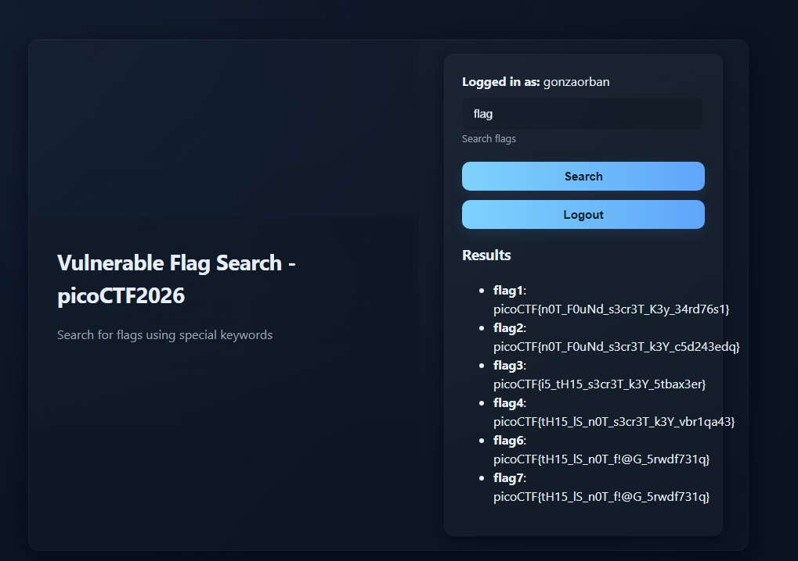
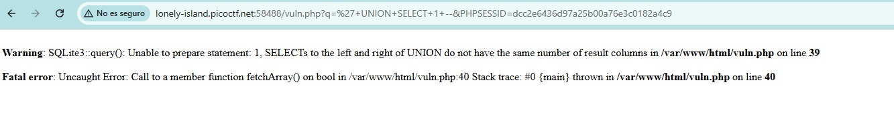
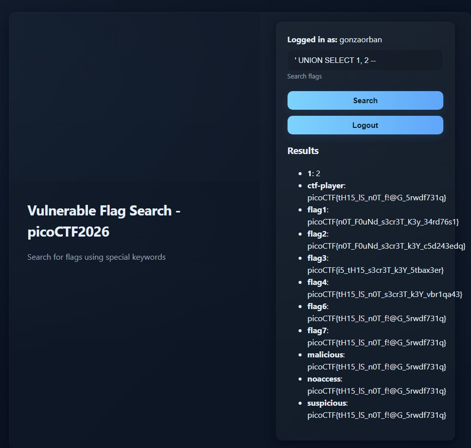
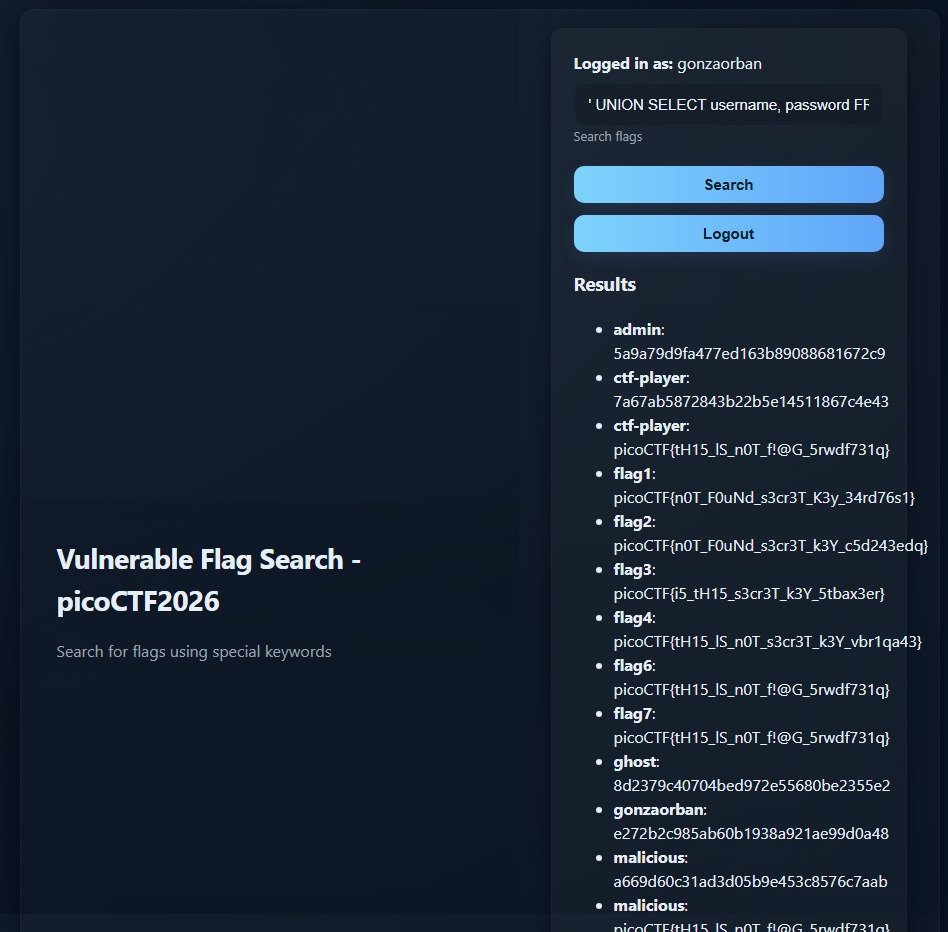
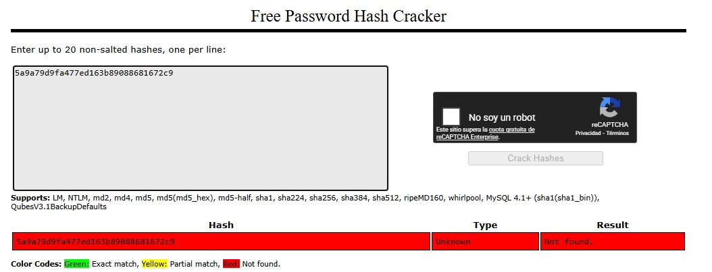
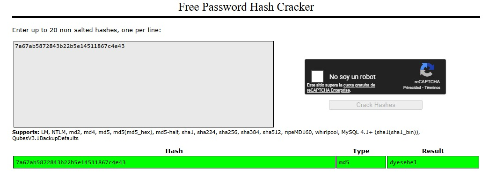
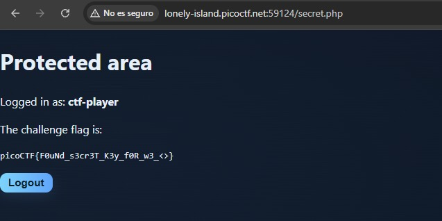

# 🎯 Mapa SQL1 (Vulnerable Flag Search / Strong Auth)

**Plataforma:** picoCTF 2026
**Categoría:** Web Exploitation
**Vulnerabilidades:** Union-Based SQL Injection, Insecure Password Storage (MD5 Raw), Database Schema Enumeration.
**Conceptos Clave:** Rabbit Holes (Pistas Falsas), Known-Plaintext Attack, Reconocimiento de Arquitectura.
**Dificultad:** Alta (300 puntos)

---

### 📂 Resumen Ejecutivo
El desafío presenta un panel de búsqueda de banderas vulnerable a Inyección SQL (SQLite3) y un sistema de autenticación moderno pero con un error crítico en el manejo criptográfico de las contraseñas. A través de la enumeración de la base de datos, se extrajeron los hashes MD5 de los usuarios del sistema. Tras identificar que la contraseña del usuario `admin` era intencionalmente irrompible (un "Rabbit Hole"), se pivotó el ataque hacia un usuario secundario legítimo (`ctf-player`) que utilizaba una contraseña débil, permitiendo evadir la restricción lógica y obtener la bandera oculta.

*Captura del panel de búsqueda vulnerable y el sistema de login.*

---

### 1. Reconocimiento
Al ingresar al sistema, se observó que la aplicación permitía el registro de usuarios y la búsqueda de banderas. Las pistas indicaban: *"código descuidado y prácticas de hash obsoletas"* y *"actuar como un usuario legítimo"*.

Al inyectar comillas simples (`'`) en el buscador de banderas, se provocó un error de sintaxis que reveló el motor de la base de datos: **SQLite3**.

*El error `SQLite3::query()` filtra el motor de base de datos y la ruta `/var/www/html/vuln.php`.*

### 2. Explotación (Union-Based SQLi)
Se procedió a determinar el número de columnas de la consulta original utilizando `UNION SELECT`. La consulta requería exactamente 2 columnas (`' UNION SELECT 1, 2 -- `).

Con el control de la consulta, se interrogó a la tabla maestra de SQLite (`sqlite_master`) para volcar el esquema completo de la base de datos:
`' UNION SELECT name, sql FROM sqlite_master WHERE type='table' -- `

Esto reveló la existencia de dos tablas críticas:
1. `flags (id, key, value)`
2. `users (id, username, password)`

*`' UNION SELECT 1, 2 -- ` confirma que la consulta usa 2 columnas.*

### 3. Enumeración y El "Rabbit Hole"
Se realizó un volcado de la tabla `flags`, pero la bandera número 5 (`flag5`) no existía en la base de datos, confirmando que estaba oculta a nivel de código fuente en PHP y condicionada a la sesión activa.

Posteriormente, se volcó la tabla `users` mediante el payload:
`' UNION SELECT username, password FROM users -- `
Se obtuvieron hashes para los usuarios `admin`, `ctf-player`, `ghost` y `malicious`.

Se intentó romper el hash del `admin` (`5a9a79d9fa477ed163b89088681672c9`) utilizando diccionarios (CrackStation/Hashcat), pero no se encontró coincidencia. Este fue un claro "Rabbit Hole" diseñado por el autor para hacer perder tiempo al atacante.

*`' UNION SELECT username, password FROM users -- ` expone los hashes MD5 de todos los usuarios.*

*El hash de `admin` no se rompe con diccionarios: es el "Rabbit Hole" del reto.*

### 4. Criptoanálisis y Pivoting
Para entender la "práctica de hash obsoleta", se realizó un ataque de Texto Plano Conocido (Known-Plaintext). Se registró un usuario propio (`gonza1`) con contraseña conocida (`123456`) y se extrajo su hash mediante la inyección SQL. Al comparar el resultado, se comprobó que el servidor utilizaba **MD5 puro sin salt**.

Dado que la misión era "actuar como un usuario legítimo" (no necesariamente el administrador), se apuntó el ataque de fuerza bruta offline contra el hash del usuario secundario `ctf-player` (`7a67ab5872843b22b5e14511867c4e43`). 

El hash se rompió exitosamente revelando la contraseña débil: **`dyesebel`**.

*El hash de `ctf-player` (`7a67ab...`) se rompe: MD5 puro sin salt → contraseña `dyesebel`.*

### 5. Resultado
Iniciando sesión con las credenciales obtenidas (`ctf-player` / `dyesebel`), la aplicación validó la sesión legítima y reveló por pantalla la bandera oculta.

*Con la sesión legítima de `ctf-player`, el área protegida revela la bandera oculta.*

**Flag:** `picoCTF{F0uNd_s3cr3T_K3y_f0R_w3_<>}`

---

### 🛡️ Remediación (Developer Perspective)
1. **Prevención de SQLi:** Reemplazar todas las consultas dinámicas (concatenación de strings) en el buscador por Consultas Preparadas (Prepared Statements) con parametrización estricta, tal como ya se implementaba en la fase de registro y login.
2. **Almacenamiento Seguro de Contraseñas:** Abandonar inmediatamente MD5. Utilizar algoritmos de derivación de claves diseñados específicamente para contraseñas, como `bcrypt`, `Argon2` o, en su defecto, usar la función nativa `password_hash()` de PHP, la cual maneja automáticamente la generación de sales (salts) criptográficas.