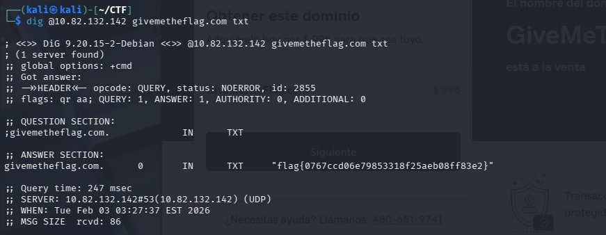

# 🌐 Dig Dug - DNS 

**Plataforma:** TryHackMe  
**Categoría:** Network / DNS  
**Dificultad:** Fácil  

## 1. El Problema
Se nos pide encontrar un registro oculto en el dominio `givemetheflag.com` alojado en la máquina víctima. Al realizar una consulta DNS estándar (`dig givemetheflag.com`), la petición se enrutaba a través del DNS público (Internet), devolviendo resultados genéricos sin la bandera.

## 2. La Solución Técnica
El servidor DNS de la máquina víctima (DNS Privado) contiene registros que no existen en el Internet público ("Split-Horizon DNS"). Debemos forzar a la herramienta `dig` a consultar directamente a la IP de la máquina del CTF, ignorando el resolver local del sistema.

## 3. Ejecución
Utilizamos el operador `@` de `dig` para especificar el servidor de nombres destino. Solicitamos registros de tipo `TXT`, comunes para ocultar información en CTFs.

**Comando:**

```bash```
dig @MACHINE_IP givemetheflag.com TXT



## 4. Resultado
El servidor DNS interno respondió con un registro TXT que contenía la bandera.

## 📝 Nota Técnica
En un entorno real, esto simula la enumeración de una red interna (Intranet) donde los servidores DNS internos resuelven dominios corporativos que no son accesibles desde el exterior.
