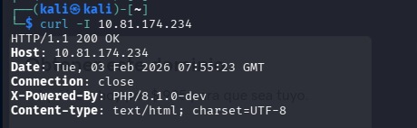
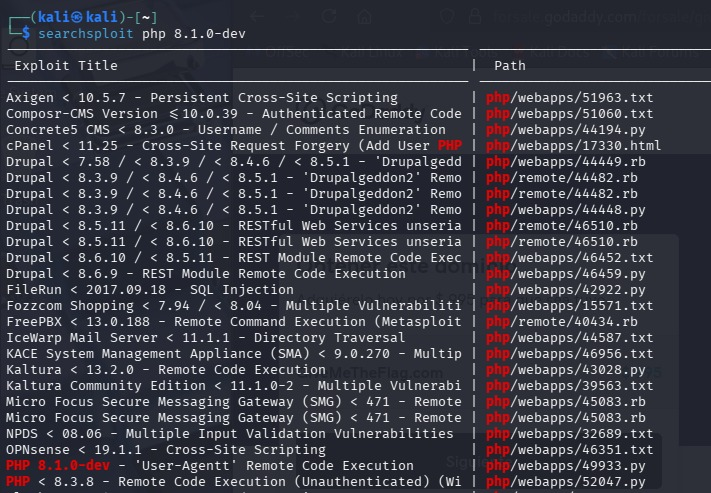
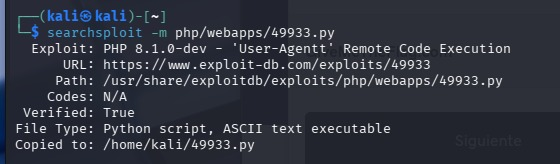
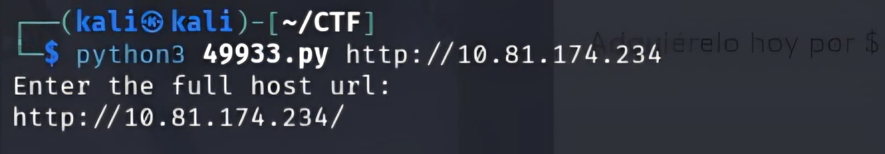
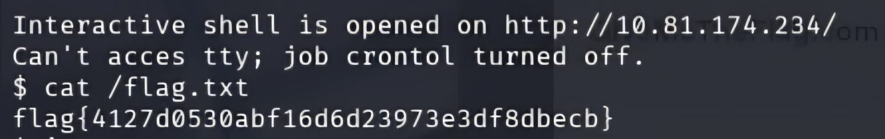

# 🕵️ Agent T

**Plataforma:** TryHackMe  
**Categoría:** Web Exploitation / CVE Exploitation  
**Vulnerabilidad:** Remote Code Execution (RCE) / PHP 8.1.0-dev Backdoor  
**Dificultad:** Fácil  

## 1. Reconocimiento
Al inspeccionar las cabeceras HTTP de la respuesta del servidor (usando `curl -I` o Wappalyzer), detectamos una versión de PHP inusual.

**Comando:**

```bash```
curl -I http://MACHINE_IP



Hallazgo Crítico: La cabecera X-Powered-By reveló una versión de PHP extremadamente específica y no estándar:
X-Powered-By: PHP/8.1.0-dev

## 2. Análisis de Vulnerabilidad
La versión PHP 8.1.0-dev está comprometida por una puerta trasera (backdoor) histórica. En marzo de 2021, el repositorio oficial de código fuente de PHP fue vulnerado (Supply Chain Attack), inyectando código malicioso en esta versión de desarrollo.

Mecanismo del Fallo: El código malicioso busca una cabecera HTTP específica llamada User-Agentt (con doble 't'). Si el servidor la recibe, ejecuta el contenido de esa cabecera como código PHP arbitrario, permitiendo una Ejecución Remota de Código (RCE) sin autenticación.

## 3. Explotación
Para explotar este fallo, consultamos la base de datos de exploits local en Kali Linux (searchsploit).

Búsqueda del Exploit:

```Bash```
searchsploit php 8.1.0-dev



Obtención del Script: Copiamos el exploit identificado (ID 49933) a nuestro directorio de trabajo:

```Bash```
searchsploit -m 49933



Ejecución: Lanzamos el script de Python apuntando a la dirección IP de la máquina víctima:

```Bash```
python3 49933.py http://MACHINE_IP



Esto abrió una shell interactiva con privilegios elevados, permitiéndonos navegar por el sistema de archivos.

## 4. Resultado (Flag)
Con acceso a la terminal del servidor, localizamos la bandera en el directorio raíz:

```Bash```
cat /flag.txt




## 🛡️ Remediación y Buenas Prácticas
Como medida de corrección para entornos de producción:

Evitar Versiones de Desarrollo: Nunca desplegar versiones -dev, nightly o beta de lenguajes o frameworks en servidores públicos.

Actualización Inmediata: Actualizar PHP a una versión estable (Stable Release) que no contenga el commit malicioso.

Hardening de Cabeceras: Configurar el servidor web (Nginx/Apache) para ocultar la cabecera X-Powered-By (expose_php = Off en php.ini), dificultando la enumeración de versiones por parte de atacantes.
