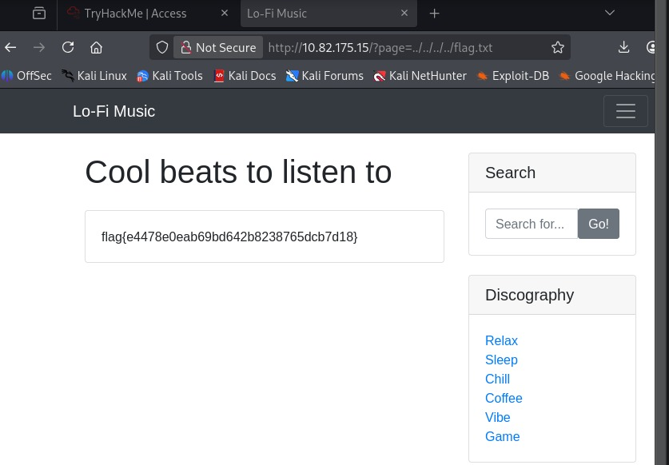

# 🎧 Lo-fi beats - Local File Inclusion (LFI)

**Plataforma:** TryHackMe  
**Categoría:** Web Exploitation  
**Vulnerabilidad:** Local File Inclusion (LFI)  
**Dificultad:** Fácil  

## 1. Reconocimiento
La aplicación web permite seleccionar distintas "pistas" o vistas mediante un parámetro en la URL, por ejemplo: `?page=home`. Esto indica que el servidor está incluyendo archivos dinámicamente basándose en este input.

## 2. Análisis de Vulnerabilidad
El servidor no sanitiza correctamente la entrada del usuario, permitiendo el uso de caracteres de recorrido de directorios (`../`). Esto permite escapar de la raíz del servidor web (`/var/www/html`) y acceder al sistema de archivos del servidor (LFI).

## 3. Explotación
El objetivo es leer el archivo `flag.txt` ubicado en la raíz del sistema (`/`). Calculamos que necesitamos retroceder aproximadamente 4 niveles para llegar a la raíz.

**Payload:**
```http```

http://MACHINE_IP/?page=../../../../flag.txt



## 4. Resultado
El servidor procesó la ruta, leyó el archivo /flag.txt y mostró su contenido en el navegador: flag{...}.


## 🛡️ Remediación
Evitar pasar nombres de archivos directamente en la URL.
Utilizar una Allowlist (Lista blanca) de archivos permitidos (ej. ['home', 'about', 'contact']).
Sanitizar el input eliminando caracteres como ../ o /.
